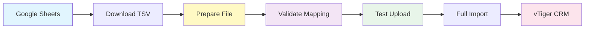
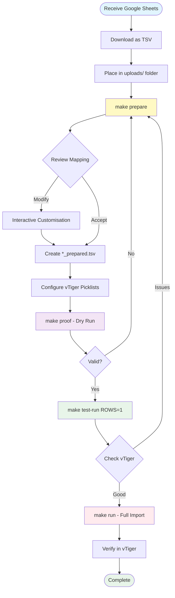
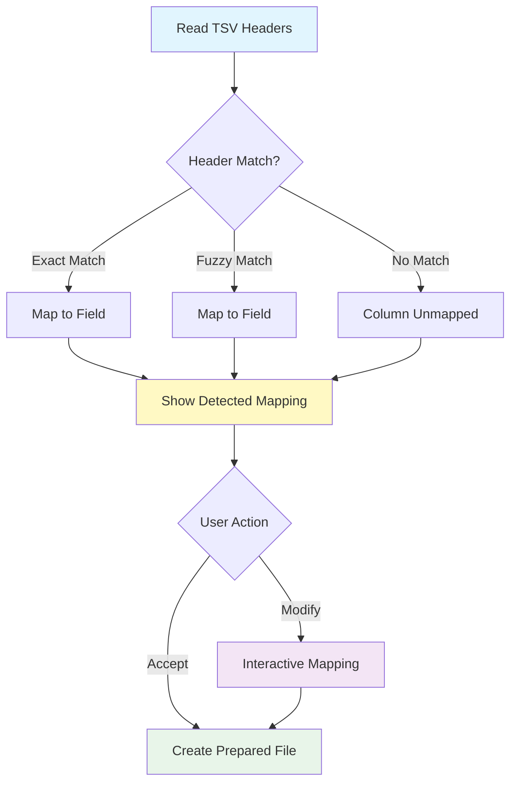
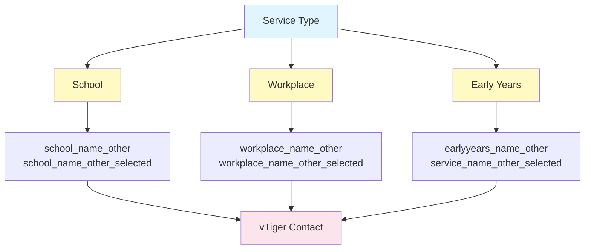
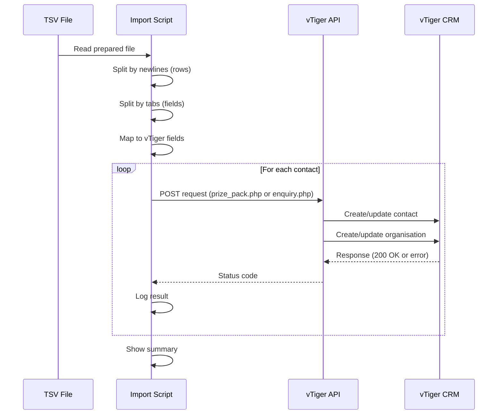

# Import Workflow & Business Logic

This guide explains how to import conference leads into vTiger CRM, including data preparation, supported columns, and vTiger configuration.

## Overview

This system batch imports conference leads (delegates, enquiries, prize packs) into The Resilience Project's vTiger CRM. The workflow processes tab-separated data from spreadsheets and submits them via HTTP POST requests to vTiger API endpoints.



## Import Workflow



### Step 1: Receive Data

Data is typically provided by Ash or Monica in a spreadsheet format via Google Sheets.

### Step 2: Download and Save

1. Export the spreadsheet data as a tab-separated values (TSV) file
2. Place the TSV file in the `uploads/` directory

**Why TSV and not CSV?**
- Commas appear in organisation names and addresses, which would break CSV parsing
- TSV uses tabs as delimiters, which are less common in data

### Step 3: Prepare the TSV File (REQUIRED)

```bash
make prepare
# OR
python3 prepare_tsv.py uploads/your_file.tsv
```

This step is **REQUIRED** - the import script only accepts prepared TSV files.

The preparation process:
1. **Detects column mappings** from file headers automatically
2. **Shows you the detected mapping** for review
3. **Allows customisation**:
   - Review detected column mappings
   - Customise which columns map to which fields
   - Unmap fields by entering `x` or `none`
   - Remap fields to different columns
4. **Creates cleaned copy** with only supported columns: `uploads/your_file_prepared.tsv`
5. **Removes unsupported columns** (Address, Website, Social Media URLs, etc.)

After preparation, you can open the `*_prepared.tsv` file to massage/edit the data before importing.

### Step 4: Ensure File Has Headers

The script automatically detects column mapping from headers:

**Required headers**: First Name, Last Name, Email, Organisation (or School/Workplace)

**Optional headers**: Number of Students, Job Title, Phone, State, Enquiry

Header names are flexible (e.g., "First Name", "first_name", "First" all work). The script will show you the detected mapping and ask for confirmation.

### Step 5: vTiger Configuration

For each sheet in the spreadsheet, check if the source form exists in vTiger. If it doesn't, add it:

1. Ash will normally provide the name (e.g., "NSWPDPN Delegate 2026")
2. Open Picklist editor in vTiger
3. Select **Contacts** module
4. Select **"Forms Completed"** in dropdown
5. If it doesn't exist:
   - Click Add Value
   - Type the name of the source form
   - Leave role as All Roles
   - Leave colour (Ash likes to set these)
   - Hit save
6. Repeat for **Organisation** module and picklist **"2026 sales events"**

**IMPORTANT**: Ensure the names are exactly the same in both picklists.

### Step 6: Interactive Configuration

When you run the import script, it will prompt you for:

1. **Service Type**: School, Workplace, or Early Years
2. **Source Form**: The exact name from vTiger picklists (e.g., "NSWPDPN Delegate 2026")
3. **API Endpoint**: Prize Pack or Enquiry
   - **IMPORTANT**: If selecting Enquiry, you MUST disable the workflow **'New enquiry - send email to enquirer'** in vTiger before starting the upload

The script automatically configures organisation field mapping based on service type:
- **School**: Uses `school_name_other` + `school_name_other_selected`
- **Workplace**: Uses `workplace_name_other` + `workplace_name_other_selected`
- **Early Years**: Uses `earlyyears_name_other` + `service_name_other_selected`

### Step 7: Validate Configuration (Dry Run)

```bash
make proof
```

The dry run:
- Detects and shows column mapping from file headers
- Confirms the detected mapping is correct
- Prompts for service type, source form, and API endpoint
- Reviews what data would be sent **WITHOUT making API calls**
- Verifies all field mappings and values

### Step 8: Test with First Row

```bash
make test-run ROWS=1
```

This will:
- Prompt for configuration (service type, source form, endpoint)
- Upload only the first contact to vTiger
- Allow you to verify in vTiger that all fields are correct

### Step 9: Run Full Upload

```bash
make run
```

The full upload process:
1. Select your TSV file from the list
2. Enter configuration (service type, source form, endpoint)
3. Script shows count and asks for confirmation
4. Monitor output for any non-200 responses

### Step 10: Post-Upload Verification

1. **If you used Enquiry endpoint**: Re-enable the workflow **'New enquiry - send email to enquirer'** in vTiger
2. In vTiger, go to **Contacts**
3. Filter by **"Forms Completed"** with your source form name
4. Verify total count matches number of rows in the data file

**Note**: Count mismatches usually indicate duplicate emails. In this scenario, advise that the numbers did not match because of duplicate emails. vTiger will skip creating duplicate contacts with the same email address.

## Supported Columns

The system supports the following fields:

| Field | Description | Required | Variations |
|-------|-------------|----------|------------|
| `first_name` | Contact's first name | Yes | First Name, first_name, First, Given Name |
| `last_name` | Contact's last name | Yes | Last Name, last_name, Last, Surname, Family Name |
| `email` | Contact's email address | Yes | Email, Email Address, E-mail |
| `org` | Organisation name | Yes | Organisation, Organization, School, Workplace, Company |
| `num_of_students` | Number of students/employees | No | Number of Students, # Students, Num Students, Number of Employees |
| `job_title` | Contact's job title | No | Job Title, Title, Position |
| `phone` | Contact's phone number | No | Phone, Mobile, Telephone, Contact Number |
| `state` | Australian state/territory | No | State, State/Territory |
| `enquiry` | Enquiry text/comments | No | Enquiry, Inquiry, Comments, Notes |

**Note**: During preparation, unsupported columns (Address, Website, Social Media URLs, etc.) are automatically removed.

## Column Mapping

### Automatic Detection

The script automatically detects column mapping from TSV file headers using flexible matching:

- **Exact match first**: For prepared files (e.g., "org" matches "org")
- **Flexible matching**: Handles variations (e.g., "First Name", "first_name", "First" all detected)
- **Case-insensitive**: Matches regardless of capitalisation



### Interactive Customisation

During preparation, you can:
1. **Review** the automatically detected mappings
2. **Change** mappings by entering different column numbers
3. **Unmap** fields you don't want to import (enter `x` or `none`)
4. **Keep** current mappings (press Enter)

### Field Mapping to vTiger

The `enquiry` field maps to `enquiryBody` in the vTiger API:

```python
# From api/classes/traits/enquiry.php
$request_body = array(
    "enquirySubject" => $enquiry_subject,
    "enquiryBody" => $this->data["enquiry"],  # Maps here
    "contactId" => $this->contact_id,
    ...
);
```

## Service Types

The `service_type` field determines the lead category and organisation field mapping:



### School
- For educational institutions
- Uses `school_name_other` + `school_name_other_selected` fields in vTiger

### Workplace
- For corporate leads
- Uses `workplace_name_other` + `workplace_name_other_selected` fields in vTiger

### Early Years
- For early childhood services
- Uses `earlyyears_name_other` + `service_name_other_selected` fields in vTiger

## API Endpoints

Two endpoints are available at `theresilienceproject.com.au/resilience/api/`:

### Prize Pack API (`prize_pack.php`)
- Used for delegates and prize pack leads
- Standard contact creation workflow
- No email workflow concerns

### Enquiry API (`enquiry.php`)
- Used for enquiry leads
- **IMPORTANT**: Disable workflow **'New enquiry - send email to enquirer'** in vTiger before using this endpoint
- Creates enquiry records in addition to contacts
- **Remember to re-enable the workflow after upload is complete**

## Source Form Naming Convention

Format: `{Conference Name} {Conference Type} {Year}`

**Example**: `NSWPDPN Delegate 2026`

### Conference Types

| Type | API Endpoint | Description |
|------|-------------|-------------|
| Delegate | prize_pack.php | Conference delegates |
| Enquiry | enquiry.php | General enquiries |
| Prize Pack | prize_pack.php | Prize pack requests (rarely uploaded) |

These types allow splitting leads by category in vTiger.

**IMPORTANT**: The source form value must exactly match the picklist value created in vTiger for both:
- Contacts module → "Forms Completed" field
- Organisation module → "2026 sales events" field

## Pre-Upload Checklist

Before running imports, verify:

- [ ] TSV file prepared with `make prepare` (creates `*_prepared.tsv`)
- [ ] Source form exists in vTiger picklists (Contacts "Forms Completed" AND Organisation "2026 sales events")
- [ ] Source form names are identical in both picklists
- [ ] For enquiry uploads: Workflow **'New enquiry - send email to enquirer'** is disabled in vTiger
- [ ] Column mappings reviewed and confirmed
- [ ] Service type matches the upload (School/Workplace/Early Years)
- [ ] Dry run completed successfully (`make proof`)
- [ ] First row test completed and verified in vTiger (`make test-run ROWS=1`)

## Post-Upload Verification

After import:

1. **If you used Enquiry endpoint**: Re-enable workflow **'New enquiry - send email to enquirer'** in vTiger
2. Filter contacts by "Forms Completed" in vTiger
3. Verify total count matches number of data rows
4. Check sample contacts for correct field mapping
5. **Note**: Count mismatches usually indicate duplicate emails (advise accordingly)

## Common Issues

### Count Mismatch After Upload

**Symptom**: Number of contacts in vTiger doesn't match number of rows in TSV

**Cause**: Duplicate emails in the data

**Resolution**:
- vTiger will skip creating duplicate contacts with the same email address
- Advise that the numbers did not match because of duplicate emails
- This is expected behaviour to prevent duplicate contact records

### Column Not Detected

**Symptom**: Column exists in file but wasn't detected during preparation

**Cause**: Column header doesn't match any known variations

**Resolution**:
- Use the interactive mapping modification in prepare script
- Enter the column number manually for the field
- Or rename the column header in the TSV file to match a known variation

### Import Script Rejects File

**Symptom**: Error message "This script only accepts prepared TSV files"

**Cause**: Trying to import a file that hasn't been through preparation

**Resolution**:
- Run `make prepare` on the file first
- Use the `*_prepared.tsv` version for import

### Fields Not Appearing in vTiger

**Symptom**: Some fields are empty in vTiger after import

**Cause**: Field was unmapped or not detected during preparation

**Resolution**:
- Re-run preparation and check column mappings
- Ensure field is mapped to correct column
- Verify column has data in the TSV file

## Data Flow Architecture



**Processing Steps:**

1. **Tab-separated data** embedded in TSV file
2. **Data split** by newlines into individual contact rows
3. **Each row split** by tabs into fields
4. **Fields mapped** into body dictionary with vTiger-compatible keys
5. **POST request** sent to selected API endpoint (prize_pack.php or enquiry.php)
6. **vTiger processes** the request and creates contact/organisation records

## Best Practices

1. **Always run preparation first** - Don't skip the prepare step
2. **Use dry run mode** - Verify mappings before actual upload
3. **Test with one row** - Upload one contact first to verify
4. **Check vTiger immediately** - Verify the test contact has correct data
5. **Monitor during upload** - Watch for non-200 responses
6. **Verify counts after** - Check total matches expectations
7. **Document source forms** - Keep track of what's been created in vTiger
8. **Communicate duplicates** - Explain count mismatches are normal for duplicate emails
