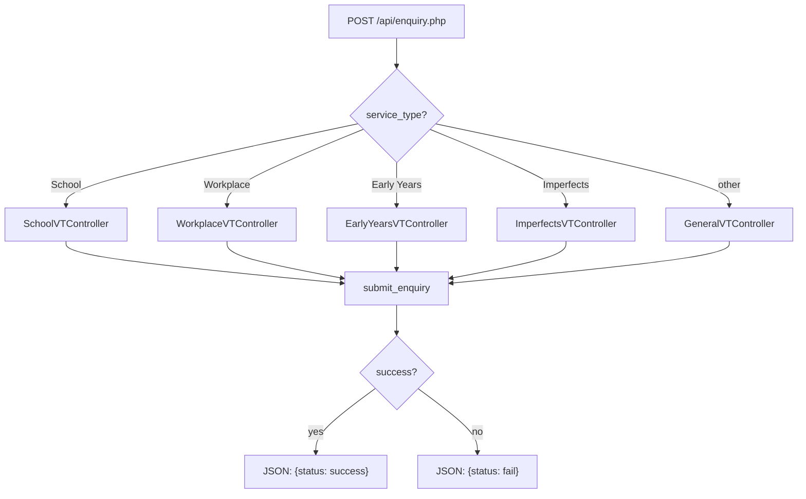
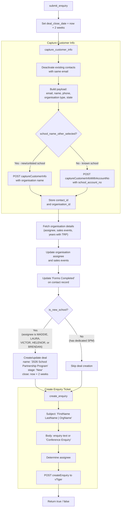
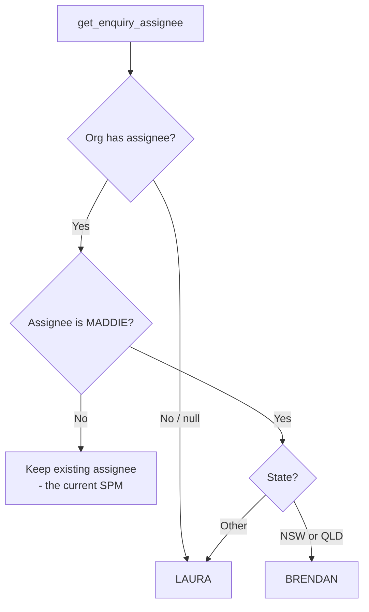
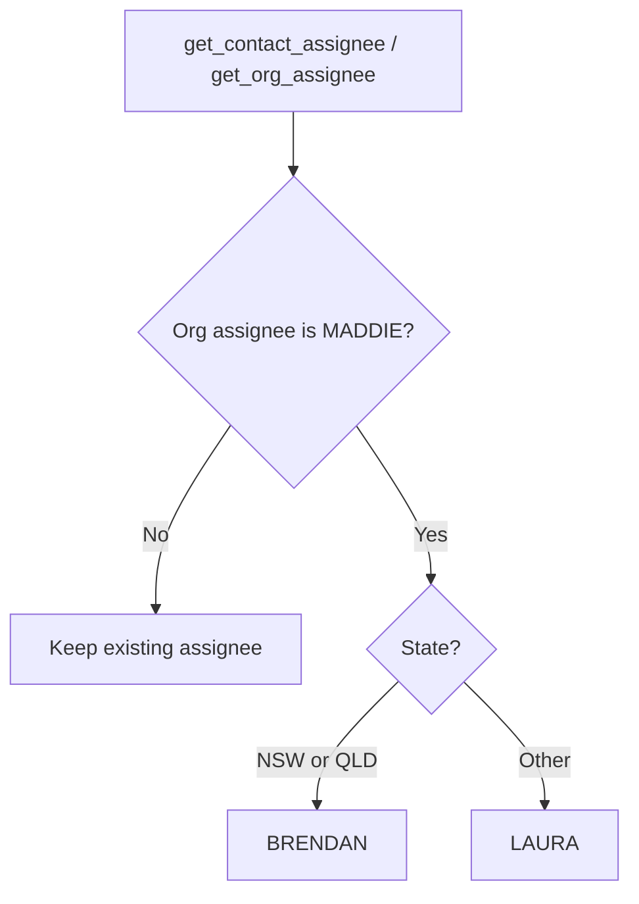

# Enquiry API Flow

## Overview

The `api/enquiry.php` endpoint accepts POST requests to create enquiry records in vTiger CRM. It routes to a service-type-specific controller, each with its own enquiry submission logic.

## Endpoint Routing

## School Enquiry Flow

## School Enquiry Assignee Logic

## Contact and Organisation Assignee Logic

The same state-based routing applies to `get_contact_assignee` and `get_org_assignee`:

## Other Service Type Enquiry Flows

```mermaid
flowchart TD
    subgraph Workplace
        W1[capture_customer_info] --> W2["Create deal\n(always, stage: 'New')"]
        W2 --> W3[create_enquiry\nassignee: LAURA]
    end

    subgraph Early Years
        EY1[capture_customer_info] --> EY2["Create deal\n(always, stage: 'New')"]
        EY2 --> EY3[create_enquiry\nassignee: BRENDAN]
    end

    subgraph General
        G1["get_contact_by_email\n(lookup only, no org capture)"] --> G2[create_enquiry\nassignee: ASHLEE]
    end

    subgraph Imperfects
        I1["get_contact_by_email\n(same as General)"] --> I2[create_enquiry\ntype: 'Imperfects'\nassignee: ASHLEE]
    end
```

