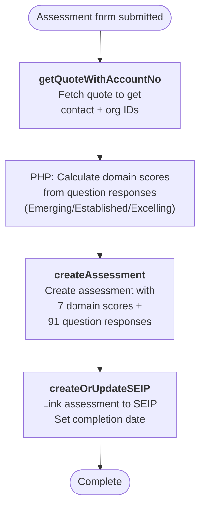

# Wellbeing Culture Assessment Flow

Triggered when a school completes the Wellbeing Culture Assessment. Creates an assessment record with domain scores and individual question responses, then links it to the school's SEIP.

---

### Quick Reference

| Layer | Detail | Docs |
|-------|--------|------|
| **Gravity Form** | Culture Assessment Form (ID: 86) | — |
| **Form Pre-population** | `GET /api/school_ltrp_details.php` (via `gform_pre_render_86`) — returns SEIP status, org name, participants, LTRP/CA completion | [v1 Form Details](../v1/form-details.md) |
| **API v1** | `POST /api/submit_ca.php` (not yet migrated to v2) | [v1 Culture Assessment](../v1/school-operations/culture-assessment.md) |
| **PHP Handler** | `Assess` trait | — |
| **VTAP Endpoints** | getQuoteWithAccountNo → createAssessment → createOrUpdateSEIP | [Endpoint Reference](../vtiger/vtap-endpoints.md) |
| **Vtiger Workflow** | None known | — |

---

## Flow Diagram

---

## Step-by-Step

### 1. Fetch quote for context
**Endpoint:** [getQuoteWithAccountNo](../vtiger/vtap-endpoints.md#getquotewithaccountno)

Retrieves the school's quote to get the contact ID and organisation details needed for the assessment record.

### 2. Calculate domain scores
**PHP logic** (not a VTAP call):

The assessment form submits boolean responses for individual questions across 7 domains. The PHP handler calculates a score for each domain:

| Domain | Questions | Score Levels |
|--------|-----------|-------------|
| Vision & Practice | VP01–VP14 | Emerging / Established / Excelling |
| Explicit Teaching | ET01–ET14 | Emerging / Established / Excelling |
| Habit Building | HB01–HB14 | Emerging / Established / Excelling |
| Staff Capacity | SC01–SC13 | Emerging / Established / Excelling |
| Staff Wellbeing | SW01–SW12 | Emerging / Established / Excelling |
| Family Capacity | FC01–FC12 | Emerging / Established / Excelling |
| Partnerships | P01–P12 | Emerging / Established / Excelling |

### 3. Create assessment record
**Endpoint:** [createAssessment](../vtiger/vtap-endpoints.md#createassessment)

Creates the Wellbeing Culture Assessment record with:
- 7 domain scores (Emerging/Established/Excelling)
- 91 individual question boolean responses
- Linked to organisation and contact
- Organisation type (e.g., "School - New")

### 4. Update SEIP
**Endpoint:** [createOrUpdateSEIP](../vtiger/vtap-endpoints.md#createorupdateseip)

Links the assessment to the school's SEIP record:
- Sets `wellbeingCultureAssessmentId` to the new assessment
- Sets `caCompleted` date
- Optionally updates `schoolContext` with HTML description

---

## Notes

- The assessment is one of the later steps in the school engagement lifecycle — it typically happens after program confirmation and before/during resource ordering
- Domain scoring thresholds are defined in the PHP handler, not in Vtiger
- The SEIP tracks assessment completion as a milestone in the school's engagement journey
