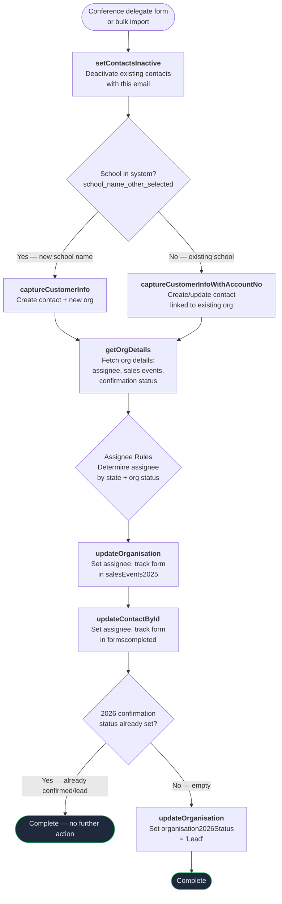

# Conference Delegate Flow

Triggered when a conference delegate's details are captured — either via a Gravity Form on the TRP website or via bulk import from a Google Sheets spreadsheet. Delegates are people who attended a conference booth and provided their contact details. This flow creates/updates the contact and organisation, then marks the organisation as a "2026 Lead".

**No deal or enquiry record is created.** Delegates are tracked as leads for future follow-up by the sales team.

---

### Quick Reference

| Layer | Detail | Docs |
|-------|--------|------|
| **Gravity Form** | Conference delegate form (via GF Webhooks Add-On) | -- |
| **Bulk Import** | `apps/conf-uploads/` Python CLI → `make run` with Prize Pack endpoint | [Import Workflow](../../apps/conf-uploads/WORKFLOW.md) |
| **API v2** | `POST /api/v2/schools/prize-pack` | [v2 Schools Endpoints](../v2/schools.md) |
| **API v1** | `POST /api/prize_pack.php` | [Prize Pack API](../v1/prize-pack.md) |
| **PHP Handler (v2)** | `ApiV2\Application\Schools\SubmitPrizePackHandler` | -- |
| **PHP Handler (v1)** | `Lead` trait on `SchoolVTController` / `WorkplaceVTController` / `EarlyYearsVTController` | -- |
| **Shared Service** | `ApiV2\Application\Schools\CustomerService` (capture, update org/contact) | -- |
| **VTAP Endpoints** | setContactsInactive → captureCustomerInfo → getOrgDetails → updateOrganisation → updateContactById → updateOrganisation (2026 lead) | [Endpoint Reference](../vtiger/vtap-endpoints.md) |
| **Vtiger Workflow** | None — no emails triggered | -- |
| **Source Form Convention** | `{Conference Name} Delegate {Year}` e.g., "NSWPDPN Delegate 2026" | -- |

---

## Flow Diagram

---

## Step-by-Step

### 1. Deactivate existing contacts
**Endpoint:** [setContactsInactive](../vtiger/vtap-endpoints.md#setcontactsinactive)

Deactivates all contacts matching the submitted email address, ensuring a clean state before creating/updating.

**Payload sent:** `{ contactEmail: <email> }`

### 2. Capture customer info
**Endpoint:** [captureCustomerInfo](../vtiger/vtap-endpoints.md#capturecustomerinfo) or [captureCustomerInfoWithAccountNo](../vtiger/vtap-endpoints.md#capturecustomerinfowithaccountno)

Creates or updates the contact and organisation. Branching depends on the `school_name_other_selected` field:

- **Truthy** (new school name typed) → `captureCustomerInfo` with `organisationName`
- **Falsy** (existing school selected) → `captureCustomerInfoWithAccountNo` with `organisationAccountNo`

**Returns:** `contact_id` and `account_id` used in all subsequent steps.

### 3. Fetch organisation details
**Endpoint:** [getOrgDetails](../vtiger/vtap-endpoints.md#getorgdetails)

Retrieves the organisation record to check:
- `assigned_user_id` — drives assignee routing
- `cf_accounts_2025salesevents` — sales event tracking
- `cf_accounts_2026confirmationstatus` — determines whether to mark as lead

### 4. Apply assignee rules and update organisation
**Endpoint:** [updateOrganisation](../vtiger/vtap-endpoints.md#updateorganisation)

Same assignee routing as the [enquiry flow](enquiry.md#4-apply-assignee-rules):
- **No assignee (null):** Defaults to LAURA (`19x8`)
- **Assignee is MADDIE (`19x1`):** NSW/QLD → BRENDAN (`19x57`), others → LAURA
- **Any other assignee:** Preserved unchanged

**Fields updated on the organisation:**

| CRM Field | VTAP Payload Key | What changes | Why |
|-----------|-----------------|--------------|-----|
| `assigned_user_id` | `assignee` | Set to resolved assignee (only if different from current) | Routes the org to the correct partnership manager based on state |
| `cf_accounts_2025salesevents` | `salesEvents2025` | Appends `source_form` value (e.g., "NSWPDPN Delegate 2026") to multi-select | Tracks which conference/form touched this org — used for reporting and deduplication |

The source form is only appended if it isn't already in the pipe-delimited list (`|##|` separator). If neither field has changed, this VTAP call is skipped entirely.

### 5. Update contact
**Endpoint:** [updateContactById](../vtiger/vtap-endpoints.md#updatecontactbyid)

**Fields updated on the contact:**

| CRM Field | VTAP Payload Key | What changes | Why |
|-----------|-----------------|--------------|-----|
| `assigned_user_id` | `assignee` | Set to resolved contact assignee (only if different from current) | Keeps contact assignee in sync with org routing |
| `cf_contacts_formscompleted` | `contactLeadSource` | Appends `source_form` value to multi-select | Tracks which forms this contact has come through — used for reporting and preventing duplicate outreach |

Same deduplication logic as the org update — the form is only appended if not already listed. Skipped entirely if no values have changed.

### 6. Mark organisation as 2026 lead
**Endpoint:** [updateOrganisation](../vtiger/vtap-endpoints.md#updateorganisation)

**Fields updated on the organisation:**

| CRM Field | VTAP Payload Key | What changes | Why |
|-----------|-----------------|--------------|-----|
| `cf_accounts_2026confirmationstatus` | `organisation2026Status` | Set to `"Lead"` (only if currently empty) | Flags the org for sales follow-up without creating a deal |

Checks `cf_accounts_2026confirmationstatus`:
- **Not empty** (already has a status like "Lead", "Confirmed", etc.) → skips, no update needed
- **Empty** → sets to `"Lead"`

---

## What Gets Created in CRM

| Record | Action | Fields Modified | Modified By (VTAP endpoint) |
|--------|--------|----------------|----------------------------|
| **Contact** | Created or updated (always) | `assigned_user_id` (assignee routing), `cf_contacts_formscompleted` (source form appended) | `captureCustomerInfo` → `updateContactById` |
| **Organisation** | Created (new) or updated (existing) | `assigned_user_id` (assignee routing), `cf_accounts_2025salesevents` (source form appended), `cf_accounts_2026confirmationstatus` (set to "Lead" if empty) | `captureCustomerInfo` → `updateOrganisation` (×2) |
| **Deal** | Not created | — | — |
| **Enquiry** | Not created | — | — |

---

## Forms and Inputs

| Source | Source Form Example | API Endpoint | Notes |
|--------|-------------------|--------------|-------|
| Gravity Form (website) | Conference delegate form | `POST /api/v2/schools/prize-pack` or `POST /api/prize_pack.php` | Direct form submission from TRP website |
| Bulk Conference Import | `NSWPDPN Delegate 2026` | `POST /api/prize_pack.php` | Via `apps/conf-uploads/` tool. See [Conference Import](conference-import.md). |

**Key form fields:**

| Field | Required | Description |
|-------|----------|-------------|
| `contact_email` | Yes | Delegate's email address |
| `contact_first_name` | Yes | First name |
| `contact_last_name` | Yes | Last name |
| `service_type` | Yes | `School`, `Workplace`, or `Early Years` |
| `source_form` | Yes | e.g., "NSWPDPN Delegate 2026" |
| `school_name_other` / `school_name_other_selected` | Conditional | New school name (if not selecting from dropdown) |
| `school_account_no` | Conditional | Existing school account number |
| `state` | No | State/territory — drives assignee routing |
| `num_of_students` | No | Number of students at the school |
| `contact_phone` | No | Phone number |

---

## Differences from Prize Pack Flow

The delegate flow and prize pack flow use the **same API endpoint** (`prize_pack.php` / `/api/v2/schools/prize-pack`) and identical processing. The only difference is the `source_form` value:

| Type | Source Form Convention | Use Case |
|------|----------------------|----------|
| Delegate | `{Conference} Delegate {Year}` | Conference attendee who visited the booth |
| Prize Pack | `{Conference} Prize Pack {Year}` | Conference attendee who entered a prize draw |

Both result in the organisation being marked as a "2026 Lead".
