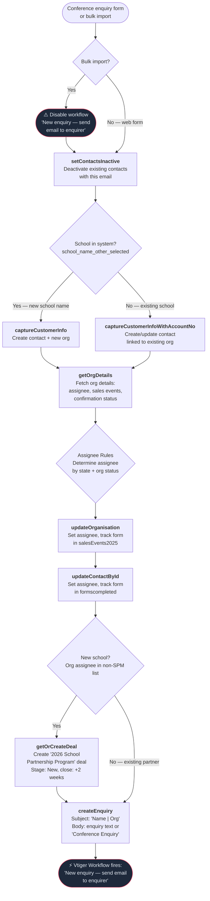

# Conference Enquiry Flow

Triggered when a conference attendee submits an enquiry — either via a conference-specific Gravity Form (Form 53) on the TRP website, or via bulk import from a Google Sheets spreadsheet. This flow runs the full [school enquiry flow](enquiry.md), creating a contact, organisation, optional deal, and an enquiry record.

**Important:** Bulk imports via the conference import tool require the email workflow to be **disabled** beforehand — otherwise every imported contact receives an automated enquiry confirmation email. See [Conference Import](conference-import.md).

---

### Quick Reference

| Layer | Detail | Docs |
|-------|--------|------|
| **Gravity Form** | School Enquiries Conferences (Form 53, via GF Webhooks Add-On) | -- |
| **Bulk Import** | `apps/conf-uploads/` Python CLI → `make run` with Enquiry endpoint | [Import Workflow](../../apps/conf-uploads/WORKFLOW.md) |
| **API v2** | `POST /api/v2/schools/enquiry` | [v2 Schools Endpoints](../v2/schools.md) |
| **API v1** | `POST /api/enquiry.php` | [Enquiry API](../v1/enquiries/index.md) |
| **PHP Handler (v2)** | `ApiV2\Application\Schools\SubmitEnquiryHandler` | -- |
| **PHP Handler (v1)** | `Enquiry` trait on `SchoolVTController` | [v1 School Enquiry](../v1/enquiries/school-enquiries.md) |
| **Domain Logic** | `ApiV2\Domain\AssigneeRules` (assignee routing), `ApiV2\Domain\Deal` (deal creation) | -- |
| **Shared Service** | `ApiV2\Application\Schools\CustomerService` (capture, update org/contact) | -- |
| **VTAP Endpoints** | setContactsInactive → captureCustomerInfo → getOrgDetails → updateOrganisation → updateContactById → getOrCreateDeal → createEnquiry | [Endpoint Reference](../vtiger/vtap-endpoints.md) |
| **Vtiger Workflow** | "New enquiry — send email to enquirer" — **must be disabled for bulk imports** | [Workflows](../vtiger/workflows.md) |
| **Source Form Convention** | `{Conference Name} Enquiry {Year}` e.g., "NSWPDPN Enquiry 2026" | -- |

---

## Flow Diagram

---

## Step-by-Step

This flow runs the full [school enquiry flow](enquiry.md#step-by-step). The key conference-specific differences are noted below.

### 1–6. Standard enquiry processing

Steps 1–6 are identical to the [school enquiry flow](enquiry.md):

1. **Deactivate existing contacts** — [setContactsInactive](../vtiger/vtap-endpoints.md#setcontactsinactive)
2. **Capture customer info** — [captureCustomerInfo](../vtiger/vtap-endpoints.md#capturecustomerinfo) or [captureCustomerInfoWithAccountNo](../vtiger/vtap-endpoints.md#capturecustomerinfowithaccountno)
3. **Fetch organisation details** — [getOrgDetails](../vtiger/vtap-endpoints.md#getorgdetails)
4. **Apply assignee rules and update organisation** — [updateOrganisation](../vtiger/vtap-endpoints.md#updateorganisation)
5. **Update contact** — [updateContactById](../vtiger/vtap-endpoints.md#updatecontactbyid)
6. **Create deal** (new schools only) — [getOrCreateDeal](../vtiger/vtap-endpoints.md#getorcreatedeal)

### 7. Create enquiry (conference-specific behaviour)
**Endpoint:** [createEnquiry](../vtiger/vtap-endpoints.md#createenquiry)

| Field | Value |
|-------|-------|
| Subject | `"{First} {Last} \| {Org Name}"` |
| Body | Form `enquiry` field, or **`"Conference Enquiry"`** as fallback |
| Type | `School` |
| Contact | Linked to the captured `contactId` |
| Assignee | Resolved via `AssigneeRules::resolveEnquiryAssignee()` |

**Conference-specific:** When no enquiry text is provided (common for bulk imports where the attendee didn't write anything specific), the body defaults to `"Conference Enquiry"`. For web form submissions via Form 53, the attendee can optionally provide enquiry text.

### 8. Email workflow fires

The Vtiger workflow "New enquiry — send email to enquirer" automatically sends a confirmation email.

> **Critical for bulk imports:** This workflow **must be disabled** before running `make run` with the Enquiry endpoint, and **re-enabled** afterwards. Otherwise every imported contact receives an email. See [Conference Import](conference-import.md#6-disable-email-workflow-enquiry-imports-only).

---

## What Gets Created in CRM

| Record | Action | Fields Modified | Modified By (VTAP endpoint) |
|--------|--------|----------------|----------------------------|
| **Contact** | Created or updated (always) | `assigned_user_id` (assignee routing), `cf_contacts_formscompleted` (source form appended) | `captureCustomerInfo` → `updateContactById` |
| **Organisation** | Created (new) or updated (existing) | `assigned_user_id` (assignee routing), `cf_accounts_2025salesevents` (source form appended) | `captureCustomerInfo` → `updateOrganisation` |
| **Deal** | Created only for new schools | Name: `2026 School Partnership Program`, stage: `New`, close date: +2 weeks. Only when org assignee is in non-SPM list. | `getOrCreateDeal` |
| **Enquiry** | Always created | Subject: `"Name \| Org"`, body: form text or `"Conference Enquiry"`, type: `School`. Triggers email workflow. | `createEnquiry` |

---

## Forms and Inputs

| Source | Form ID | Source Form Example | API Endpoint | Notes |
|--------|---------|-------------------|--------------|-------|
| School Enquiries Conferences | 53 | `NSWPDPN Enquiry 2026` | `POST /api/v2/schools/enquiry` or `POST /api/enquiry.php` | Conference-specific GF form with custom validation |
| Bulk Conference Import | -- | `NSWPDPN Enquiry 2026` | `POST /api/v2/schools/enquiry` or `POST /api/enquiry.php` | Via `apps/conf-uploads/` tool. **Disable email workflow first.** |

> **v2 conference support:** The v2 endpoint accepts an optional `source_form` field in the request body. When provided (e.g., `"VACPSP Enquiry 2026"`), it overrides the default `"Enquiry 2026"` value for form tracking on both the contact and organisation. When omitted, defaults to `"Enquiry 2026"`.

**Key form fields:**

| Field | Required | Description |
|-------|----------|-------------|
| `contact_email` | Yes | Enquirer's email address |
| `contact_first_name` | Yes | First name |
| `contact_last_name` | Yes | Last name |
| `service_type` | Yes | `School` (always for conference school enquiries) |
| `source_form` | Yes | e.g., "NSWPDPN Enquiry 2026" |
| `enquiry` | No | Enquiry text. Defaults to `"Conference Enquiry"` if empty. |
| `school_name_other` / `school_name_other_selected` | Conditional | New school name (Form 53 requires either dropdown or "Other") |
| `school_account_no` | Conditional | Existing school account number |
| `state` | No | State/territory — drives assignee routing |
| `num_of_students` | No | Number of students at the school |
| `contact_phone` | No | Phone number |

---

## How This Differs from Delegate and Prize Pack

| Aspect | Conference Enquiry | Conference Delegate | Conference Prize Pack |
|--------|-------------------|--------------------|-----------------------|
| **API Endpoint** | `enquiry.php` / `v2/schools/enquiry` | `prize_pack.php` / `v2/schools/prize-pack` | `prize_pack.php` / `v2/schools/prize-pack` |
| **Source Form** | `{Conf} Enquiry {Year}` | `{Conf} Delegate {Year}` | `{Conf} Prize Pack {Year}` |
| **Creates Deal** | Yes (new schools only) | No | No |
| **Creates Enquiry** | Yes (always) | No | No |
| **Triggers Email** | Yes (must disable for bulk imports) | No | No |
| **Marks as Lead** | No (uses deal instead) | Yes | Yes |
| **Enquiry Body** | Form text or "Conference Enquiry" | N/A | N/A |
