# Conference Lead Import Flow

Triggered when conference leads (delegates, enquiries, prize packs) need importing into Vtiger CRM from a Google Sheets spreadsheet. This is a batch operation that feeds into the standard enquiry or prize pack flows for each contact.

---

### Quick Reference

| Layer | Detail | Docs |
|-------|--------|------|
| **Data Source** | Google Sheets → TSV download | — |
| **Import Tool** | `apps/conf-uploads/` Python CLI (`make prepare` → `make run`) | [Import Workflow](../../apps/conf-uploads/WORKFLOW.md) |
| **API Endpoints** | `POST /api/enquiry.php` (enquiries) / `POST /api/prize_pack.php` (delegates) | [Enquiry API](../v1/enquiries/index.md) · [Prize Pack API](../v1/prize-pack.md) |
| **Service Types** | School, Workplace, Early Years (configured per import) | — |
| **VTAP Endpoints** | Same as enquiry flow: setContactsInactive → captureCustomerInfo → getOrgDetails → updateOrganisation → updateContactById → getOrCreateDeal → createEnquiry | [Endpoint Reference](../vtiger/vtap-endpoints.md) |
| **Vtiger Workflow** | "New enquiry — send email to enquirer" — **must be disabled before enquiry imports** | [Workflows](../vtiger/workflows.md) |
| **Source Form Convention** | `{Conference Name} {Type} {Year}` e.g., "NSWPDPN Delegate 2026" | — |

---

## Flow Diagram

```mermaid
flowchart TD
    Start([Conference attendee list\nin Google Sheets]) --> Download[Download as TSV]
    Download --> Prepare["<b>make prepare</b>\nColumn detection +\ninteractive mapping"]
    Prepare --> Review{Review\nmapping?}
    Review -- "Modify" --> Custom[Interactive\ncustomisation]
    Custom --> Prepared["*_prepared.tsv"]
    Review -- "Accept" --> Prepared

    Prepared --> Picklist["Configure vTiger picklists\n• Contacts → Forms Completed\n• Accounts → 2026 sales events"]
    Picklist --> Proof["<b>make proof</b>\nDry run — no API calls\nShows request bodies"]
    Proof --> Test["<b>make test-run ROWS=1</b>\nUpload first contact only\nVerify in vTiger"]

    Test --> Endpoint{Which API\nendpoint?}
    Endpoint -- "Enquiry" --> Disable(["⚠️ Disable workflow\n'New enquiry — send\nemail to enquirer'"])
    Disable --> Run["<b>make run</b>\nFull import"]
    Endpoint -- "Prize Pack" --> Run

    Run --> Loop["For each contact in TSV:"]
    Loop --> API["POST to /api/enquiry.php\nor /api/prize_pack.php"]
    API --> CRM["Enquiry flow runs per contact\n(see service-type flows)"]
    CRM --> More{More\ncontacts?}
    More -- "Yes" --> API
    More -- "No" --> Verify["Post-upload verification\nFilter by Forms Completed"]

    Verify --> Enable{Used enquiry\nendpoint?}
    Enable -- "Yes" --> Reenable(["⚠️ Re-enable workflow\n'New enquiry — send\nemail to enquirer'"])
    Reenable --> Done([Complete])
    Enable -- "No" --> Done

    style Disable fill:#1e293b,stroke:#f43f5e,color:#e2e8f0
    style Reenable fill:#1e293b,stroke:#f43f5e,color:#e2e8f0
```



---

## Step-by-Step

### 1. Receive and download data

Conference leads arrive as a Google Sheets spreadsheet (typically from Ash or Monica). Download as a **TSV** file (not CSV — commas appear in organisation names which would break CSV parsing).

### 2. Prepare the TSV

```bash
make prepare
```

The preparation tool (`apps/conf-uploads/src/prepare_tsv.py`):
- **Detects columns** automatically from headers using flexible matching (e.g., "First Name", "first_name", "First" all work)
- **Shows the mapping** for review and allows interactive customisation
- **Creates a cleaned copy** (`*_prepared.tsv`) with only supported columns

**Supported columns:**

| Field | Required | Header variations |
|-------|----------|-------------------|
| `first_name` | Yes | First Name, Given Name |
| `last_name` | Yes | Last Name, Surname, Family Name |
| `email` | Yes | Email, Email Address |
| `org` | Yes | Organisation, School, Workplace, Company |
| `num_of_students` | No | Number of Students, # Students |
| `job_title` | No | Job Title, Title, Position |
| `phone` | No | Phone, Mobile, Contact Number |
| `state` | No | State, State/Territory |
| `enquiry` | No | Enquiry, Comments, Notes |

### 3. Configure vTiger picklists

Before importing, the source form value must exist in **both** vTiger picklists:

1. **Contacts** module → **"Forms Completed"** field → add value (e.g., "NSWPDPN Delegate 2026")
2. **Accounts (Organisations)** module → **"2026 sales events"** field → add the **exact same** value

**Naming convention:** `{Conference Name} {Type} {Year}`

| Type | API Endpoint | Use case | Docs |
|------|-------------|----------|------|
| Delegate | `prize_pack.php` | Conference delegates | [Prize Pack API](../v1/prize-pack.md) |
| Enquiry | `enquiry.php` | Enquiries from the conference | [Enquiry API](../v1/enquiries/index.md) |
| Prize Pack | `prize_pack.php` | Prize pack requests | [Prize Pack API](../v1/prize-pack.md) |

### 4. Dry run validation

```bash
make proof
```

Shows what would be sent **without making any API calls**. The script prompts for:
- **Service type:** School, Workplace, or Early Years
- **Source form:** The exact picklist value (e.g., "NSWPDPN Delegate 2026")
- **API endpoint:** Prize Pack or Enquiry

### 5. Test with first row

```bash
make test-run ROWS=1
```

Uploads only the first contact. Check vTiger to verify all fields mapped correctly before running the full import.

### 6. Disable email workflow (enquiry imports only)

> **Critical:** If using the **Enquiry** endpoint, you **must** disable the Vtiger workflow before importing — otherwise every imported contact receives an automated enquiry confirmation email.

1. Navigate to Vtiger → Settings → Automation → Workflows
2. Find **"New enquiry — send email to enquirer"**
3. Toggle the workflow **off**

This step is **not needed** for Prize Pack / Delegate imports.

### 7. Run full import

```bash
make run
```

For each row in the TSV, the script:
1. Builds a request body with the contact data + service type + source form
2. POSTs to the selected API endpoint (`enquiry.php` or `prize_pack.php`)
3. The standard [enquiry flow](enquiry.md) or prize pack flow runs per contact
4. Logs the result (watch for non-200 responses)

**Organisation field mapping** varies by service type:

| Service Type | Org field | Selected flag |
|-------------|-----------|---------------|
| School | `school_name_other` | `school_name_other_selected` |
| Workplace | `workplace_name_other` | `workplace_name_other_selected` |
| Early Years | `earlyyears_name_other` | `service_name_other_selected` |

### 8. Post-upload verification

1. **If enquiry endpoint:** Re-enable the workflow **"New enquiry — send email to enquirer"**
2. In vTiger, filter **Contacts** by **"Forms Completed"** → your source form value
3. Verify total count matches the number of rows in the TSV
4. Check 2–3 sample contacts for correct field mapping

> **Note:** Count mismatches usually indicate duplicate emails — vTiger skips creating duplicate contacts with the same email. This is expected behaviour.

---

## What Happens Per Contact in CRM

Each imported row triggers the same CRM flow as a web form submission. The processing depends on the endpoint:

**[Enquiry endpoint](../v1/enquiries/index.md)** (`enquiry.php`) → runs the full [enquiry flow](enquiry.md):
- Contact + Organisation created/updated
- Assignee routing applied
- Deal created for new schools/workplaces/early years
- Enquiry record created (body defaults to "Conference Enquiry" if no enquiry text)

**[Prize Pack endpoint](../v1/prize-pack.md)** (`prize_pack.php`) → simpler flow:
- Contact + Organisation created/updated
- Assignee routing applied
- No deal or enquiry record created

---

## Pre-Upload Checklist

- [ ] TSV file prepared: `make prepare` creates `*_prepared.tsv`
- [ ] vTiger picklists created in **both** Contacts and Accounts modules
- [ ] Source form names are **identical** in both picklists
- [ ] For enquiry uploads: workflow **"New enquiry — send email to enquirer"** is disabled
- [ ] Column mappings reviewed and confirmed
- [ ] Service type correct (School / Workplace / Early Years)
- [ ] Dry run successful: `make proof`
- [ ] First row test successful: `make test-run ROWS=1`

## Post-Upload Checklist

- [ ] For enquiry uploads: re-enable workflow **"New enquiry — send email to enquirer"**
- [ ] Filter contacts by "Forms Completed" in vTiger — verify count
- [ ] Check 2–3 sample contacts for correct field mapping
- [ ] Note: count mismatches usually indicate duplicate emails (expected)
