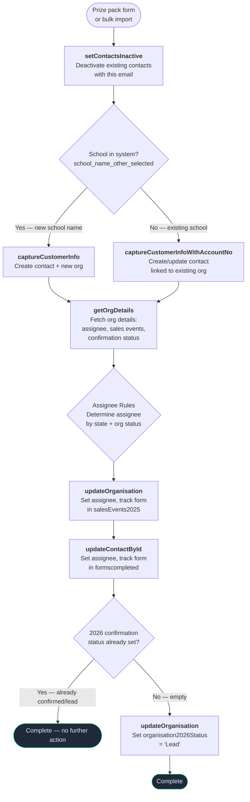

# Conference Prize Pack Flow

Triggered when a conference attendee enters a prize pack draw at a TRP conference booth. Creates/updates the contact and organisation, then marks the organisation as a "2026 Lead". Uses the same API endpoint and processing as the [delegate flow](conference-delegate.md) — the only difference is the `source_form` value.

**No deal or enquiry record is created.**

---

### Quick Reference

| Layer | Detail | Docs |
|-------|--------|------|
| **Gravity Form** | Conference prize pack form (via GF Webhooks Add-On) | -- |
| **Bulk Import** | `apps/conf-uploads/` Python CLI → `make run` with Prize Pack endpoint | [Import Workflow](../../apps/conf-uploads/WORKFLOW.md) |
| **API v2** | `POST /api/v2/schools/prize-pack` | [v2 Schools Endpoints](../v2/schools.md) |
| **API v1** | `POST /api/prize_pack.php` | [Prize Pack API](../v1/prize-pack.md) |
| **PHP Handler (v2)** | `ApiV2\Application\Schools\SubmitPrizePackHandler` | -- |
| **PHP Handler (v1)** | `Lead` trait on `SchoolVTController` / `WorkplaceVTController` / `EarlyYearsVTController` | -- |
| **Shared Service** | `ApiV2\Application\Schools\CustomerService` (capture, update org/contact) | -- |
| **VTAP Endpoints** | setContactsInactive → captureCustomerInfo → getOrgDetails → updateOrganisation → updateContactById → updateOrganisation (2026 lead) | [Endpoint Reference](../vtiger/vtap-endpoints.md) |
| **Vtiger Workflow** | None — no emails triggered | -- |
| **Source Form Convention** | `{Conference Name} Prize Pack {Year}` e.g., "NSWPDPN Prize Pack 2026" | -- |

---

## Flow Diagram

---

## Step-by-Step

The processing is identical to the [conference delegate flow](conference-delegate.md#step-by-step). See that page for full details on each step including exact CRM fields modified.

1. **Deactivate existing contacts** — [setContactsInactive](../vtiger/vtap-endpoints.md#setcontactsinactive) — deactivates all contacts matching the email
2. **Capture customer info** — [captureCustomerInfo](../vtiger/vtap-endpoints.md#capturecustomerinfo) or [captureCustomerInfoWithAccountNo](../vtiger/vtap-endpoints.md#capturecustomerinfowithaccountno) — creates/updates contact + org
3. **Fetch organisation details** — [getOrgDetails](../vtiger/vtap-endpoints.md#getorgdetails) — retrieves `assigned_user_id`, `cf_accounts_2025salesevents`, `cf_accounts_2026confirmationstatus`
4. **Update organisation** — [updateOrganisation](../vtiger/vtap-endpoints.md#updateorganisation) — sets `assigned_user_id` (assignee routing) + appends source form to `cf_accounts_2025salesevents`
5. **Update contact** — [updateContactById](../vtiger/vtap-endpoints.md#updatecontactbyid) — sets `assigned_user_id` (assignee routing) + appends source form to `cf_contacts_formscompleted`
6. **Mark organisation as 2026 lead** — [updateOrganisation](../vtiger/vtap-endpoints.md#updateorganisation) — sets `cf_accounts_2026confirmationstatus` to `"Lead"` if currently empty

---

## What Gets Created in CRM

| Record | Action | Fields Modified | Modified By (VTAP endpoint) |
|--------|--------|----------------|----------------------------|
| **Contact** | Created or updated (always) | `assigned_user_id` (assignee routing), `cf_contacts_formscompleted` (source form appended) | `captureCustomerInfo` → `updateContactById` |
| **Organisation** | Created (new) or updated (existing) | `assigned_user_id` (assignee routing), `cf_accounts_2025salesevents` (source form appended), `cf_accounts_2026confirmationstatus` (set to "Lead" if empty) | `captureCustomerInfo` → `updateOrganisation` (×2) |
| **Deal** | Not created | — | — |
| **Enquiry** | Not created | — | — |

---

## Forms and Inputs

| Source | Source Form Example | API Endpoint | Notes |
|--------|-------------------|--------------|-------|
| Gravity Form (website) | Conference prize pack form | `POST /api/v2/schools/prize-pack` or `POST /api/prize_pack.php` | Direct form submission |
| Bulk Conference Import | `NSWPDPN Prize Pack 2026` | `POST /api/prize_pack.php` | Via `apps/conf-uploads/` tool. See [Conference Import](conference-import.md). |

**Key form fields:** Same as the [delegate flow](conference-delegate.md#forms-and-inputs).

---

## How This Differs from Delegate vs Enquiry

| Aspect | Delegate | Prize Pack | Enquiry |
|--------|----------|------------|---------|
| **API Endpoint** | `prize_pack.php` | `prize_pack.php` | `enquiry.php` |
| **Source Form** | `{Conf} Delegate {Year}` | `{Conf} Prize Pack {Year}` | `{Conf} Enquiry {Year}` |
| **Creates Deal** | No | No | Yes (new schools only) |
| **Creates Enquiry** | No | No | Yes (always) |
| **Triggers Email** | No | No | Yes (enquiry confirmation) |
| **Marks as Lead** | Yes | Yes | No (uses deal instead) |
