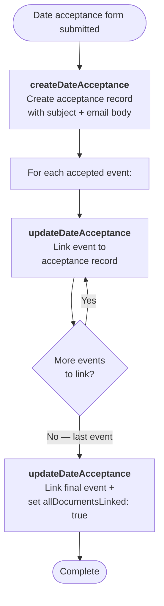

# Date Acceptance Flow

Triggered when a school accepts proposed event dates. Creates a date acceptance record and links each accepted event to it.

---

### Quick Reference

| Layer | Detail | Docs |
|-------|--------|------|
| **Gravity Form** | Date Acceptance Form (ID: 70) | — |
| **Form Pre-population** | `populate_dates.php` (server-side, via `gform_pre_render_70`) — loads available event dates from Vtiger | — |
| **API v1** | `POST /api/accept_dates.php` (not yet migrated to v2) | [v1 Date Acceptance](../v1/school-operations/date-acceptance.md) |
| **PHP Handler** | `AcceptDates` trait | — |
| **VTAP Endpoints** | createDateAcceptance → updateDateAcceptance (per event) | [Endpoint Reference](../vtiger/vtap-endpoints.md) |
| **Vtiger Workflow** | None known | — |

---

## Flow Diagram

---

## Step-by-Step

### 1. Create date acceptance record
**Endpoint:** [createDateAcceptance](../vtiger/vtap-endpoints.md#createdateacceptance)

Creates the acceptance record with:
- Subject: `"2026 School Date Acceptance"`
- Email: contact email address
- Email body: HTML-formatted details of accepted dates
- Organisation ID
- Comma-separated list of accepted event numbers

**Returns:** `date_acceptance_id` used to link events.

### 2. Link events to acceptance
**Endpoint:** [updateDateAcceptance](../vtiger/vtap-endpoints.md#updatedateacceptance) (called once per event)

For each accepted event, links it to the date acceptance record by event number. On the final event, sets `allDocumentsLinked: true` to signal completion.

---

## Notes

- This is a relatively simple flow compared to others — no customer capture or deal management
- The form data includes the contact email and organisation (identified by account number or name from the form)
- The HTML email body is generated by the PHP handler and includes formatted details of all accepted dates
