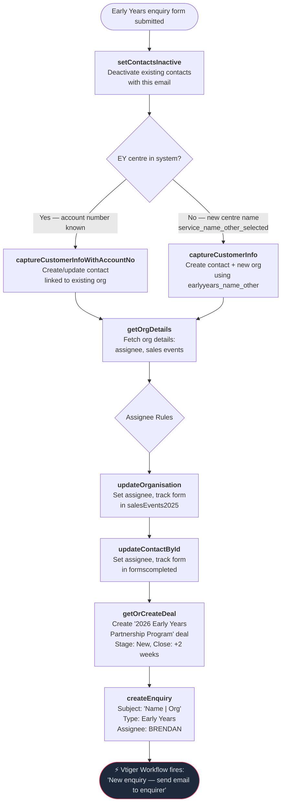

# Early Years Enquiry Flow

Triggered when an Early Years service submits an enquiry form. Creates or updates the contact and organisation in Vtiger, always creates a deal, and creates an enquiry record.

---

### Quick Reference

| Layer | Detail | Docs |
|-------|--------|------|
| **Gravity Form** | Early Years enquiry form (via GF Webhooks Add-On) | — |
| **API v1** | `POST /api/enquiry.php` (service_type=Early Years) | [v1 Early Years Enquiry](../v1/enquiries/early-years-enquiries.md) |
| **PHP Handler** | `EarlyYearsVTController::submit_enquiry()` | — |
| **VTAP Endpoints** | setContactsInactive → captureCustomerInfo → getOrgDetails → updateOrganisation → updateContactById → getOrCreateDeal → createEnquiry | [Endpoint Reference](../vtiger/vtap-endpoints.md) |
| **Vtiger Workflow** | "New enquiry — send email to enquirer" | [Workflows](../vtiger/workflows.md) |

---

## Flow Diagram

---

## Step-by-Step

### 1. Deactivate existing contacts
**Endpoint:** [setContactsInactive](../vtiger/vtap-endpoints.md#setcontactsinactive)
Deactivates all contacts matching the submitted email address.

### 2. Capture customer info
**Endpoint:** [captureCustomerInfo](../vtiger/vtap-endpoints.md#capturecustomerinfo) or [captureCustomerInfoWithAccountNo](../vtiger/vtap-endpoints.md#capturecustomerinfowithaccountno)

Two paths for identifying the Early Years centre:

| Scenario | Field | Webhook |
|---|---|---|
| New centre (not in CRM) | `earlyyears_name_other` + `service_name_other_selected` flag | captureCustomerInfo |
| Existing centre (known account) | `earlyyears_account_no` | captureCustomerInfoWithAccountNo |

**Returns:** `contact_id` and `account_id` (organisation).

### 3. Fetch organisation details
**Endpoint:** [getOrgDetails](../vtiger/vtap-endpoints.md#getorgdetails)
Retrieves the full organisation record including current assignee and sales events tracking.

### 4. Apply assignee rules
**PHP logic:** `EarlyYearsVTController` assignee methods

All Early Years assignees default to BRENDAN:

| Method | Logic |
|---|---|
| Enquiry assignee | Always **BRENDAN** (19x57) |
| Contact assignee | Org assignee if ≠ MADDIE, otherwise **BRENDAN** |
| Org assignee | Same as contact assignee |

### 5. Update organisation
**Endpoint:** [updateOrganisation](../vtiger/vtap-endpoints.md#updateorganisation)
Sets assignee and tracks form in `cf_accounts_2025salesevents`. Only calls API if something changed.

### 6. Update contact
**Endpoint:** [updateContactById](../vtiger/vtap-endpoints.md#updatecontactbyid)
Sets assignee and tracks form in `cf_contacts_formscompleted`. Only calls API if something changed.

### 7. Create deal (always)
**Endpoint:** [getOrCreateDeal](../vtiger/vtap-endpoints.md#getorcreatedeal)

Early Years enquiries **always** create a deal — no conditional check.

| Field | Value |
|---|---|
| Deal name | `2026 Early Years Partnership Program` |
| Deal type | `Early Years` |
| Org type | `Early Years - New` |
| Stage | `New` |
| Close date | Today + 2 weeks |
| Participants | `num_of_ey_children` (if provided) |

### 8. Create enquiry
**Endpoint:** [createEnquiry](../vtiger/vtap-endpoints.md#createenquiry)

- Subject: `"{Contact Name} | {Org Name}"`
- Body: enquiry text (defaults to "Conference Enquiry")
- Type: `Early Years`
- Assignee: **BRENDAN** (19x57)

> **Workflow trigger:** Creating the enquiry fires "New enquiry — send email to enquirer".

---

## What Gets Created in CRM

| Record | Always? | Details |
|--------|---------|---------|
| Contact | Yes | Created or updated with email, name, phone, job title |
| Organisation | Yes | Created (new) or updated (existing) — assignee and form tracking |
| Deal | Yes | `2026 Early Years Partnership Program`, stage `New`, close +2 weeks |
| Enquiry | Yes | Type `Early Years`, assigned to BRENDAN |
