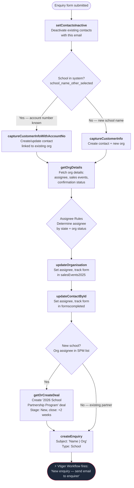
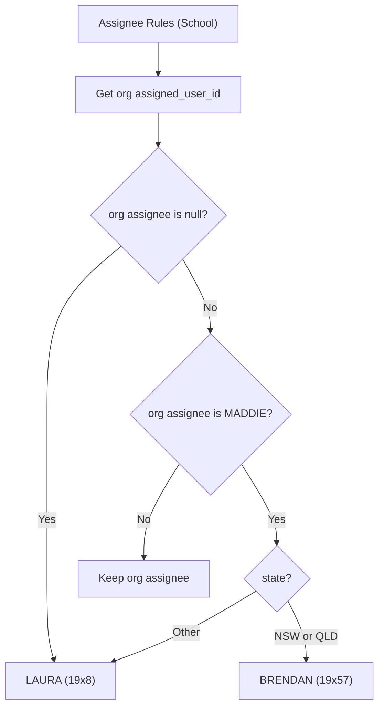

# School Enquiry Flow

Triggered when a school submits an enquiry form. Creates or updates the contact and organisation in Vtiger, optionally creates a deal (for new schools), and always creates an enquiry record.

---

### Quick Reference

| Layer | Detail | Docs |
|-------|--------|------|
| **Gravity Form** | School enquiry form (via GF Webhooks Add-On) | -- |
| **API v2 (current)** | `POST /api/v2/schools/enquiry` | [v2 Schools Endpoints](../v2/schools.md) |
| **API v1 (deprecated)** | `POST /api/enquiry.php` | [v1 Enquiry Endpoints](../v1/enquiries/index.md) |
| **PHP Handler (v2)** | `ApiV2\Application\Schools\SubmitEnquiryHandler` | -- |
| **PHP Handler (v1)** | `Enquiry` trait on `SchoolVTController` | [v1 School Enquiry](../v1/enquiries/school-enquiries.md) |
| **Domain Logic** | `ApiV2\Domain\AssigneeRules` (assignee routing), `ApiV2\Domain\Deal` (deal creation) | -- |
| **Shared Service** | `ApiV2\Application\Schools\CustomerService` (capture, update org/contact) | -- |
| **VTAP Endpoints** | setContactsInactive -> captureCustomerInfo -> getOrgDetails -> updateOrganisation -> updateContactById -> getOrCreateDeal -> createEnquiry | [Endpoint Reference](../vtiger/vtap-endpoints.md) |
| **Vtiger Workflow** | "New enquiry -- send email to enquirer" | [Workflows](../vtiger/workflows.md) |

---

## Flow Diagram

---

## Step-by-Step

### 1. Deactivate existing contacts
**Endpoint:** [setContactsInactive](../vtiger/vtap-endpoints.md#setcontactsinactive)

Deactivates all contacts matching the submitted email address. This ensures a clean state before creating/updating the contact -- prevents duplicate active contacts.

**Payload sent:** `{ contactEmail: <email> }`

### 2. Capture customer info
**Endpoint:** [captureCustomerInfo](../vtiger/vtap-endpoints.md#capturecustomerinfo) or [captureCustomerInfoWithAccountNo](../vtiger/vtap-endpoints.md#capturecustomerinfowithaccountno)

Creates or updates the contact and organisation in Vtiger. The branching logic checks the `school_name_other_selected` field from the form data:

- **Truthy** (user typed a new school name) -> calls `captureCustomerInfo` with `organisationName`
- **Falsy** (user selected an existing school from the dropdown) -> calls `captureCustomerInfoWithAccountNo` with `organisationAccountNo`

Both endpoints receive the same base payload built by `CustomerService::buildCustomerPayload()`:

| Field | Source |
|-------|--------|
| `contactEmail` | Form `email` |
| `contactFirstName` / `contactLastName` | Form `first_name` / `last_name` |
| `organisationType` | Always `"School"` |
| `state` | Form `state` (optional) |
| `contactType` | Form `type` (e.g. Teacher, Principal) |
| `contactPhone` / `orgPhone` | Form phone fields (optional) |
| `newsletter` | Form newsletter opt-in (optional) |
| `jobTitle` | Form job title (optional) |
| `organisationNumOfStudents` | Form `num_of_students` (optional) |
| `contactLeadSource` | Form `lead_source` (optional) |
| `organisationSubType` | Form `sub_type` (optional) |

**Returns:** `contact_id` and `account_id` (organisation) used in all subsequent steps. These are cached on the `CustomerService` instance.

### 3. Fetch organisation details
**Endpoint:** [getOrgDetails](../vtiger/vtap-endpoints.md#getorgdetails)

Retrieves the full organisation record and caches it on `CustomerService`. The following fields are extracted:

| CRM Field | Purpose |
|-----------|---------|
| `assigned_user_id` | Current assignee -- drives assignee routing and new-school detection |
| `cf_accounts_2025salesevents` | Sales events tracking (pipe-delimited multi-select) |
| `cf_accounts_freetravel` | Free travel status |
| `cf_accounts_yearswithtrp` | Number of years partnered with TRP |
| `cf_accounts_2024inspire` | 2024 Inspire status |
| `cf_accounts_2025inspire` | 2025 Inspire status |
| `cf_accounts_2024confirmationstatus` | 2024 confirmation status |
| `cf_accounts_2025confirmationstatus` | 2025 confirmation status |
| `cf_accounts_2026confirmationstatus` | 2026 confirmation status |

This data drives assignee routing and determines whether the school is "new" or "existing".

### 4. Apply assignee rules
**PHP logic** (not a VTAP call): `AssigneeRules` (v2) or controller methods (v1)

Three separate assignee resolutions happen during the flow, each with slightly different rules:

| Resolution | Method | Used for |
|------------|--------|----------|
| Organisation assignee | `AssigneeRules::resolveOrgAssignee()` | Updating the org record (step 5) |
| Contact assignee | `AssigneeRules::resolveContactAssignee()` | Updating the contact record (step 6) and assigning the deal (step 7) |
| Enquiry assignee | `AssigneeRules::resolveEnquiryAssignee()` | Assigning the enquiry record (step 8) |

All three methods follow the same core logic but differ in how they handle null assignees:

**Key routing rules:**
- **No assignee (null):** Defaults to LAURA (`19x8`) -- this covers brand new organisations that have just been created
- **Assignee is MADDIE (`19x1`):** MADDIE is the CRM admin/default user, so her assignment is treated as "unassigned". NSW and QLD schools are routed to BRENDAN (`19x57`); all other states go to LAURA
- **Any other assignee:** The school already has a dedicated partnership manager -- their assignee is preserved unchanged

The `routeByState()` helper handles the geographic split: NSW and QLD -> BRENDAN, everything else -> the provided default (LAURA).

### 5. Update organisation
**Endpoint:** [updateOrganisation](../vtiger/vtap-endpoints.md#updateorganisation)

Updates the organisation with two potential changes:

1. **Assignee:** If the resolved assignee differs from the current one, sends the new `assignee` value. The response's `assigned_user_id` is cached back onto `CustomerService` so that subsequent steps (new-school check, deal creation) use the updated value.
2. **Sales events tracking:** Appends the current form (from `source_form`) to the `cf_accounts_2025salesevents` multi-select field, but only if the form isn't already listed. The existing value is split on ` |##| ` (Vtiger's multi-select delimiter).

If neither value has changed, this VTAP call is skipped entirely.

### 6. Update contact
**Endpoint:** [updateContactById](../vtiger/vtap-endpoints.md#updatecontactbyid)

Updates the contact with:

1. **Assignee:** Set via `AssigneeRules::resolveContactAssignee()` using the (now-updated) org assignee and state
2. **Forms completed:** Appends the current form to `cf_contacts_formscompleted` (same deduplication logic as the org sales events field)

As with step 5, this call is skipped if no values have changed.

### 7. Create deal (new schools only)
**Endpoint:** [getOrCreateDeal](../vtiger/vtap-endpoints.md#getorcreatedeal)

#### New school detection

`AssigneeRules::isNewSchool()` determines whether a school is "new" by checking if the organisation's assignee is in the **non-SPM list** -- i.e., generic/internal staff who are not dedicated School Partnership Managers:

| Staff Member | User ID | Role |
|-------------|---------|------|
| MADDIE | `19x1` | CRM admin / default |
| LAURA | `19x8` | Internal team |
| VICTOR | `19x33` | Internal team |
| HELENOR | `19x24` | Internal team |
| BRENDAN | `19x57` | Internal team |

If the organisation's assignee **is** in this list, the school is considered "new" -- it doesn't have a dedicated partnership manager, so a deal is created to track the new relationship.

If the assignee is **not** in this list, the school already has a dedicated SPM (e.g., a regional partnership manager). This means it's an existing partner, so no deal is created -- the enquiry is simply logged.

#### Deal details

When a deal is created, `Deal::forSchoolEnquiry()` produces:

| Field | Value |
|-------|-------|
| Name | `2026 School Partnership Program` |
| Type | `School` |
| Org Type | `School - New` |
| Stage | `New` |
| Close Date | **+2 weeks from today** (formatted `d/m/Y`) |

The deal payload also includes:
- `contactId` and `organisationId` from the customer capture step
- `assignee` resolved via `AssigneeRules::resolveContactAssignee()`
- `dealNumOfParticipants` from `participating_num_of_students` or `num_of_students` (if provided)
- `dealState` from the form's `state` field (if provided)

### 8. Create enquiry
**Endpoint:** [createEnquiry](../vtiger/vtap-endpoints.md#createenquiry)

Creates the enquiry record with:

| Field | Value |
|-------|-------|
| Subject | `"{First} {Last} \| {Org Name}"` (org name appended only if available) |
| Body | Form `enquiry` field, or `"Conference Enquiry"` as fallback |
| Type | `School` |
| Contact | Linked to the captured `contactId` |
| Assignee | Resolved via `AssigneeRules::resolveEnquiryAssignee()` |

> **Workflow trigger:** Creating the enquiry fires the Vtiger workflow "New enquiry -- send email to enquirer", which automatically emails the person who submitted the form.

---

## What Gets Created in CRM

Summary of all CRM records created or updated during a school enquiry:

| Record | Action | Detail |
|--------|--------|--------|
| **Contact** | Created or updated (always) | Matched by email. Existing contacts with the same email are deactivated first, then a new/updated contact is created. Assignee and `formscompleted` tracking field are set. |
| **Organisation** | Created (new school) or updated (existing) | If the user typed a new school name, a new org is created. If they selected from the dropdown, the existing org is updated. Assignee routing is applied and the form is tracked in `salesEvents2025`. |
| **Deal** | Created only for new schools | `2026 School Partnership Program` deal with stage `New` and close date +2 weeks from submission. Only created when the org assignee is in the non-SPM list (MADDIE, LAURA, VICTOR, HELENOR, BRENDAN). |
| **Enquiry** | Always created | Type `School`, subject `"Name \| Org"`, linked to the contact. Triggers the automated email workflow to the enquirer. |

---

## Forms That Trigger This Flow

Multiple Gravity Forms feed into this same enquiry flow via the GF Webhooks Add-On. The CRM processing is identical — the only difference is the `source_form` value tracked on the contact and organisation records.

| Form | ID | Source Form Example | Notes |
|------|----|-------------------|-------|
| School Enquiry | — | Website enquiry form | Standard enquiry from the TRP website |
| School Enquiries Conferences | 53 | `NSWPDPN Enquiry 2026` | Conference-specific form. Enquiry body defaults to "Conference Enquiry" if no text provided. Has custom validation: requires either school dropdown selection or "Other" checkbox. |
| Bulk Conference Import | — | `NSWPDPN Delegate 2026` | Batch import via `apps/conf-uploads/` tool. See [Conference Lead Import](conference-import.md) flow. Email workflow must be disabled before bulk enquiry imports. |

The `source_form` value follows the convention `{Conference Name} {Type} {Year}` for conference forms, and must match the vTiger picklist values in both Contacts ("Forms Completed") and Accounts ("2026 sales events").
