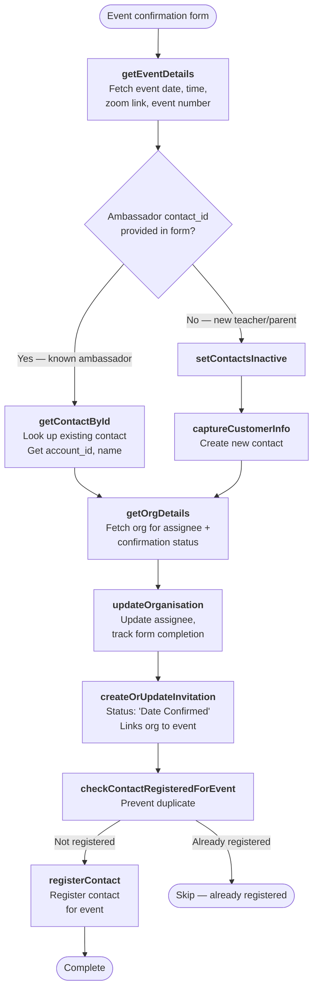

# Event Confirmation Flow

Triggered when an ambassador, teacher, or parent confirms attendance at an event. Unlike other flows, event confirmations can use an **existing contact ID** (ambassador) rather than creating a new contact.

---

### Quick Reference

| Layer | Detail | Docs |
|-------|--------|------|
| **Gravity Form** | Event Confirmation Form (ID: 72) | — |
| **Form Pre-population** | `populate_event_date.php` (server-side, via `gform_pre_render_72`) | — |
| **API v2** | `POST /api/v2/schools/register` (`source_form = event_confirmation`) | [v2 Schools Endpoints](../v2/schools.md) |
| **API v1** | `POST /api/register.php` | [v1 School Registrations](../v1/registrations/school-registrations.md) |
| **PHP Handler** | `SubmitRegistrationHandler` (v2) / `SchoolVTController::submit_event_registration()` (v1) | — |
| **VTAP Endpoints** | getEventDetails → getContactById / captureCustomerInfo → getOrgDetails → updateOrganisation → createOrUpdateInvitation → checkContactRegisteredForEvent → registerContact | [Endpoint Reference](../vtiger/vtap-endpoints.md) |
| **Vtiger Workflow** | None known | — |

---

## Flow Diagram

---

## Step-by-Step

### 1. Get event details
**Endpoint:** [getEventDetails](../vtiger/vtap-endpoints.md#geteventdetails)

Fetches event metadata — date, time, event number, short name, and zoom link.

### 2. Resolve contact

**Two paths depending on form data:**

**Path A — Known ambassador** (contact_id provided):
- **Endpoint:** [getContactById](../vtiger/vtap-endpoints.md#getcontactbyid)
- Looks up the existing ambassador contact to get their `account_id` (organisation link), name, and current data

**Path B — New teacher/parent** (no contact_id):
- **Endpoints:** [setContactsInactive](../vtiger/vtap-endpoints.md#setcontactsinactive) → [captureCustomerInfo](../vtiger/vtap-endpoints.md#capturecustomerinfo)
- Standard contact capture flow — deactivate old contacts, create new one

### 3. Fetch and update organisation
**Endpoints:** [getOrgDetails](../vtiger/vtap-endpoints.md#getorgdetails) → [updateOrganisation](../vtiger/vtap-endpoints.md#updateorganisation)

Fetches the org's current assignee and confirmation status, then updates with form tracking data.

### 4. Create invitation
**Endpoint:** [createOrUpdateInvitation](../vtiger/vtap-endpoints.md#createorupdateinvitation)

Creates or updates an invitation record linking the organisation to the event. Always sets status to `Date Confirmed`.

### 5. Register for event
**Endpoints:** [checkContactRegisteredForEvent](../vtiger/vtap-endpoints.md#checkcontactregisteredforevent) → [registerContact](../vtiger/vtap-endpoints.md#registercontact)

Checks for duplicate registration, then registers the contact for the event with attendance details.

---

## Key Difference from Other Flows

| Aspect | Event Confirmation | Other Flows |
|--------|-------------------|-------------|
| Contact resolution | Can use existing contact_id | Always creates new contact |
| Invitation record | Always created | Not created |
| Deal creation | Never | New schools only |
| Enquiry creation | Never | Existing schools only |
