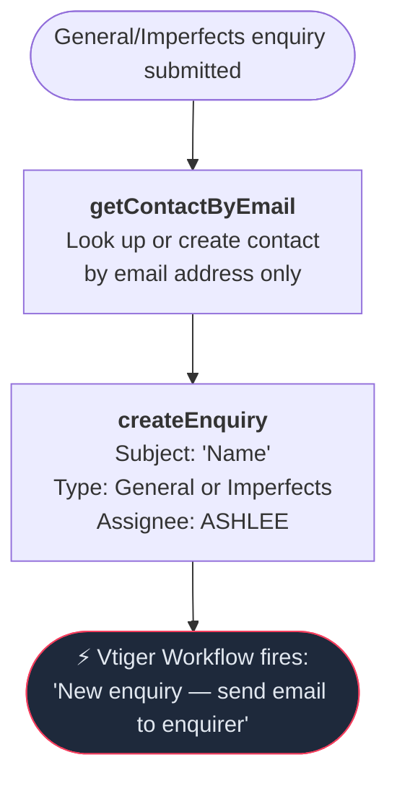

# General & Imperfects Enquiry Flow

Triggered when a general enquiry is submitted (no specific service type) or an Imperfects enquiry. Uses the simplest path through the system — no organisation handling, no deal creation, and only two VTAP calls.

---

### Quick Reference

| Layer | Detail | Docs |
|-------|--------|------|
| **Gravity Form** | General enquiry form (via GF Webhooks Add-On) | — |
| **API v1** | `POST /api/enquiry.php` (service_type=General or Imperfects or missing) | [v1 General Enquiry](../v1/enquiries/general-enquiries.md) |
| **PHP Handler** | `GeneralVTController::submit_enquiry()` / `ImperfectsVTController` | — |
| **VTAP Endpoints** | getContactByEmail → createEnquiry | [Endpoint Reference](../vtiger/vtap-endpoints.md) |
| **Vtiger Workflow** | "New enquiry — send email to enquirer" | [Workflows](../vtiger/workflows.md) |

---

## How This Differs from Other Enquiry Flows

| Aspect | School / Workplace / EY | General / Imperfects |
|---|---|---|
| Contact capture | Full flow: deactivate → captureCustomerInfo → update org → update contact | Simplified: `getContactByEmail` only |
| Organisation | Created or linked | Not handled |
| Deal | Created (conditionally or always) | Never created |
| Contacts deactivated | Yes | No |
| Form tracking | Yes (updates salesEvents and formsCompleted) | No |
| VTAP calls | 7 | 2 |

---

## Flow Diagram

---

## Step-by-Step

### 1. Look up contact
**Endpoint:** [getContactByEmail](../vtiger/vtap-endpoints.md#getcontactbyemail)

Uses a **custom `capture_customer_info()` override** that bypasses the standard flow entirely. Instead of the full deactivate → capture → update sequence, it:

1. Builds a minimal request: `contactEmail`, `contactFirstName`, `contactLastName`, and optionally `contactPhone`
2. Calls `getContactByEmail` — looks up or creates a basic contact record
3. Sets `contact_id` from the response
4. Does **not** set `organisation_id`, call `deactivate_contacts()`, `update_organisation()`, or `update_contact()`

### 2. Create enquiry
**Endpoint:** [createEnquiry](../vtiger/vtap-endpoints.md#createenquiry)

Creates the enquiry record:
- Subject: `"{Contact Name}"` (no organisation name since none is captured)
- Body: enquiry text (defaults to "Conference Enquiry")
- Assignee: **ASHLEE** (19x29) — always
- Type: `General` or `Imperfects` (only difference between the two controllers)

> **Workflow trigger:** Creating the enquiry fires "New enquiry — send email to enquirer".

---

## Imperfects vs General

`ImperfectsVTController` extends `GeneralVTController` with a single override:

| | General | Imperfects |
|---|---|---|
| Enquiry type | `General` | `Imperfects` |
| Everything else | Identical | Identical |

---

## Assignee Routing

Fixed assignees — no state or org-based routing:

| Method | Returns |
|---|---|
| Enquiry assignee | **ASHLEE** (19x29) |
| Contact assignee | **MADDIE** (19x1) |
| Org assignee | **MADDIE** (19x1) |

---

## What Gets Created in CRM

| Record | Always? | Details |
|--------|---------|---------|
| Contact | Yes | Looked up by email or created with minimal fields |
| Organisation | No | Not handled in this flow |
| Deal | No | Never created |
| Enquiry | Yes | Type `General` or `Imperfects`, assigned to ASHLEE |
