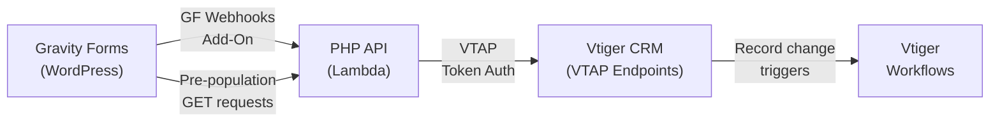

# Business Flows

End-to-end documentation of how form submissions are processed across the entire stack — from Gravity Forms through the PHP API to Vtiger CRM. Each flow page includes a Quick Reference table mapping every layer with links to the relevant documentation.

---

## Flow Index

### Enquiry Flows

| Flow | Form | API | VTAP Endpoints | Workflow |
|------|------|-----|----------------|----------|
| [School Enquiry](enquiry.md) | GF Webhooks | v1 + v2 | 7 endpoints | Sends enquiry email |
| [Workplace Enquiry](workplace-enquiry.md) | GF Webhooks | v1 only | 7 endpoints | Sends enquiry email |
| [Early Years Enquiry](early-years-enquiry.md) | GF Webhooks | v1 only | 7 endpoints | Sends enquiry email |
| [General / Imperfects Enquiry](general-enquiry.md) | GF Webhooks | v1 only | 2 endpoints | Sends enquiry email |

### Conference Flows

| Flow | Form | API | VTAP Endpoints | Workflow |
|------|------|-----|----------------|----------|
| [Conference Delegate](conference-delegate.md) | GF Webhooks / Bulk Import | v1 + v2 (`prize_pack`) | 6 endpoints | — |
| [Conference Prize Pack](conference-prize-pack.md) | GF Webhooks / Bulk Import | v1 + v2 (`prize_pack`) | 6 endpoints | — |
| [Conference Enquiry](conference-enquiry.md) | Form 53 / Bulk Import | v1 + v2 (`enquiry`) | 7 endpoints | Sends enquiry email |
| [Conference Lead Import](conference-import.md) | — (batch tool) | v1 only | Per-contact (above flows) | Must disable for enquiries |

### School Operations Flows

| Flow | Form | API | VTAP Endpoints | Workflow |
|------|------|-----|----------------|----------|
| [School Registration](registration.md) | GF Webhooks | v1 + v2 | 10 endpoints | — |
| [Event Confirmation](event-confirmation.md) | Form 72 | v1 + v2 | 7 endpoints | — |
| [Program Confirmation](program-confirmation.md) | Form 76/80 | v1 only | 9 endpoints | — |
| [Order Resources](order-resources.md) | Form 63/89 | v1 only | 8 endpoints | — |
| [Date Acceptance](date-acceptance.md) | Form 70 | v1 only | 2 endpoints | — |
| [Assessment](assessment.md) | Form 86 | v1 only | 3 endpoints | — |

---

## What Each Flow Page Covers

Every flow page includes:

- **Quick Reference table** — maps each layer (form, pre-population, API endpoint, PHP handler, VTAP endpoints, workflows) with links to relevant docs
- **Flow diagram** — Mermaid diagram showing the sequence of VTAP endpoint calls with decision points
- **Step-by-step breakdown** — detailed description of each step with links to the [VTAP Endpoint Reference](../vtiger/vtap-endpoints.md)

## Cross-References

| Section | What it covers | Link |
|---------|---------------|------|
| API v1 | Controller-based PHP endpoints | [v1 docs](../v1/index.md) |
| API v2 | DDD-lite school endpoints | [v2 docs](../v2/schools.md) |
| VTAP Endpoints | Request/response fields for all 37 CRM operations | [Endpoint Reference](../vtiger/vtap-endpoints.md) |
| Vtiger Workflows | Automated actions triggered by record changes | [Workflows](../vtiger/workflows.md) |

## How to Read the Diagrams

- Each **box** is a VTAP endpoint call — click through to the [VTAP Endpoint Reference](../vtiger/vtap-endpoints.md) for full request/response details
- **Diamond** shapes are decision points in the PHP code
- **Rounded** shapes are start/end points
- Flows are driven by PHP handlers in `src/api-v2/Application/Schools/` (v2) or `src/api/classes/traits/` (v1)
