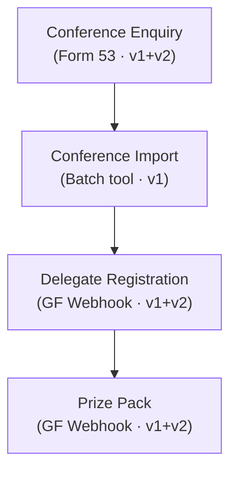

# Conference Journey

The lifecycle of conference lead capture, from initial enquiry through delegate registration to prize pack fulfilment.

## Journey Map

## Stages

| # | Stage | Flow Doc | Form IDs | API | VTAP Calls | Workflows |
|---|-------|----------|----------|-----|------------|-----------|
| 1 | Enquiry | [Conference Enquiry](../conference-enquiry.md) | 53 | v1 + v2 | 7 | Yes |
| 2 | Import | [Conference Import](../conference-import.md) | — | v1 | 7 | Conditional |
| 3 | Delegate | [Delegate Registration](../conference-delegate.md) | — | v1 + v2 | 6 | — |
| 4 | Prize Pack | [Prize Pack](../conference-prize-pack.md) | — | v1 + v2 | 6 | — |

## Flow

1. **Conference Enquiry** — A lead submits an enquiry at a conference via Form 53. Uses the same CRM flow as a standard school enquiry — creates/updates contact and organisation, finds or creates a deal, and creates an enquiry record. The email workflow fires.

2. **Conference Import** — After a conference, the batch import tool (`apps/conf-uploads/`) processes collected leads in bulk. For each lead it calls either the enquiry endpoint (for new leads) or the prize pack endpoint (for delegate registrations). The email workflow must be **disabled** during bulk imports to avoid spamming leads.

3. **Delegate Registration** — A conference attendee registers as a delegate. The API captures customer info and updates the organisation. No deal or enquiry is created — this is a lighter-weight flow than a full enquiry.

4. **Prize Pack** — A conference attendee requests a prize pack. Same CRM flow as delegate registration — captures customer info and updates the organisation. The prize pack details are recorded against the contact.

## Decision Points

- **Enquiry vs Import** — Individual leads coming in during the conference go through the enquiry flow. Batch processing after the conference uses the import tool.
- **Import branching** — The import tool decides per-row whether to call the enquiry endpoint or the prize pack endpoint based on the lead data.
- **Workflow disable** — The "New enquiry -- send email to enquirer" workflow must be manually disabled before running bulk imports, then re-enabled afterwards.
