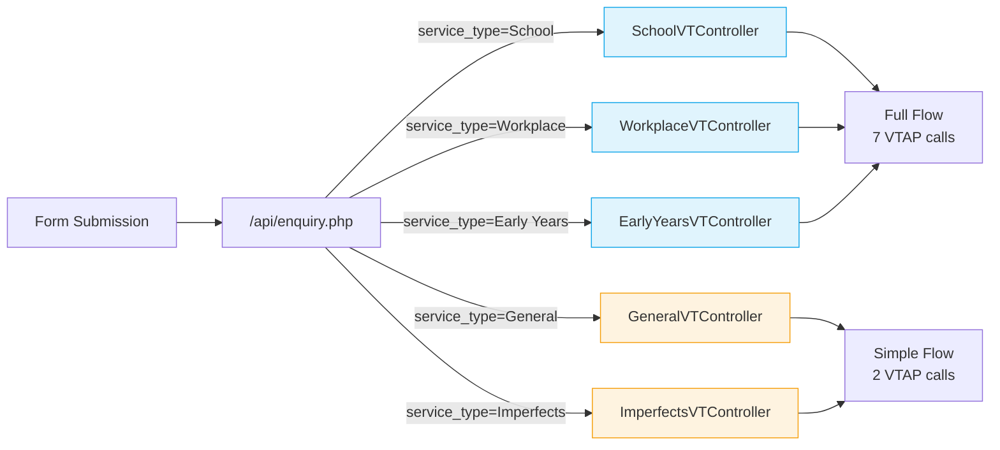

# Enquiries Overview

How the four enquiry types relate to each other. All enquiry flows share the same API endpoint (`/api/enquiry.php`) but are routed to different controllers based on the `service_type` parameter.

## Enquiry Types

## Comparison

| Enquiry Type | Flow Doc | API Version | Service Type | VTAP Calls | Contact/Org Update | Deal Created |
|-------------|----------|-------------|--------------|------------|-------------------|--------------|
| [School](../enquiry.md) | v1 + v2 | `School` | 7 | Yes | Yes |
| [Workplace](../workplace-enquiry.md) | v1 only | `Workplace` | 7 | Yes | Yes |
| [Early Years](../early-years-enquiry.md) | v1 only | `Early Years` | 7 | Yes | Yes |
| [General](../general-enquiry.md) | v1 only | `General` | 2 | No | No |

## Shared vs Different

### What all enquiries share
- Same v1 endpoint: `POST /api/enquiry.php`
- Same workflow trigger: "New enquiry -- send email to enquirer"
- `createEnquiry` VTAP call to record the enquiry in CRM

### What differs

**School, Workplace, and Early Years** use the full flow:
1. `setContactsInactive` — marks existing contacts as inactive
2. `captureCustomerInfo` — creates/updates contact and organisation
3. `getOrgDetails` + `updateOrganisation` — enriches organisation data
4. `updateContactById` — updates contact with additional fields
5. `getOrCreateDeal` — finds or creates a partnership deal
6. `createEnquiry` — records the enquiry

**General and Imperfects** use a simplified flow:
1. `getContactByEmail` — looks up existing contact
2. `createEnquiry` — records the enquiry (no org/deal work)

### v2 migration status
Only the **School** enquiry has been migrated to v2 (`POST /api/v2/schools/enquiry`). Workplace, Early Years, and General remain v1-only.

## Assignee Routing

Enquiry assignees are determined by the contact's state (Australian state/territory). See the [School Enquiry flow](../enquiry.md) for the full assignee routing rules. Workplace and Early Years use different assignee logic defined in their respective controller classes.
