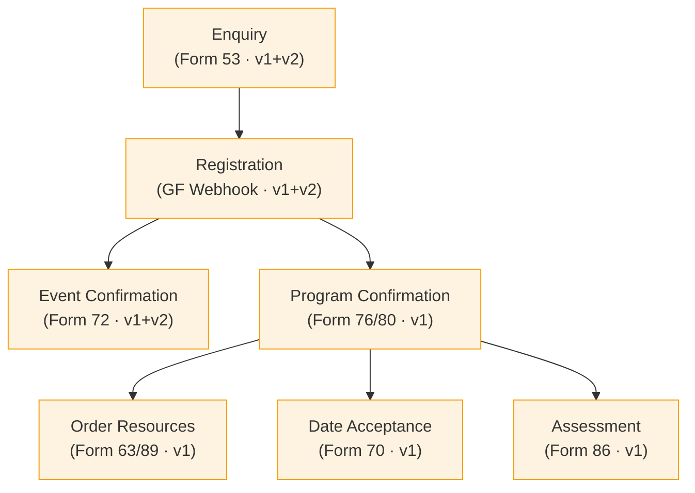

# Schools Journey

The full lifecycle of a school partnership, from initial enquiry through to wellbeing culture assessment.

## Journey Map

## Stages

| # | Stage | Flow Doc | Form IDs | API | VTAP Calls | Workflows |
|---|-------|----------|----------|-----|------------|-----------|
| 1 | Enquiry | [School Enquiry](../enquiry.md) | 53 | v1 + v2 | 7 | Yes |
| 2 | Registration | [Registration](../registration.md) | — | v1 + v2 | 10 | Conditional |
| 3 | Event Confirmation | [Event Confirmation](../event-confirmation.md) | 72 | v1 + v2 | 9 | — |
| 4 | Program Confirmation | [Program Confirmation](../program-confirmation.md) | 76, 80 | v1 | 9 | — |
| 5 | Order Resources | [Order Resources](../order-resources.md) | 63, 89 | v1 | 8 | — |
| 6 | Date Acceptance | [Date Acceptance](../date-acceptance.md) | 70 | v1 | 2 | — |
| 7 | Assessment | [Assessment](../assessment.md) | 86 | v1 | 3 | — |

## Flow

1. **Enquiry** — A school submits an enquiry via Form 53. The API creates/updates the contact and organisation, finds or creates a deal, and creates an enquiry record. An email workflow notifies the enquirer.

2. **Registration** — The school registers for events. The API looks up event details, captures customer info, creates or updates the deal, and registers the contact for the event.

3. **Event Confirmation** — An ambassador, teacher, or parent confirms attendance at a specific event via Form 72. This creates/updates an invitation and registers the contact.

4. **Program Confirmation** — The school confirms their program via Form 76 (2025) or 80 (2026). The API captures customer info, updates the deal with selected services, creates a quote, and sets up a SEIP.

5. **Order Resources** — The school orders curriculum resources via Form 63 (2025) or 89 (2026). The API looks up the existing quote, deal, and organisation, then creates an invoice.

6. **Date Acceptance** — The school accepts proposed event dates via Form 70. Creates and confirms a date acceptance record.

7. **Assessment** — The school completes the Wellbeing Culture Assessment via Form 86. The API looks up the existing quote, creates assessment records with domain scores, and updates the SEIP.

## Decision Points

- **Registration** can branch to either **Event Confirmation** (specific event attendance) or **Program Confirmation** (full program commitment) depending on the school's next step.
- **Program Confirmation** unlocks three parallel paths: resource ordering, date acceptance, and assessment — these can happen in any order.
- **Existing schools** (those that skip the enquiry stage) enter directly at Registration via the `confirm_existing_schools.php` endpoint.
