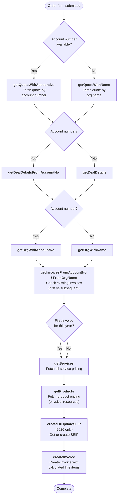

# Order Resources / Invoice Creation Flow

Triggered when a school orders curriculum resources. Retrieves the existing quote and deal, fetches product/service pricing, and creates an invoice with line items.

---

### Quick Reference

| Layer | Detail | Docs |
|-------|--------|------|
| **Gravity Form** | Curriculum Ordering Form 2025 (ID: 63) / 2026 (ID: 89) | — |
| **Form Pre-population** | `GET /api/school_curric_ordering_details.php` (via `gform_pre_render`) — returns engage status, free shipping, funded years, deal type | [v1 Form Details](../v1/form-details.md) |
| **API v1** | `POST /api/order_resources.php` / `POST /api/order_resources_2026.php` (not yet migrated to v2) | [v1 Resource Ordering](../v1/school-operations/resource-ordering.md) |
| **PHP Handler** | `OrderResources` trait / `OrderResources26` trait | — |
| **VTAP Endpoints** | getQuoteWithAccountNo → getDealDetailsFromAccountNo → getOrgWithAccountNo → getInvoicesFromAccountNo → getServices → getProducts → createOrUpdateSEIP → createInvoice | [Endpoint Reference](../vtiger/vtap-endpoints.md) |
| **Vtiger Workflow** | None known | — |

---

## Flow Diagram

---

## Step-by-Step

### 1. Fetch quote
**Endpoint:** [getQuoteWithAccountNo](../vtiger/vtap-endpoints.md#getquotewithaccountno) or [getQuoteWithName](../vtiger/vtap-endpoints.md#getquotewithname)

Retrieves the school's quote (created during program confirmation) to get the deal link, billing contact, and existing line items. Prefers account number lookup; falls back to organisation name.

### 2. Fetch deal details
**Endpoint:** [getDealDetailsFromAccountNo](../vtiger/vtap-endpoints.md#getdealdetailsfromaccountno) or [getDealDetails](../vtiger/vtap-endpoints.md#getdealdetails)

Retrieves the deal to get the sales stage, assigned staff member, and program details.

### 3. Fetch organisation
**Endpoint:** [getOrgWithAccountNo](../vtiger/vtap-endpoints.md#getorgwithaccountno) or [getOrgWithName](../vtiger/vtap-endpoints.md#getorgwithname)

Retrieves the organisation for address, assignee, funded years, and free travel status. This data affects pricing and shipping calculations.

### 4. Check existing invoices
**Endpoint:** [getInvoicesFromAccountNo](../vtiger/vtap-endpoints.md#getinvoicesfromaccountno) or [getInvoicesFromOrgName](../vtiger/vtap-endpoints.md#getinvoicesfromorgname)

Checks if this is the first invoice for the current year. First invoices may include additional items (welcome packs, initial resource kits) that aren't included in subsequent orders.

### 5. Fetch pricing
**Endpoints:** [getServices](../vtiger/vtap-endpoints.md#getservices) + [getProducts](../vtiger/vtap-endpoints.md#getproducts)

Retrieves current pricing for:
- **Services:** Program fees (Inspire, Engage, Extend sessions)
- **Products:** Physical resources (books, posters, activity kits)

Service codes (e.g., `SER12`) and product codes (e.g., `PRO18`) are mapped to the items selected in the order form.

### 6. Get or create SEIP (2026 orders)
**Endpoint:** [createOrUpdateSEIP](../vtiger/vtap-endpoints.md#createorupdateseip)

For 2026 orders, retrieves or creates the SEIP record to link the invoice to the school's engagement plan.

### 7. Create invoice
**Endpoint:** [createInvoice](../vtiger/vtap-endpoints.md#createinvoice)

Creates the invoice with:
- All calculated line items (services + products)
- Billing and shipping addresses
- Status: `Auto Created` (confirmed deal) or `Unconfirmed Deal`
- Selected year levels and hub course selections
- Linked to deal, quote, contact, organisation, and SEIP
- PO number (if provided)
- Ship-by and hold-until dates

---

## Lookup Strategy

The flow uses a consistent fallback pattern: prefer **account number** lookups, fall back to **organisation name** when account number is unavailable. Both endpoints return the same data.

| Lookup | Primary | Fallback |
|--------|---------|----------|
| Quote | `getQuoteWithAccountNo` | `getQuoteWithName` |
| Deal | `getDealDetailsFromAccountNo` | `getDealDetails` |
| Organisation | `getOrgWithAccountNo` | `getOrgWithName` |
| Invoices | `getInvoicesFromAccountNo` | `getInvoicesFromOrgName` |
