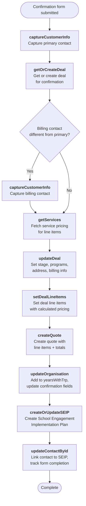

# Program Confirmation Flow

Triggered when a school confirms their program participation (typically "Deal Won"). This is the most complex flow — it creates contacts, updates the deal, builds a quote with line items, creates a SEIP record, and optionally handles a separate billing contact.

---

### Quick Reference

| Layer | Detail | Docs |
|-------|--------|------|
| **Gravity Form** | School Confirmation Form 2025 (ID: 76) / 2026 (ID: 80) | — |
| **Form Pre-population** | `GET /api/school_confirmation_form_details.php` (via `gform_pre_render`) — returns deal status, org type, programs, free travel, funded years | [v1 Form Details](../v1/form-details.md) |
| **API v1** | `POST /api/confirm.php` (not yet migrated to v2) | [v1 Confirmations](../v1/confirmations/index.md) |
| **PHP Handler** | `Confirmation` trait + `SchoolVTController` / `EarlyYearsVTController` | — |
| **VTAP Endpoints** | captureCustomerInfo → getOrCreateDeal → getServices → updateDeal → setDealLineItems → createQuote → updateOrganisation → createOrUpdateSEIP → updateContactById | [Endpoint Reference](../vtiger/vtap-endpoints.md) |
| **Vtiger Workflow** | None known | — |

---

## Flow Diagram

---

## Step-by-Step

### 1. Capture primary contact
**Endpoints:** [setContactsInactive](../vtiger/vtap-endpoints.md#setcontactsinactive) → [captureCustomerInfo](../vtiger/vtap-endpoints.md#capturecustomerinfo)

Standard contact capture for the primary school contact confirming the program.

### 2. Get or create deal
**Endpoint:** [getOrCreateDeal](../vtiger/vtap-endpoints.md#getorcreatedeal)

Retrieves the existing deal or creates one. The deal will be updated with confirmation details in subsequent steps.

### 3. Capture billing contact (optional)
**Endpoint:** [captureCustomerInfo](../vtiger/vtap-endpoints.md#capturecustomerinfo)

If the form specifies a different billing contact, a second contact is captured. The billing contact ID is used on the quote and invoice.

### 4. Fetch service pricing
**Endpoint:** [getServices](../vtiger/vtap-endpoints.md#getservices)

Retrieves service records (Inspire, Engage, Extend programs) with current pricing. Service codes (e.g., `SER12`) are mapped to the programs selected in the form.

### 5. Update deal
**Endpoint:** [updateDeal](../vtiger/vtap-endpoints.md#updatedeal)

Updates the deal with confirmation details:
- Stage → `In Campaign`, `Ready To Close`, or `Deal Won`
- Programs: inspire, engage, extend selections
- Address fields
- Billing contact and notes
- Selected year levels
- Total value
- Funding information (mental health funding, kindy uplift, SRF)

### 6. Set deal line items
**Endpoint:** [setDealLineItems](../vtiger/vtap-endpoints.md#setdeallineitems)

Sets the calculated line items on the deal. Uses form-encoded POST with line item data (not JSON).

### 7. Create quote
**Endpoint:** [createQuote](../vtiger/vtap-endpoints.md#createquote)

Creates the quote with:
- All line items (services + products)
- Financial totals (pre-tax, tax, grand total)
- Linked to deal, contact, organisation
- Billing and shipping addresses

### 8. Update organisation
**Endpoint:** [updateOrganisation](../vtiger/vtap-endpoints.md#updateorganisation)

Updates the organisation to:
- Add to `yearsWithTrp` picklist (e.g., "1st year", "2nd year")
- Update confirmation status fields
- Set address if not already set

### 9. Create SEIP
**Endpoint:** [createOrUpdateSEIP](../vtiger/vtap-endpoints.md#createorupdateseip)

Creates the School Engagement Implementation Plan with:
- Confirmation date
- Assignee
- Number of participants
- Linked to the deal
- Years with TRP

### 10. Update contact with SEIP link
**Endpoint:** [updateContactById](../vtiger/vtap-endpoints.md#updatecontactbyid)

Links the primary contact to the newly created SEIP record and tracks the confirmation form in `formscompleted`.
