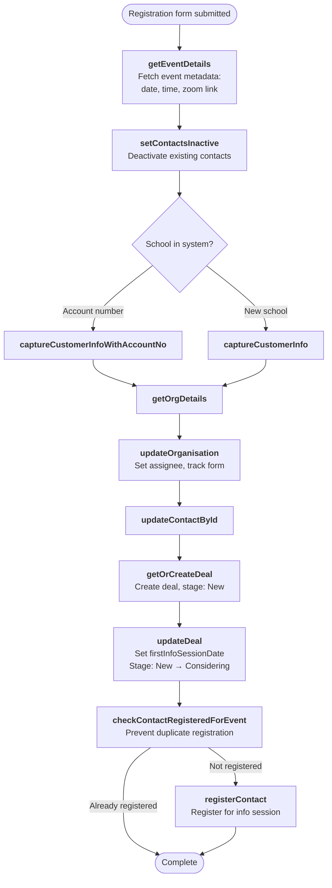
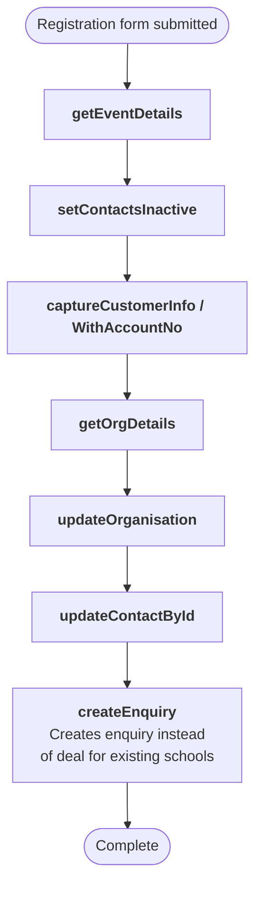
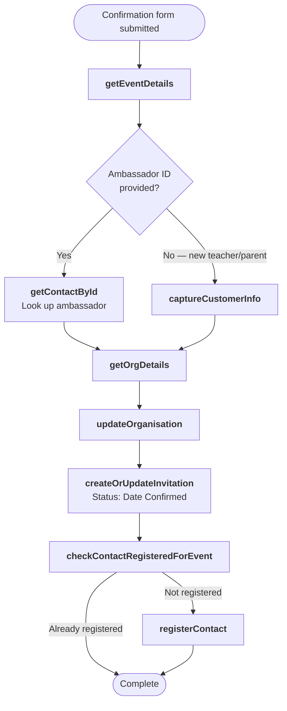

# School Registration Flow

Triggered when a school registers for an info session, info session recording, or Leading TRP event. The flow varies significantly based on the `source_form` value and whether the school is new or existing.

---

### Quick Reference

| Layer | Detail | Docs |
|-------|--------|------|
| **Gravity Form** | Info session / recording registration form (via GF Webhooks Add-On) | — |
| **API v2** | `POST /api/v2/schools/register` | [v2 Schools Endpoints](../v2/schools.md) |
| **API v1** | `POST /api/register.php` | [v1 School Registrations](../v1/registrations/school-registrations.md) |
| **PHP Handler** | `SubmitRegistrationHandler` (v2) / `Registration` trait (v1) | — |
| **VTAP Endpoints** | getEventDetails → setContactsInactive → captureCustomerInfo → getOrgDetails → updateOrganisation → updateContactById → getOrCreateDeal → updateDeal → checkContactRegisteredForEvent → registerContact | [Endpoint Reference](../vtiger/vtap-endpoints.md) |
| **Vtiger Workflow** | "New enquiry — send email to enquirer" (when existing school creates enquiry instead) | [Workflows](../vtiger/workflows.md) |

---

## Flow Diagram — Info Session (New School)

## Flow Diagram — Info Session (Existing School)

## Flow Diagram — Event Confirmation

---

## Step-by-Step

### 1. Get event details
**Endpoint:** [getEventDetails](../vtiger/vtap-endpoints.md#geteventdetails)

Fetches the event record to get date, time, event number, short name, and zoom link. These are needed for the registration record.

### 2. Customer capture
**Endpoints:** [setContactsInactive](../vtiger/vtap-endpoints.md#setcontactsinactive) → [captureCustomerInfo](../vtiger/vtap-endpoints.md#capturecustomerinfo) / [captureCustomerInfoWithAccountNo](../vtiger/vtap-endpoints.md#capturecustomerinfowithaccountno) → [getOrgDetails](../vtiger/vtap-endpoints.md#getorgdetails) → [updateOrganisation](../vtiger/vtap-endpoints.md#updateorganisation) → [updateContactById](../vtiger/vtap-endpoints.md#updatecontactbyid)

Same customer capture flow as [School Enquiry](enquiry.md#step-by-step) — deactivate, capture, fetch org, apply assignee rules, update org and contact.

### 3. Deal creation/update (new schools only)
**Endpoints:** [getOrCreateDeal](../vtiger/vtap-endpoints.md#getorcreatedeal) → [updateDeal](../vtiger/vtap-endpoints.md#updatedeal)

For new schools registering for an info session:
- Creates the deal if it doesn't exist
- Sets `firstInfoSessionDate` to the event date
- Progresses deal stage from `New` to `Considering`
- Sets close date to event date (info session) or event date + 4 weeks (recording)

### 4. Duplicate check and registration
**Endpoints:** [checkContactRegisteredForEvent](../vtiger/vtap-endpoints.md#checkcontactregisteredforevent) → [registerContact](../vtiger/vtap-endpoints.md#registercontact)

Checks if the contact is already registered for this event. If not, creates the registration record with event details and zoom link.

### 5. Enquiry (existing schools only)
**Endpoint:** [createEnquiry](../vtiger/vtap-endpoints.md#createenquiry)

For existing schools (non-new), creates an enquiry instead of a deal. This notifies the assigned staff member about the existing school's interest.

---

## Source Form Variants

| `source_form` | Behaviour |
|---------------|-----------|
| Info Session Registration | Full flow: customer capture → deal → registration |
| Info Session Recording | Same as above, close date = event + 4 weeks |
| Leading TRP Registration | Customer capture → `updateOrganisation` with `leadingTrp` datetime |
| Event Confirmation | Ambassador lookup or new contact → `createOrUpdateInvitation` → registration |
