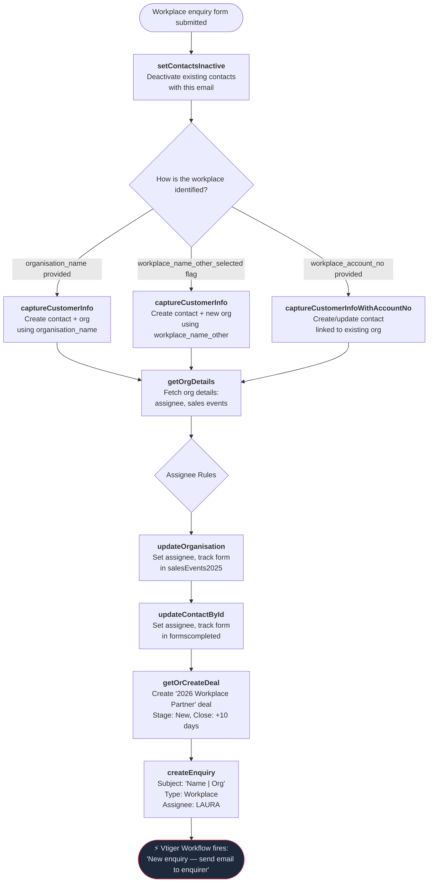

# Workplace Enquiry Flow

Triggered when a workplace submits an enquiry form. Creates or updates the contact and organisation in Vtiger, always creates a deal (unlike schools which conditionally create), and creates an enquiry record.

---

### Quick Reference

| Layer | Detail | Docs |
|-------|--------|------|
| **Gravity Form** | Workplace enquiry form (via GF Webhooks Add-On) | — |
| **API v1** | `POST /api/enquiry.php` (service_type=Workplace) | [v1 Workplace Enquiry](../v1/enquiries/workplace-enquiries.md) |
| **PHP Handler** | `WorkplaceVTController::submit_enquiry()` | — |
| **VTAP Endpoints** | setContactsInactive → captureCustomerInfo → getOrgDetails → updateOrganisation → updateContactById → getOrCreateDeal → createEnquiry | [Endpoint Reference](../vtiger/vtap-endpoints.md) |
| **Vtiger Workflow** | "New enquiry — send email to enquirer" | [Workflows](../vtiger/workflows.md) |

---

## Flow Diagram

---

## Step-by-Step

### 1. Deactivate existing contacts
**Endpoint:** [setContactsInactive](../vtiger/vtap-endpoints.md#setcontactsinactive)

Deactivates all contacts matching the submitted email address to prevent duplicate active contacts.

### 2. Capture customer info
**Endpoint:** [captureCustomerInfo](../vtiger/vtap-endpoints.md#capturecustomerinfo) or [captureCustomerInfoWithAccountNo](../vtiger/vtap-endpoints.md#capturecustomerinfowithaccountno)

Workplace has three paths for identifying the organisation (checked in priority order):

| Priority | Field | Webhook | Scenario |
|---|---|---|---|
| 1 | `organisation_name` | captureCustomerInfo | Named organisation (most common) |
| 2 | `workplace_name_other` + flag | captureCustomerInfo | New workplace not in CRM |
| 3 | `workplace_account_no` | captureCustomerInfoWithAccountNo | Known account number |

**Returns:** `contact_id` and `account_id` (organisation) used in subsequent steps.

### 3. Fetch organisation details
**Endpoint:** [getOrgDetails](../vtiger/vtap-endpoints.md#getorgdetails)

Retrieves the full organisation record including current assignee and sales events tracking.

### 4. Apply assignee rules
**PHP logic:** `WorkplaceVTController` assignee methods

Workplace assignee routing is simpler than schools — no state-based logic:

| Method | Logic |
|---|---|
| Enquiry assignee | Always **LAURA** (19x8) |
| Contact assignee | Org assignee if ≠ MADDIE, otherwise **LAURA** |
| Org assignee | Same as contact assignee |

### 5. Update organisation
**Endpoint:** [updateOrganisation](../vtiger/vtap-endpoints.md#updateorganisation)

Sets the calculated assignee and adds the current form to the sales events tracking field (`cf_accounts_2025salesevents`). Only makes the API call if the assignee changed or the form isn't already tracked.

### 6. Update contact
**Endpoint:** [updateContactById](../vtiger/vtap-endpoints.md#updatecontactbyid)

Sets the contact's assignee and tracks which forms the contact has completed (`cf_contacts_formscompleted`). Only calls the API if something changed.

### 7. Create deal (always)
**Endpoint:** [getOrCreateDeal](../vtiger/vtap-endpoints.md#getorcreatedeal)

Unlike schools, workplace enquiries **always** create a deal — there is no new-vs-existing conditional check.

| Field | Value |
|---|---|
| Deal name | `2026 Workplace Partner` |
| Deal type | `Workplace` |
| Org type | `Workplace - New` |
| Stage | `New` |
| Close date | Today + 10 days |
| Participants | `num_of_employees` (if provided) |

The `getOrCreateDeal` webhook auto-detects if a deal already exists for this contact+organisation and updates it rather than creating a duplicate.

### 8. Create enquiry
**Endpoint:** [createEnquiry](../vtiger/vtap-endpoints.md#createenquiry)

Creates the enquiry record:
- Subject: `"{Contact Name} | {Org Name}"`
- Body: the enquiry text from the form (defaults to "Conference Enquiry")
- Type: `Workplace`
- Assignee: **LAURA** (19x8) — always

> **Workflow trigger:** Creating the enquiry fires the Vtiger workflow "New enquiry — send email to enquirer".

---

## What Gets Created in CRM

| Record | Always? | Details |
|--------|---------|---------|
| Contact | Yes | Created or updated with email, name, phone, job title |
| Organisation | Yes | Created (new) or updated (existing) — assignee and form tracking |
| Deal | Yes | `2026 Workplace Partner`, stage `New`, close date +10 days |
| Enquiry | Yes | Type `Workplace`, assigned to LAURA |
