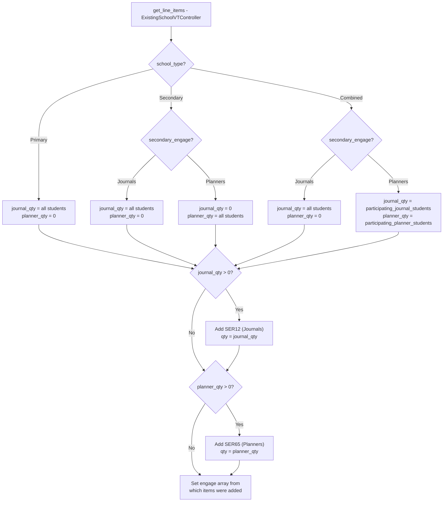
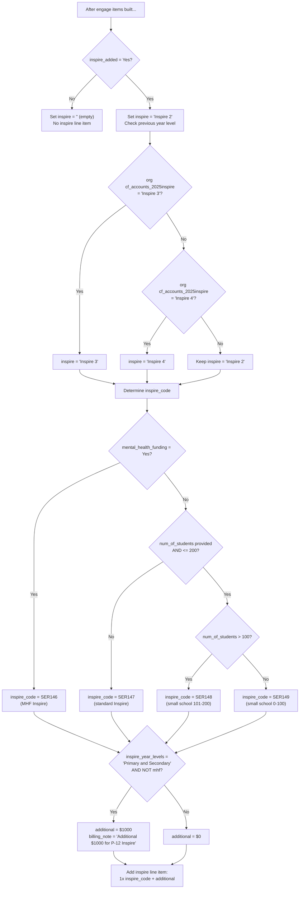
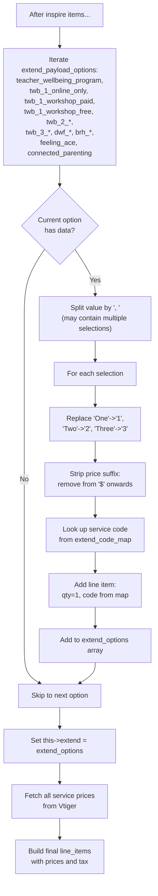
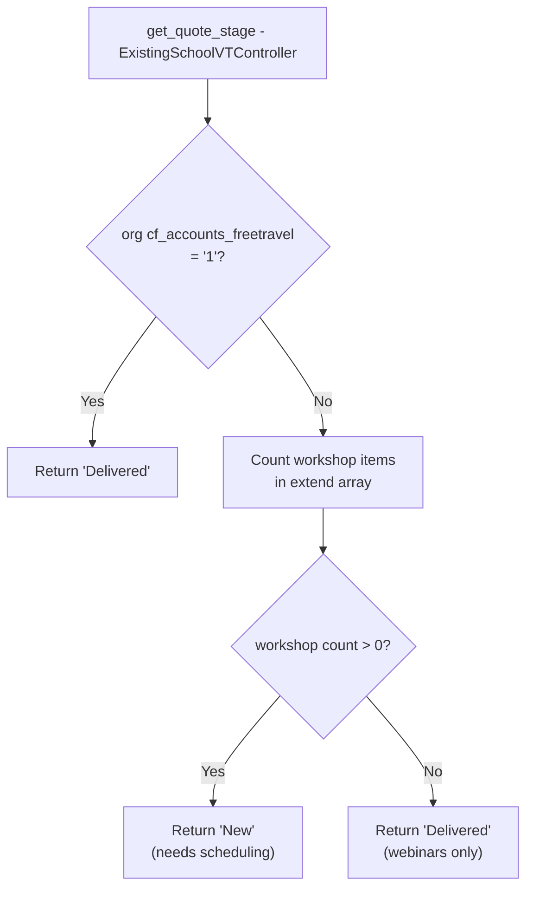

# Existing School Extensions

## POST /api/confirm_existing_schools.php

Processes confirmation for returning/existing schools adding Extend programs (teacher wellbeing workshops, parent webinars) and optionally re-adding Inspire. Hardcoded to use `ExistingSchoolVTController` (no service_type routing).

### Request

**Method:** POST
**Content-Type:** application/json

#### Core Parameters

Same as `confirm.php` for contact and address fields. The key differences are the Extend-specific fields below.

#### Extend Parameters

| Parameter | Type | Required | Description |
|---|---|---|---|
| `school_type` | string | Yes | `Primary`, `Secondary`, or `Combined` -- determines journal/planner split |
| `secondary_engage` | string | Conditional | `Journals` or `Planners` -- required for Secondary and Combined schools |
| `inspire_added` | string | No | `Yes` or `No` -- whether to add an Inspire session |
| `inspire_year_levels` | string | No | `Primary and Secondary` -- triggers +$1000 P-12 surcharge |
| `num_of_students_1` / `num_of_students_2` | integer | No | Total enrolment for small school inspire pricing |
| `teacher_wellbeing_program` | string | No | Comma-separated list: `TWB 1`, `TWB 2`, `TWB 3`, `DWF`, `BRH` |
| `twb_1_online_only` | string | No | `Yes` if TWB 1 is online-only |
| `twb_1_workshop_paid` | string | No | Selected paid workshop, e.g. `Wellbeing Workshop 1 (Self) ($XYZ)` |
| `twb_1_workshop_free` | string | No | Selected free workshop (for schools with free travel) |
| `twb_2_online_only` | string | No | `Yes` if TWB 2 is online-only |
| `twb_2_workshop_paid` | string | No | TWB 2 paid workshop selection |
| `twb_2_workshop_free` | string | No | TWB 2 free workshop selection |
| `twb_3_online_only` | string | No | `Yes` if TWB 3 is online-only |
| `twb_3_workshop_paid` | string | No | TWB 3 paid workshop selection |
| `twb_3_workshop_free` | string | No | TWB 3 free workshop selection |
| `dwf_online_only` | string | No | `Yes` if Digital Wellbeing Families is online-only |
| `dwf_workshop_paid` | string | No | DWF paid workshop selection |
| `dwf_workshop_free` | string | No | DWF free workshop selection |
| `brh_online_only` | string | No | `Yes` if Building Resilience at Home is online-only |
| `brh_workshop_paid` | string | No | BRH paid workshop selection |
| `brh_workshop_free` | string | No | BRH free workshop selection |
| `feeling_ace` | string | No | `Yes` to add Feeling ACE parent webinar |
| `connected_parenting` | string | No | `Yes` to add Connected Parenting webinar |

#### Extend Service Code Map

The extend option values contain a service name followed by a price in parentheses (e.g. `Wellbeing Workshop 1 (Self) ($500)`). The code strips the price portion and maps the name to a Vtiger service code:

| Extend Option | Service Code |
|---|---|
| Teacher Wellbeing Program (online) | SER23 |
| Wellbeing Webinar 1 (Self) | SER26 |
| Wellbeing Workshop 1 (Self) | SER24 |
| Wellbeing Webinar 2 (Others) | SER27 |
| Wellbeing Workshop 2 (Others) | SER25 |
| Wellbeing Webinar 3 (Success) | SER117 |
| Wellbeing Workshop 3 (Success) | SER118 |
| Family Digital Wellbeing Webinar | SER120 |
| Family Digital Wellbeing Workshop | SER119 |
| Building Resilience at Home Webinar | SER30 |
| Building Resilience at Home Workshop | SER104 |
| Hugh Parent Webinar (Feeling ACE) | SER160 |
| Martin Parent Webinar (Feeling ACE) | SER161 |
| Connected Parenting Webinar | SER32 |

### Control Flow

#### Flowchart 7: Existing School Student Count and Engage Split

Shows how `ExistingSchoolVTController::get_line_items()` determines journal and planner quantities based on school type and secondary engage preference.

#### Flowchart 8: Existing School Inspire Pricing

Shows the Inspire pricing logic for existing schools. Previous inspire level is checked from the organisation's 2025 data.

#### Flowchart 9: Existing School Extend Programs

Shows how extend options (teacher wellbeing programs, parent webinars) are parsed and converted to line items.

#### Flowchart 10: Existing School Quote Stage

The `ExistingSchoolVTController` overrides `get_quote_stage()` with logic based on free travel and workshop count.

### Postman Scenarios

| # | Scenario | Key Fields |
|---|---|---|
| 1 | **Existing School Confirmation** | TWB 1 online only, no workshops |
| 2 | **Existing School (Multiple Programs)** | TWB 1 paid workshop + DWF online + BRH paid workshop + connected parenting |
| 3 | **Existing School (Feeling Ace)** | TWB 2 online + feeling_ace add-on |
