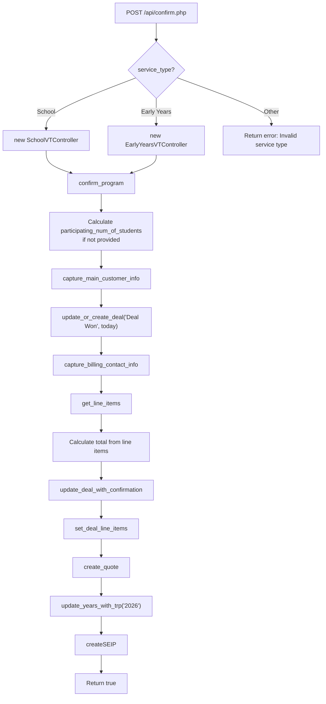
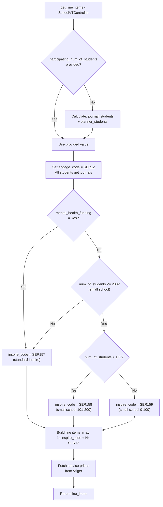
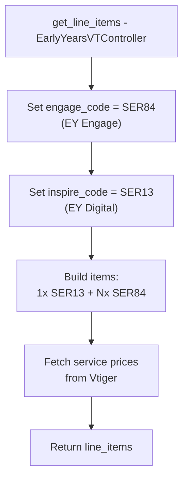
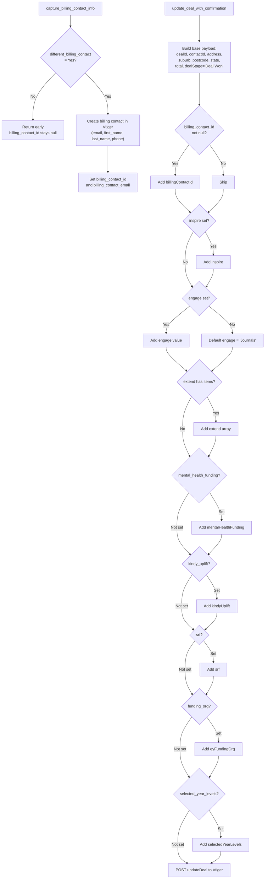
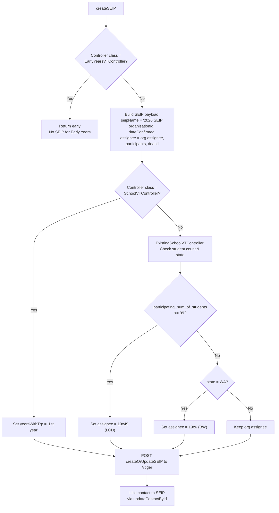
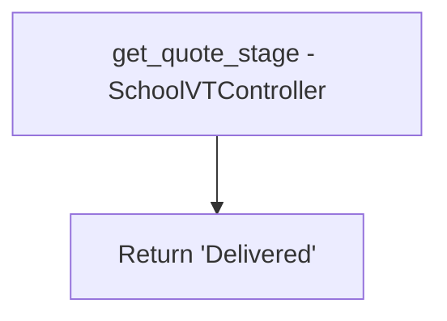

# New School & Early Years Confirmations

## POST /api/confirm.php

Processes new program confirmations for School and Early Years service types. Other service types are rejected with an error response.

### Request

**Method:** POST
**Content-Type:** application/json

#### Parameters

| Parameter | Type | Required | Description |
|---|---|---|---|
| `service_type` | string | Yes | Must be `School` or `Early Years`. Others return error. |
| `contact_email` | string | Yes | Primary contact email address |
| `contact_first_name` | string | Yes | Primary contact first name |
| `contact_last_name` | string | Yes | Primary contact last name |
| `contact_phone` | string | No | Primary contact phone number |
| `job_title` | string | No | Primary contact job title |
| `school_account_no` | string | Conditional | Vtiger account number for existing schools (School service type) |
| `school_name_other` | string | Conditional | Name for new schools not in Vtiger (School service type) |
| `school_name_other_selected` | boolean | Conditional | Flag indicating a new school name was entered (School) |
| `earlyyears_account_no` | string | Conditional | Vtiger account number (Early Years service type) |
| `earlyyears_name_other` | string | Conditional | Name for new EY centres not in Vtiger |
| `service_name_other_selected` | boolean | Conditional | Flag indicating a new EY centre name was entered |
| `state` | string | Yes | Australian state/territory (e.g. VIC, NSW, QLD, WA) |
| `address` | string | Yes | Street address |
| `suburb` | string | Yes | Suburb |
| `postcode` | string | Yes | Postcode |
| `participating_num_of_students` | integer | Conditional | Total participating students. If not provided, calculated from journal + planner counts. |
| `participating_journal_students` | integer | Conditional | Students receiving journals (Combined schools with Planners secondary) |
| `participating_planner_students` | integer | Conditional | Students receiving planners (Combined schools with Planners secondary) |
| `num_of_students` | integer | No | Total school enrolment (used for small school pricing in SchoolVTController) |
| `different_billing_contact` | string | Yes | `Yes` or `No` -- whether a separate billing contact is provided |
| `billing_contact_email` | string | Conditional | Billing contact email (required if `different_billing_contact=Yes`) |
| `billing_contact_first_name` | string | Conditional | Billing contact first name |
| `billing_contact_last_name` | string | Conditional | Billing contact last name |
| `billing_contact_phone` | string | Conditional | Billing contact phone |
| `mental_health_funding` | string | No | `Yes` or `No` -- using MHF affects inspire pricing (School only) |
| `school_type` | string | Conditional | `Primary`, `Secondary`, or `Combined` (School only, used by ExistingSchoolVTController for line items) |
| `engage` | string | No | `Journals` or `Planners` (default: `Journals`) |
| `secondary_engage` | string | Conditional | `Journals` or `Planners` -- for Secondary/Combined schools (ExistingSchool) |
| `inspire` | string | No | Inspire program level (e.g. `Inspire 1`) |
| `inspire_added` | string | No | `Yes` or `No` -- whether Inspire is being added (ExistingSchool only) |
| `inspire_year_levels` | string | No | `Primary and Secondary` -- triggers +$1000 surcharge (ExistingSchool) |
| `kindy_uplift` | string | No | `Yes` or `No` (Early Years only) |
| `srf` | string | No | SRF participation flag (Early Years only) |
| `funding_org` | string | No | Funding organisation name, sent as `eyFundingOrg` (Early Years only) |
| `selected_year_levels` | array | No | Array of participating year levels (e.g. `["Foundation", "Year 1", "Year 2"]`) |

### Response

```json
{ "status": "success" }
```

or on failure:

```json
{ "status": "fail" }
```

### Control Flow

#### Flowchart 1: Endpoint Routing and Main Flow

Shows the top-level routing in `confirm.php` and the `confirm_program()` method from the `Confirmation` trait.



#### Flowchart 2: Student Count Calculation and Resource Type (SchoolVTController)

The new school `get_line_items()` in `SchoolVTController` always uses journals (SER12) for the engage component. The inspire code varies by funding and school size.



#### Flowchart 3: Early Years Line Items

The `EarlyYearsVTController` has a simpler line items structure with fixed service codes.



#### Flowchart 4: Billing Contact and Deal Update Fields

Shows how `capture_billing_contact_info()` and `update_deal_with_confirmation()` assemble the deal update payload with optional fields.



#### Flowchart 5: SEIP Creation

Shows `createSEIP()` which creates a School Engagement & Implementation Plan record. Skipped entirely for Early Years.



#### Flowchart 6: Quote Stage (SchoolVTController)

New schools always get a "Delivered" quote stage.



### Postman Scenarios

The following Postman request variants exist in `postman/collections/Confirmations/`:

| # | Scenario | Key Fields |
|---|---|---|
| 1 | **School Confirmation** | Primary school, 350 students, Journals, no MHF, no separate billing |
| 2 | **Early Years Confirmation** | EY centre, 45 students, no funding org |
| 3 | **Existing School Confirmation** | TWB 1 online only (uses `confirm_existing_schools.php`) |
| 4 | **School Confirmation (Different Billing)** | `different_billing_contact=Yes`, separate billing contact details |
| 5 | **School Confirmation (Secondary Journals)** | Secondary school, 600 students, Journals engage |
| 6 | **School Confirmation (Secondary Planners)** | Secondary school, 450 students, Planners engage |
| 7 | **School Confirmation (Combined Split)** | Combined school, 300 journal + 250 planner students, Planners secondary engage |
| 8 | **School Confirmation (Mental Health Funding)** | `mental_health_funding=Yes`, `inspire_added=Yes` |
| 9 | **School Confirmation (Inspire Both Levels)** | Combined school, `inspire_year_levels=Primary and Secondary` (+$1000 surcharge) |
| 10 | **Early Years Confirmation (With Funding)** | `funding_org=Department of Education`, `kindy_uplift=Yes` |
| 11 | **Existing School (Multiple Programs)** | TWB 1 workshop + DWF online + BRH workshop + connected parenting |
| 12 | **Existing School (Feeling Ace)** | TWB 2 online + `feeling_ace=Yes` |
