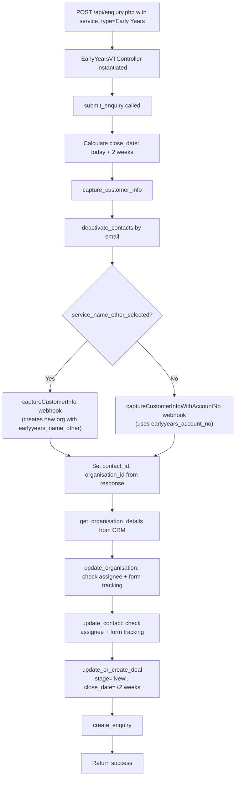

# Early Years Enquiry Flow

Early Years enquiries are handled by `EarlyYearsVTController`. Like workplace enquiries, Early Years ALWAYS creates a deal — there is no new-vs-existing conditional. The deal is created with stage `New` and a close date of +2 weeks.

## Organisation Detection

Two paths for identifying the Early Years service:

| Scenario | Field Used | Webhook |
|---|---|---|
| New EY centre (not in CRM) | `earlyyears_name_other` + `service_name_other_selected` flag | `captureCustomerInfo` |
| Existing EY centre (known account) | `earlyyears_account_no` | `captureCustomerInfoWithAccountNo` |

## Full End-to-End Flowchart

## Assignee Routing

Early Years uses BRENDAN as the default assignee.

| Method | Logic |
|---|---|
| `get_enquiry_assignee()` | Always returns BRENDAN (19x57) |
| `get_contact_assignee()` | If org assignee ≠ MADDIE → return org assignee. Otherwise → BRENDAN |
| `get_org_assignee()` | Same as contact assignee |

## Deal Creation

Always occurs — no conditional check:
- Webhook: `getOrCreateDeal`
- Deal name: `2026 Early Years Partnership Program`
- Deal type: `Early Years`
- Deal org type: `Early Years - New`
- Deal stage: `New`
- Close date: today + 2 weeks
- Participants: `num_of_ey_children` (if provided)

## Webhook Call Sequence

1. `setContactsInactive` — Deactivate existing contacts with same email
2. `captureCustomerInfo` or `captureCustomerInfoWithAccountNo` — Create/update contact and org
3. `getOrgDetails` — Fetch org details for assignee logic
4. `updateOrganisation` — Update assignee and/or form tracking (if changed)
5. `updateContactById` — Update assignee and/or form tracking (if changed)
6. `getOrCreateDeal` — Create or update deal with stage `New`
7. `createEnquiry` — Create enquiry record

## Postman Scenarios

| # | Scenario | Key Fields |
|---|---|---|
| 1 | Early Years Enquiry | `earlyyears_account_no` or `earlyyears_name_other` + flag. Deal always created. |

## Key Source Files

| File | Lines | Role |
|---|---|---|
| `src/api/enquiry.php` | 39-41 | Routes to EarlyYearsVTController |
| `src/api/classes/early_years.php` | 30-51 | Assignee routing |
| `src/api/classes/early_years.php` | 53-89 | `capture_customer_info_in_vt()` |
| `src/api/classes/early_years.php` | 91-124 | `submit_enquiry()` |
