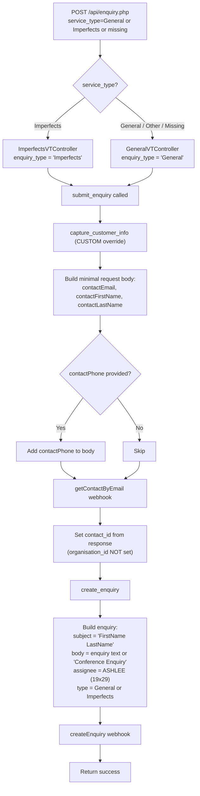

# General & Imperfects Enquiry Flow

General and Imperfects enquiries use the simplest path through the enquiry system. `GeneralVTController` handles the General type, and `ImperfectsVTController` extends it with only a different `enquiry_type`. Both use a custom `capture_customer_info()` that bypasses the full org capture flow — no organisation is created or updated, no contacts are deactivated, and no deal is created.

## Differences from Other Service Types

| Aspect | School/Workplace/Early Years | General/Imperfects |
|---|---|---|
| Contact capture | Full flow: deactivate → captureCustomerInfo → update org → update contact | Simplified: `getContactByEmail` only |
| Organisation handling | Creates or links to organisation | No organisation handling |
| Deal creation | Conditional or always | Never |
| Contacts deactivated | Yes (setContactsInactive) | No |
| Form tracking | Yes (updates source_form lists) | No |
| Enquiry assignee | Service-specific | ASHLEE (19x29) |

## Full End-to-End Flowchart



## Custom Contact Capture

The `GeneralVTController` overrides `capture_customer_info()` completely. Instead of the full flow used by School/Workplace/Early Years, it:

1. Builds a minimal request body with just email, first name, and last name (plus phone if provided)
2. Calls the `getContactByEmail` webhook — this looks up or creates a basic contact record
3. Sets `$contact_id` from the response
4. Does NOT set `$organisation_id` (no org is created or linked)
5. Does NOT call `deactivate_contacts()`, `update_organisation()`, or `update_contact()`

Source: `src/api/classes/general.php` lines 39-55

## Assignee Routing

Both General and Imperfects use fixed assignees — no state-based or org-based routing.

| Method | Returns |
|---|---|
| `get_enquiry_assignee()` | ASHLEE (19x29) |
| `get_contact_assignee()` | MADDIE (19x1) |
| `get_org_assignee()` | MADDIE (19x1) |

## Imperfects vs General

`ImperfectsVTController` extends `GeneralVTController` with a single override:

```
enquiry_type = 'Imperfects'  (instead of 'General')
```

Everything else — contact capture, assignee routing, no deal creation — is identical.

Source: `src/api/classes/general.php` lines 59-62

## Webhook Call Sequence

The shortest sequence of any service type — just 2 webhook calls:

1. `getContactByEmail` — Look up or create contact by email
2. `createEnquiry` — Create enquiry record with type General or Imperfects

## Postman Scenarios

| # | Scenario | Key Fields |
|---|---|---|
| 1 | General Enquiry | `service_type=General` (or omitted). No org fields needed. No deal created. |
| 2 | Imperfects Enquiry | `service_type=Imperfects`. Identical flow, enquiry type set to "Imperfects". |

## Key Source Files

| File | Lines | Role |
|---|---|---|
| `src/api/enquiry.php` | 42-48 | Routes to ImperfectsVTController or GeneralVTController (default) |
| `src/api/classes/general.php` | 7-56 | GeneralVTController: submit_enquiry, custom capture_customer_info, assignees |
| `src/api/classes/general.php` | 59-62 | ImperfectsVTController: only overrides enquiry_type |
