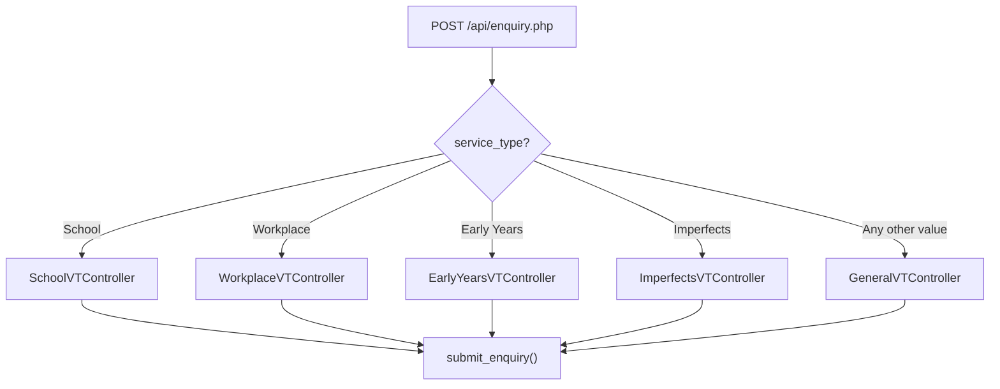

# Enquiry Endpoints

The enquiry endpoint captures contact information, optionally creates or updates a CRM deal, and creates an enquiry record in Vtiger CRM. The controller used depends on the `service_type` parameter, which determines the enquiry type, assignee routing, and whether a deal is created.

## Overview

| Method | Endpoint | Description |
|--------|----------|-------------|
| POST | `/api/enquiry.php` | Submit an enquiry for any service type |

## Request Parameters

| Parameter | Type | Required | Description |
|-----------|------|----------|-------------|
| `service_type` | string | Yes | Determines the controller: `School`, `Workplace`, `Early Years`, `Imperfects`, or any other value (falls back to `General`) |
| `contact_email` | string | Yes | Contact's email address |
| `contact_first_name` | string | Yes | Contact's first name |
| `contact_last_name` | string | Yes | Contact's last name |
| `contact_phone` | string | No | Contact's phone number |
| `job_title` | string | No | Contact's job title |
| `state` | string | No | Australian state (e.g. `NSW`, `QLD`, `VIC`). Used for assignee routing in School enquiries |
| `school_account_no` | string | No | Existing school account number (School service type) |
| `school_name_other` | string | No | New school name when not in the dropdown (School service type) |
| `school_name_other_selected` | string | No | Flag indicating a new school name was entered manually (School service type) |
| `organisation_name` | string | No | Organisation name provided directly (Workplace service type) |
| `workplace_name_other` | string | No | New workplace name when not in the dropdown (Workplace service type) |
| `workplace_name_other_selected` | string | No | Flag indicating a new workplace name was entered manually (Workplace service type) |
| `workplace_account_no` | string | No | Existing workplace account number (Workplace service type) |
| `earlyyears_account_no` | string | No | Existing Early Years account number (Early Years service type) |
| `earlyyears_name_other` | string | No | New Early Years organisation name (Early Years service type) |
| `service_name_other_selected` | string | No | Flag indicating a new Early Years name was entered manually (Early Years service type) |
| `enquiry` | string | No | Free-text enquiry body. Defaults to `"Conference Enquiry"` if not provided |
| `source_form` | string | No | Identifier of the originating form, used for form tracking on organisations and contacts |
| `num_of_students` | string | No | Number of students (School service type) |
| `num_of_employees` | string | No | Number of employees (Workplace service type) |
| `num_of_ey_children` | string | No | Number of Early Years children (Early Years service type) |
| `organisation_sub_type` | string | No | Organisation sub-type classification |
| `contact_lead_source` | string | No | How the contact heard about TRP |

## Service Type Routing



## Service Type Comparison

| Aspect | School | Workplace | Early Years | General | Imperfects |
|--------|--------|-----------|-------------|---------|------------|
| Controller | `SchoolVTController` | `WorkplaceVTController` | `EarlyYearsVTController` | `GeneralVTController` | `ImperfectsVTController` |
| Enquiry Type | School | Workplace | Early Years | General | Imperfects |
| Deal Created | Only if new school | Always | Always | Never | Never |
| Deal Stage | New | New | New | — | — |
| Deal Close Date | +2 weeks | +10 days | +2 weeks | — | — |
| Enquiry Assignee | LAURA (or BRENDAN for NSW/QLD) | LAURA | BRENDAN | ASHLEE | ASHLEE |
| Org Handling | Full capture + update | Full capture + update | Full capture + update | Contact lookup only | Contact lookup only |

## In This Section

- [Shared Enquiry Mechanics](./shared-mechanics.md) — Contact capture, org updates, form tracking, and enquiry creation
- [School Enquiries](./school-enquiries.md) — New vs existing school detection, state-based assignee routing
- [Workplace Enquiries](./workplace-enquiries.md) — Three org detection paths, always creates deal
- [Early Years Enquiries](./early-years-enquiries.md) — Two org detection paths, always creates deal
- [General & Imperfects Enquiries](./general-enquiries.md) — Simplified flow with no org or deal creation

## Response

### Success

```json
{
  "status": "success"
}
```

### Failure

```json
{
  "status": "fail"
}
```

If an exception is caught, the response includes a message:

```json
{
  "status": "fail",
  "message": "Error processing enquiry: <exception message>"
}
```
