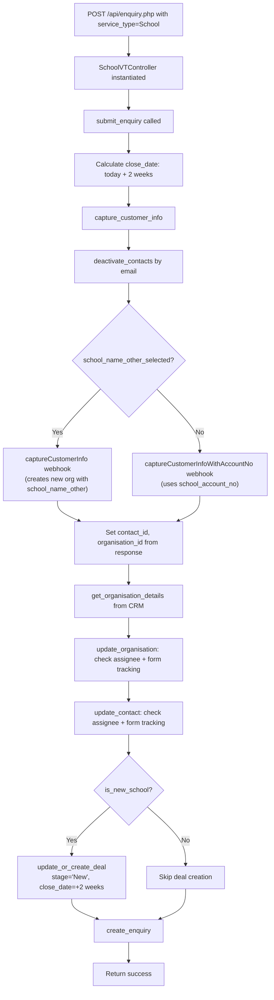
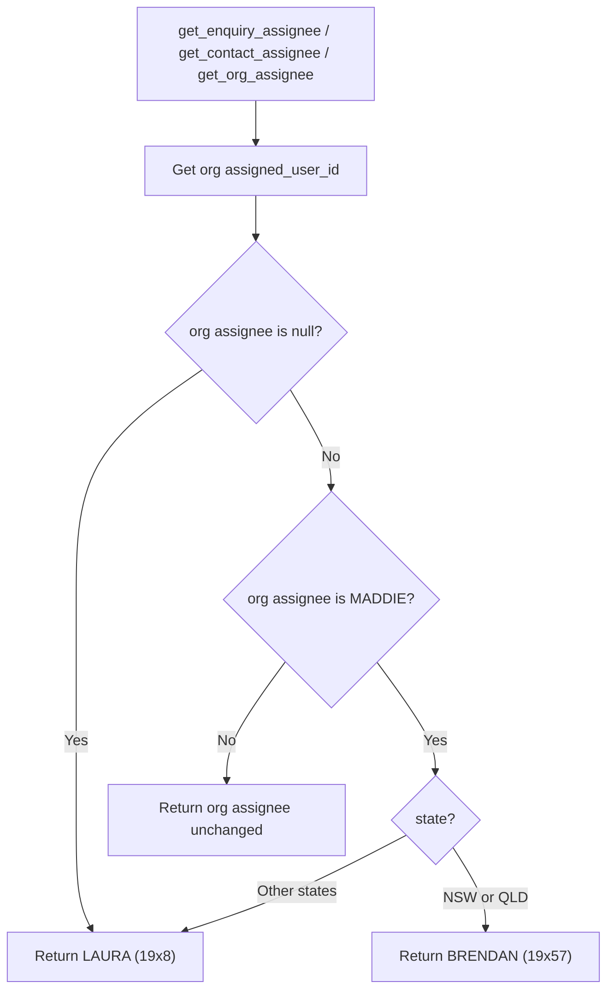

# School Enquiry Flow

School enquiries are handled by `SchoolVTController`. The key decision point is whether the school is "new" (not yet assigned to a dedicated School Partnership Manager) or "existing" (already a partner). New schools get a deal created; existing schools get an enquiry only.

## Organisation Detection

Two paths for identifying the school:

| Scenario | Field Used | Webhook |
|---|---|---|
| Existing school (known account) | `school_account_no` | `captureCustomerInfoWithAccountNo` |
| New school (not in CRM) | `school_name_other` + `school_name_other_selected` flag | `captureCustomerInfo` |

## Full End-to-End Flowchart

## New School Detection (`is_new_school`)

A school is considered "new" when its organisation's `assigned_user_id` is one of the School Partnership Manager (SPM) list — meaning it hasn't been assigned to a dedicated relationship manager yet.

**SPM List (new school indicators):**

| Staff Member | User ID |
|---|---|
| MADDIE | 19x1 |
| LAURA | 19x8 |
| VICTOR | 19x33 |
| HELENOR | 19x24 |
| BRENDAN | 19x57 |

If the org assignee is NOT in this list, the school is considered an existing partner — the enquiry is created but no deal is created/updated.

Source: `src/api/classes/school.php` lines 116–121

## Assignee Routing

School assignee logic is state-based, with special handling when the org is currently assigned to MADDIE (the default/unassigned marker).

Note: `get_enquiry_assignee()` has the same logic but also returns LAURA when org assignee is null. The contact and org assignee methods share identical logic.

Source: `src/api/classes/school.php` lines 70–114

## Deal Creation (New Schools Only)

When `is_new_school()` returns true:

- Webhook: `getOrCreateDeal`
- Deal name: `2026 School Partnership Program`
- Deal type: `School`
- Deal org type: `School - New`
- Deal stage: `New`
- Close date: today + 2 weeks
- Assignee: from `get_contact_assignee()` (state-based logic above)
- Participants: `participating_num_of_students` or `num_of_students` (first non-empty)

The `getOrCreateDeal` webhook automatically detects if a deal already exists for this contact+organisation combination and updates it rather than creating a duplicate.

## Webhook Call Sequence

**New school enquiry (full path):**

1. `setContactsInactive` — Deactivate existing contacts with same email
2. `captureCustomerInfo` or `captureCustomerInfoWithAccountNo` — Create/update contact and org
3. `getOrgDetails` — Fetch org details for assignee logic
4. `updateOrganisation` — Update assignee and/or form tracking (if changed)
5. `updateContactById` — Update assignee and/or form tracking (if changed)
6. `getOrCreateDeal` — Create or update deal with stage `New`
7. `createEnquiry` — Create enquiry record

**Existing school enquiry (skips deal):**

1. `setContactsInactive`
2. `captureCustomerInfo` or `captureCustomerInfoWithAccountNo`
3. `getOrgDetails`
4. `updateOrganisation` (if changed)
5. `updateContactById` (if changed)
6. `createEnquiry`

## Postman Scenarios

| # | Scenario | Key Fields | Deal Created? |
|---|---|---|---|
| 1 | School Enquiry (Existing) | `school_account_no` set | Only if is_new_school |
| 2 | School Enquiry (New) | `school_name_other` + `school_name_other_selected` | Only if is_new_school |

## Key Source Files

| File | Lines | Role |
|---|---|---|
| `src/api/enquiry.php` | 31–35 | Routes to SchoolVTController |
| `src/api/classes/school.php` | 49–67 | `capture_customer_info_in_vt()` — new vs existing org |
| `src/api/classes/school.php` | 70–114 | Assignee routing (state-based) |
| `src/api/classes/school.php` | 116–121 | `is_new_school()` |
| `src/api/classes/school.php` | 135–149 | `submit_enquiry()` |
