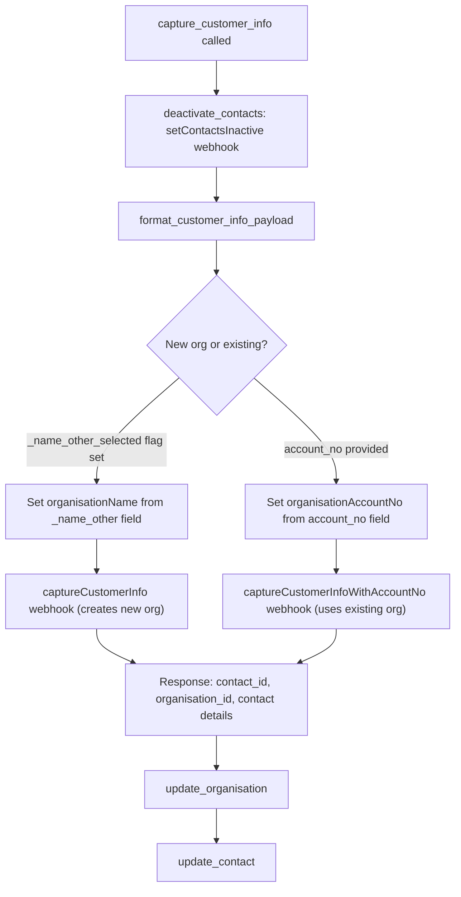
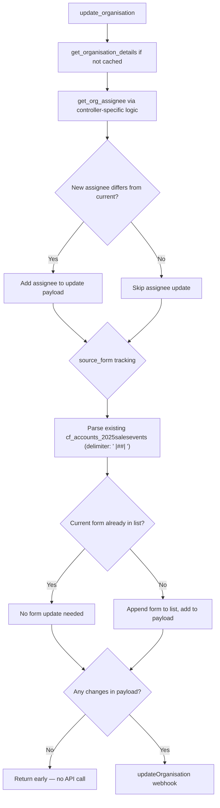
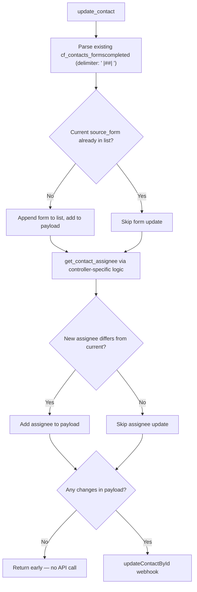
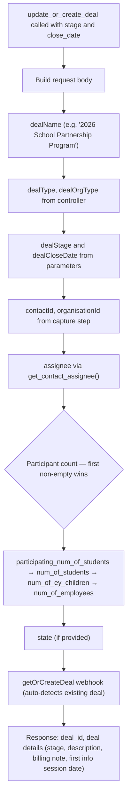

# Shared Enquiry Mechanics

This page documents the shared logic used by School, Workplace, and Early Years enquiries. General and Imperfects use a simplified path that skips organisation handling and deal creation — see their [dedicated page](./general-enquiries.md).

## Contact Capture (`capture_customer_info`)

The `capture_customer_info()` method orchestrates the full customer capture flow: deactivate existing contacts, format the payload, send to the appropriate webhook, then update the organisation and contact records.

### `format_customer_info_payload` Fields

The payload sent to the capture webhook includes the following fields:

**Core fields (always included):**

| Field | Source |
|-------|--------|
| `contactEmail` | `contact_email` parameter |
| `contactFirstName` | `contact_first_name` parameter |
| `contactLastName` | `contact_last_name` parameter |
| `organisationType` | Set by the controller class (`School`, `Workplace`, or `Early Years`) |
| `organisationName` | Set from the organisation name if available |

**Optional fields (included when present in the request):**

| Field | Source |
|-------|--------|
| `state` | `state` parameter |
| `contactType` | `contact_type` from customer data (e.g. `Primary`, `Billing`) |
| `contactPhone` | `contact_phone` parameter |
| `orgPhone` | `org_phone` parameter |
| `jobTitle` | `job_title` parameter |
| `organisationNumOfStudents` | First non-empty of `num_of_students` or `num_of_ey_children` |
| `organisationNumOfEmployees` | `num_of_employees` parameter |
| `contactLeadSource` | `contact_lead_source` parameter |
| `organisationSubType` | `organisation_sub_type` parameter |

## Organisation Update (`update_organisation`)

After capturing the customer, the organisation record is updated with assignee routing and form tracking.

The `get_org_assignee()` method is controller-specific:

- **School:** Returns the existing assignee unless it is MADDIE (unassigned), in which case it returns BRENDAN for NSW/QLD or LAURA for all other states.
- **Workplace:** Returns the existing assignee unless it is MADDIE, in which case it returns LAURA.
- **Early Years:** Returns the existing assignee unless it is MADDIE, in which case it returns BRENDAN.

## Contact Update (`update_contact`)

The contact record is updated with form tracking and assignee routing, following a similar pattern to the organisation update.

The `get_contact_assignee()` method follows the same routing rules as `get_org_assignee()` for each controller.

## Enquiry Creation (`create_enquiry`)

The `create_enquiry()` method builds and sends the enquiry record to the CRM.

| Field | Value |
|-------|-------|
| **Subject** | `"FirstName LastName \| OrgName"` — the organisation name is omitted if not set |
| **Body** | The `enquiry` field from the request, defaults to `"Conference Enquiry"` if not provided |
| **Assignee** | Determined by `get_enquiry_assignee()`, which is controller-specific |
| **Type** | Set by the `$enquiry_type` property on each controller class |
| **Webhook** | `createEnquiry` |

## Deal Creation (`update_or_create_deal`)

School (new schools only), Workplace, and Early Years enquiries create a deal as part of the enquiry flow. General and Imperfects enquiries skip this step entirely.

The `getOrCreateDeal` webhook is a VTAP endpoint that handles both creation and retrieval. It checks whether a deal already exists for the given contact and organisation combination. If a matching deal is found, it updates and returns the existing deal; otherwise, it creates a new one. This means the endpoint is idempotent — submitting the same enquiry twice will not create duplicate deals.

## Staff Constants Reference

| Constant | User ID | Used As Default For |
|----------|---------|---------------------|
| MADDIE | `19x1` | Default/unassigned org marker |
| LAURA | `19x8` | School (non-NSW/QLD), Workplace default |
| BRENDAN | `19x57` | School (NSW/QLD), Early Years default |
| ASHLEE | `19x29` | General/Imperfects enquiry assignee |
| VICTOR | `19x33` | New school marker (SPM list) |
| HELENOR | `19x24` | New school marker (SPM list) |
| EMMA | `19x15` | Staff member |
| DAWN | `19x22` | Staff member |

## Key Source Files

| File | Role |
|------|------|
| `src/api/enquiry.php` | Endpoint routing by service_type |
| `src/api/classes/base.php` | VTController base, staff constants, webhook tokens |
| `src/api/classes/traits/enquiry.php` | `create_enquiry()` |
| `src/api/classes/traits/contact_and_org.php` | `capture_customer_info()`, `update_organisation()`, `update_contact()`, `format_customer_info_payload()` |
| `src/api/classes/traits/deal.php` | `update_or_create_deal()` |
