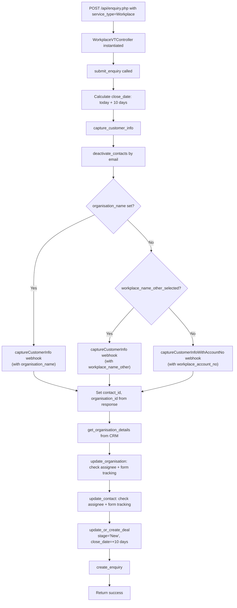

# Workplace Enquiry Flow

Workplace enquiries are handled by `WorkplaceVTController`. Unlike schools, workplace enquiries ALWAYS create a deal — there is no new-vs-existing check. The deal is created with stage `New` and a close date of +10 days.

## Organisation Detection

Three paths for identifying the workplace:

| Scenario | Field Used | Webhook |
|---|---|---|
| Named organisation (most common) | `organisation_name` | `captureCustomerInfo` |
| New workplace (not in CRM) | `workplace_name_other` + `workplace_name_other_selected` flag | `captureCustomerInfo` |
| Existing workplace (known account) | `workplace_account_no` | `captureCustomerInfoWithAccountNo` |

Detection priority: `organisation_name` is checked first. If not set, checks `workplace_name_other_selected`. If neither, falls back to `workplace_account_no`.

## Full End-to-End Flowchart

## Assignee Routing

Workplace assignee logic is simpler than schools — no state-based routing.

| Method | Logic |
|---|---|
| `get_enquiry_assignee()` | Always returns LAURA (19x8) |
| `get_contact_assignee()` | If org assignee ≠ MADDIE → return org assignee. Otherwise → LAURA |
| `get_org_assignee()` | Same as contact assignee |

## Deal Creation

Always occurs — no conditional check:
- Webhook: `getOrCreateDeal`
- Deal name: `2026 Workplace Partner`
- Deal type: `Workplace`
- Deal org type: `Workplace - New`
- Deal stage: `New`
- Close date: today + 10 days
- Participants: `num_of_employees` (if provided)

## Webhook Call Sequence

1. `setContactsInactive` — Deactivate existing contacts with same email
2. `captureCustomerInfo` or `captureCustomerInfoWithAccountNo` — Create/update contact and org
3. `getOrgDetails` — Fetch org details for assignee logic
4. `updateOrganisation` — Update assignee and/or form tracking (if changed)
5. `updateContactById` — Update assignee and/or form tracking (if changed)
6. `getOrCreateDeal` — Create or update deal with stage `New`
7. `createEnquiry` — Create enquiry record

## Postman Scenarios

| # | Scenario | Key Fields |
|---|---|---|
| 1 | Workplace Enquiry | `organisation_name` or `workplace_account_no` set. Deal always created. |

## Key Source Files

| File | Lines | Role |
|---|---|---|
| `src/api/enquiry.php` | 36-38 | Routes to WorkplaceVTController |
| `src/api/classes/workplace.php` | 26-47 | Assignee routing |
| `src/api/classes/workplace.php` | 49-80 | `submit_enquiry()` |
| `src/api/classes/workplace.php` | 82-102 | `capture_customer_info_in_vt()` |
