# Event Endpoints

Uses the Vtiger REST API (`$vtod`) directly.

## Overview

| Endpoint | Method | Integration | Purpose |
|---|---|---|---|
| `/Events/54701_sendInvitation.php` | POST | Vtiger REST + Mail | Send templated email invitations to contacts for an event |

---

## POST /Events/54701_sendInvitation.php

### Request

Form-urlencoded fields:

| Field | Type | Description |
|---|---|---|
| `list[]` | array | Array of objects, each with an `id` field (contact ID without the `4x` prefix) |
| `selectedEmail` | string | Email template name to look up in VTiger EmailTemplates |
| `mailSubject` | string | Optional override for email subject |
| `mailBody` | string | Optional override for email body (with merge fields) |
| `eventid` | string | Event ID (without the `18x` prefix) |

### Control Flow

```mermaid
flowchart TD
    A[POST request received] --> B{list param not empty?}
    B -- No --> C["Return {success: false}"]
    B -- Yes --> D{selectedEmailTemplateId not empty?}
    D -- No --> C
    D -- Yes --> E[Parse merge fields from mailBody using regex]
    E --> F["Retrieve current user data for timezone"]
    F --> G["Retrieve event data from VTiger (18x + eventid)"]
    G --> H["Retrieve assigned user data for event owner"]
    H --> I[For each contact in list array]

    I --> J["Retrieve contact from VTiger (4x + id)"]
    J --> K{mailBody and mailSubject provided?}
    K -- Yes --> L[Use provided subject and body]
    K -- No --> M[Query EmailTemplates by templatename to get subject and body]
    L & M --> N["Replace @@eventid@@ with eventid in body"]

    N --> O[Replace contact merge fields]
    O --> O1["For each contact field: replace $contacts-fieldname$ with value"]
    O1 --> O2["Special: $contacts-id$ replaced with contact ID stripped of '4x' prefix"]

    O2 --> P[Replace event merge fields]
    P --> P1["For each event field: replace $events-fieldname$ with value"]

    P1 --> Q[Replace custom date merge fields]
    Q --> Q1["$custom-currentyear$ with date Y"]
    Q1 --> Q2["$custom-currentmonth$ with date m"]
    Q2 --> Q3["$custom-currentdate$ with date d"]

    Q3 --> R[Replace reference merge fields]
    R --> R1{"$module-reference:field$ pattern"}
    R1 --> R2{"reference = contactid?"}
    R2 -- Yes --> R3[Use contact field value]
    R2 -- No --> R4{"reference = smownerid?"}
    R4 -- Yes --> R5[Use assigned user field value]
    R4 -- No --> R6["Use empty string"]

    R3 & R5 & R6 --> S[Build email record]
    S --> T["Create Emails record in VTiger with subject, body, from, to, parent_id"]
    T --> U{Email record created?}
    U -- No --> V["Set result: {success: false, error: 'Error while saving record.'}"]
    U -- Yes --> W["Call sendMail(from, '', [to_email], subject, body)"]
    W --> X{sendMail returns true?}
    X -- Yes --> Y["Set result: {success: true, data_prod: email record}"]
    X -- No --> Z["Set result: {success: false, error: 'Error while Sending Email.'}"]

    V & Y & Z --> AA[Process next contact]
    AA --> I
```

### Merge Field Syntax

| Pattern | Example | Source |
|---|---|---|
| `$contacts-fieldname$` | `$contacts-firstname$` | Contact record field |
| `$events-fieldname$` | `$events-subject$` | Event record field |
| `$custom-currentyear$` | Replaced with `date('Y')` | Current year |
| `$custom-currentmonth$` | Replaced with `date('m')` | Current month |
| `$custom-currentdate$` | Replaced with `date('d')` | Current day |
| `$module-reference:field$` | `$contacts-contactid:firstname$` | Referenced record field (contactid or smownerid lookup) |
| `@@eventid@@` | Replaced with raw event ID | Legacy placeholder |

### Processing Notes

- The `strip_tags_content()` function sanitises the subject and body before creating the VTiger email record: replaces `&` with `and`, normalises whitespace, and applies `htmlspecialchars()`.
- Each contact in the list is processed sequentially. If one fails, the loop continues to the next contact but the final `$result` will reflect the last contact's outcome.
- The email record is created in VTiger first (as an Emails entity linked to the contact), then the actual email is sent via the `sendMail()` function.
