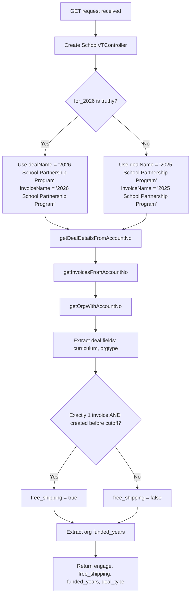

# Curriculum Ordering Details

## GET /api/school_curric_ordering_details.php

### Request

Query parameters:

| Parameter | Required | Description |
|---|---|---|
| `school_account_no` | Yes | Vtiger account number for the school |
| `for_2026` | No | Boolean flag; if truthy, returns 2026 data; otherwise returns 2025 data |

### Control Flow



The free shipping cutoff dates are:
- `for_2026 = true`: invoice created before `2025-11-29 00:00`
- `for_2026 = false`: invoice created before `2024-11-08 12:59`

### Response

```json
{
  "data": {
    "engage": "Journals",
    "free_shipping": true,
    "funded_years": "2",
    "deal_type": "School - New"
  }
}
```

### Scenarios

**Standard lookup** -- The `for_2026` flag determines which year's deal and invoice names are used for the CRM query. Free shipping is granted only when there is exactly one existing invoice and it was created before the year-specific cutoff date (indicating it was an auto-generated initial invoice, not a manual re-order).
