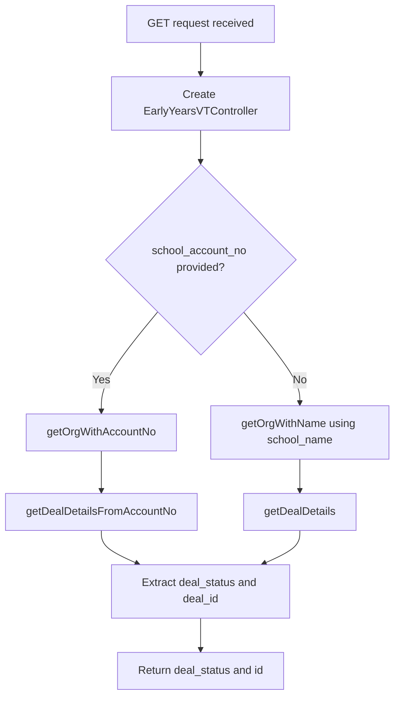

# Early Years Confirmation Form Details

## GET /api/ey_confirmation_form_details.php

### Request

Query parameters:

| Parameter | Required | Description |
|---|---|---|
| `school_account_no` | One of these | Vtiger account number for the organisation |
| `school_name` | One of these | Organisation name (used if account number not provided) |

### Control Flow



### Response

```json
{
  "data": {
    "deal_status": "Considering",
    "id": "4x56789"
  }
}
```

### Scenarios

**Standard lookup** -- Simpler than the school version. The endpoint only returns the deal's `sales_stage` and `id` for the "2026 Early Years Partnership Program" deal. No organisation-level fields are returned. If no deal is found, both fields return as empty strings.
