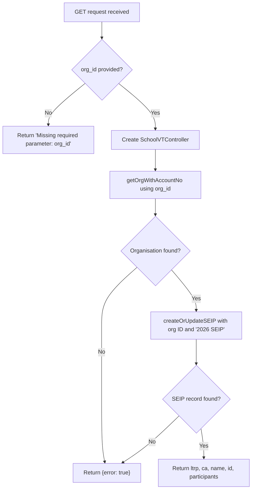

# LTRP Progress

## GET /api/school_ltrp_details.php

### Request

Query parameters:

| Parameter | Required | Description |
|---|---|---|
| `org_id` | Yes | Vtiger organisation account number |

### Control Flow



### Response

Success:
```json
{
  "data": {
    "ltrp": "2026-02-15",
    "ca": "2026-03-01",
    "name": "Example Primary School",
    "id": "3x12345",
    "participants": "25",
    "error": false
  }
}
```

Error:
```json
{
  "data": {
    "error": true
  }
}
```

### Scenarios

**Standard lookup** -- The `org_id` is used to find the organisation, then a SEIP record (named "2026 SEIP") is created or retrieved for that organisation. The response includes the Leading TRP watched date (`ltrp`), Culture Assessment completed date (`ca`), the organisation name and ID, and the number of participants. If the organisation or SEIP record cannot be found, `{error: true}` is returned.
