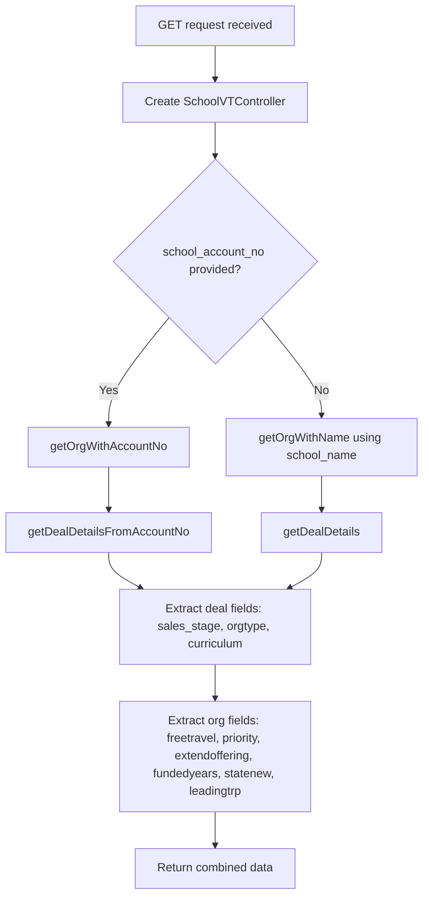

# School Confirmation Form Details

## GET /api/school_confirmation_form_details.php

### Request

Query parameters:

| Parameter | Required | Description |
|---|---|---|
| `school_account_no` | One of these | Vtiger account number for the school |
| `school_name` | One of these | School name (used if account number not provided) |

### Control Flow



### Response

```json
{
  "data": {
    "deal_status": "Deal Won",
    "deal_org_type": "School - New",
    "engage": "Journals",
    "free_travel": "Yes",
    "priority": "High",
    "f2f": true,
    "funded_years": "3",
    "org_state": "VIC",
    "leading_trp": "Jane Smith"
  }
}
```

### Scenarios

**Standard lookup** -- Either `school_account_no` or `school_name` is provided. The endpoint queries the CRM for the "2026 School Partnership Program" deal and the organisation record, then returns a merged set of fields from both. If either record is missing, those fields return as empty strings.
