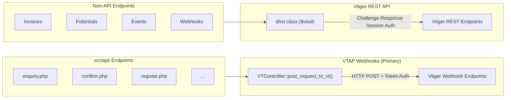
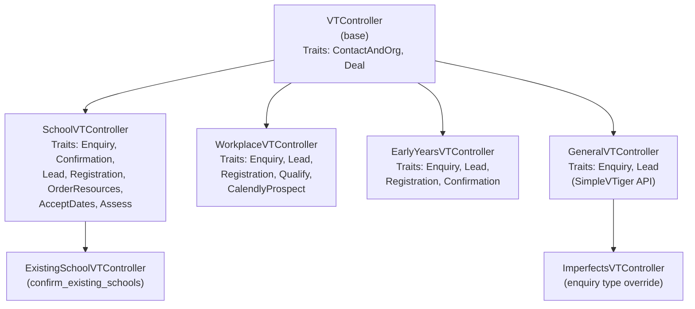
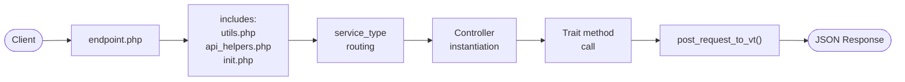

# TRP Integrations API - Architecture & Endpoint Reference

Serverless PHP 8.2 API on AWS Lambda (via Bref) for The Resilience Project (TRP). Integrates with Vtiger CRM to manage enquiries, registrations, confirmations, and resource ordering for Schools, Workplaces, and Early Years programs.

---

## 1. Architecture Overview

### Two CRM Integration Paths

The codebase communicates with Vtiger CRM in two distinct ways, depending on the endpoint.



| Path | Class / Function | Auth Method | Used By |
|---|---|---|---|
| VTAP Webhooks | `VTController::post_request_to_vt()` in `src/api/classes/base.php` | Token-based (constants in base class) | All `src/api/` endpoints |
| Vtiger REST API | `dhvt` class in `src/lib/class_dhvt.php`, global `$vtod` via `src/init.php` | Challenge-response session | Invoices, Potentials, Events, Webhooks |

**Vtiger REST API methods:** `retrieve()`, `create()`, `update()`, `query()`, `retrieveAllRelated()`, `addRelated()`

---

### Controller Hierarchy



Traits live in `src/api/classes/traits/` and encapsulate business logic (enquiry submission, order processing, confirmation, etc.).

Service types: `School`, `Workplace`, `Early Years`, `Imperfects`, `General` (fallback).

---

### Request Lifecycle



**Key utilities:**

| File | Purpose |
|---|---|
| `src/api/utils.php` | `get_method()`, `get_request_data()`, `send_response($response, $code)` |
| `src/api/api_helpers.php` | API helper functions |
| `src/init.php` | Initialises `$vtod`, `get_db()`, logging functions (`log_debug`, `log_info`, `log_warning`, `log_error`, `log_exception`) |

---

## 2. Endpoint Reference

### API Endpoints (`src/api/`)

| Function | Method | Path | Description | Docs |
|---|---|---|---|---|
| enquiry | POST | `/api/enquiry.php` | Submit enquiry (School ⚠️ deprecated/Workplace/EY/General) | [enquiries](enquiries/index.md) |
| qualify | POST | `/api/qualify.php` | Workplace qualifier submission | [workplace.md](workplace.md) |
| confirm_existing_schools | POST | `/api/confirm_existing_schools.php` | Existing school program confirmation | [confirmations](confirmations/index.md) |
| seminar_registration | POST | `/api/seminar_registration.php` | Teacher seminar registration | [registrations](registrations/index.md) |
| order_resources | POST | `/api/order_resources.php` | Order resources (legacy) | [school operations](school-operations/index.md) |
| school_confirmation_form_details | GET | `/api/school_confirmation_form_details.php` | School confirmation form data | [form details](form-details/index.md) |
| prize_pack | POST | `/api/prize_pack.php` | Prize pack entry | [prize-pack.md](prize-pack.md) |
| register | POST | `/api/register.php` | Event registration (School/Workplace/EY) | [registrations](registrations/index.md) |
| confirm | POST | `/api/confirm.php` | Program confirmation (School/EY) | [confirmations](confirmations/index.md) |
| accept_dates | POST | `/api/accept_dates.php` | Accept program dates | [school operations](school-operations/index.md) |
| ey_confirmation_form_details | GET | `/api/ey_confirmation_form_details.php` | Early Years confirmation form data | [form details](form-details/index.md) |
| calculate_shipping | POST | `/api/calculate_shipping.php` | Calculate shipping cost | [shipping.md](shipping.md) |
| calendly_event | POST | `/api/calendly_event.php` | Calendly webhook handler | [workplace.md](workplace.md) |
| school_ltrp_details | GET | `/api/school_ltrp_details.php` | School LTRP form data | [form details](form-details/index.md) |
| submit_ca | POST | `/api/submit_ca.php` | Submit culture assessment | [school operations](school-operations/index.md) |
| school_curric_ordering_details | GET | `/api/school_curric_ordering_details.php` | Curriculum ordering form data | [form details](form-details/index.md) |
| order_resources_2026 | POST | `/api/order_resources_2026.php` | Order resources for 2026 | [school operations](school-operations/index.md) |

### Invoice Endpoints (`src/Invoices/`)

| Function | Method | Path | Description | Docs |
|---|---|---|---|---|
| createShipment | POST | `/Invoices/createShipment.php` | Create ShipStation shipment | [invoices](invoices/index.md) |
| createInvoice | POST | `/Invoices/createInvoice.php` | Create VTiger invoice | [invoices](invoices/index.md) |
| updateXeroCodeInvoiceItem | POST | `/Invoices/58850_updateXeroCodeInvoiceItem.php` | Update Xero codes on invoice | [invoices](invoices/index.md) |
| create_shipment_2025 | POST | `/Invoices/create_shipment_2025.php` | Create ShipStation shipment (2025) | [invoices](invoices/index.md) |

### Potential Endpoints (`src/Potentials/`)

| Function | Method | Path | Description | Docs |
|---|---|---|---|---|
| createNewProgramBooking | POST | `/Potentials/createNewProgramBooking.php` | Create program booking deal | [potentials.md](potentials.md) |
| getEventPlanned | GET | `/Potentials/getEventPlanned.php` | Get planned events list | [potentials.md](potentials.md) |

### Event Endpoints (`src/Events/`)

| Function | Method | Path | Description | Docs |
|---|---|---|---|---|
| sendInvitation | POST | `/Events/54701_sendInvitation.php` | Send event invitation emails | [events.md](events.md) |

### Webhook Endpoints (`src/Webhooks/`)

| Function | Method | Path | Description | Docs |
|---|---|---|---|---|
| woocommerce_order | POST | `/Webhooks/Order.php` | WooCommerce order webhook | [webhooks.md](webhooks.md) |

---

## 3. Environments

| Environment | Base URL |
|---|---|
| Local | `http://localhost:8000` |
| AWS | `https://m9x7q0thrd.execute-api.ap-southeast-2.amazonaws.com` |

**Local development server:**

```bash
php -S localhost:8000 -t src/
```

---

## 4. Postman Collections

The `postman/` directory contains 11 collections with 56 request variants covering all endpoints:

| Collection | Directory |
|---|---|
| Confirmations | `postman/collections/Confirmations/` |
| Enquiries | `postman/collections/Enquiries/` |
| Events | `postman/collections/Events/` |
| Form Details | `postman/collections/Form Details/` |
| Invoices | `postman/collections/Invoices/` |
| Potentials | `postman/collections/Potentials/` |
| Registrations | `postman/collections/Registrations/` |
| School Operations | `postman/collections/School Operations/` |
| Shipping and Prize Pack | `postman/collections/Shipping and Prize Pack/` |
| Webhooks | `postman/collections/Webhooks/` |
| Workplace | `postman/collections/Workplace/` |

Environments and globals are in `postman/environments/` and `postman/globals/`.
