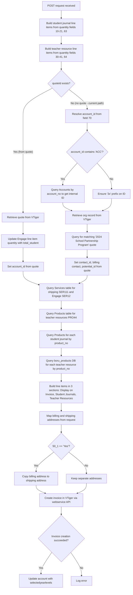

# Invoice Creation

## POST /Invoices/createInvoice.php

### Request

Form-urlencoded fields using numeric keys:

| Field Key | Description |
|---|---|
| `55` | PO number |
| `62` | Shipping/handling charge |
| `70` | Account ID (ACC number or raw ID) |
| `50_1` | "Yes" to copy billing address to shipping |
| `59` | Quote ID (currently overridden to null in code) |
| `10`-`21`, `63` | Student journal quantities (Foundation through Year 12) |
| `30`-`41`, `64` | Teacher resource quantities (Foundation through Year 12) |
| `42_1`-`42_6` | Billing address (street, city, state, postcode, country) |
| `43_1`-`43_6` | Shipping address (street, city, state, postcode, country) |

### Control Flow

### Sections

The invoice is built with three line-item sections:

1. **Display on Invoice** - Shipping/handling (SER111) and Engage program (SER12), plus Hard Copy Teacher Resources (PRO44)
2. **Student Journals** - Individual product line items per year level (PRO18-PRO30)
3. **Teacher Resources** - Individual product line items per year level (PRO31-PRO44), looked up via `boru_products` DB table
