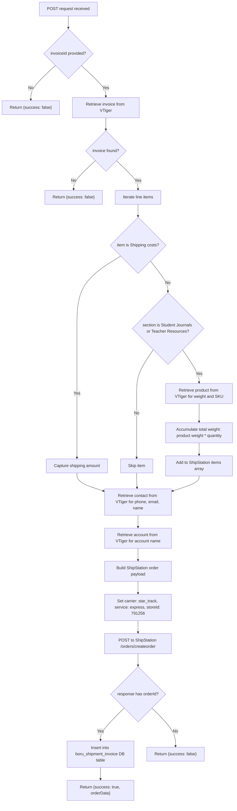
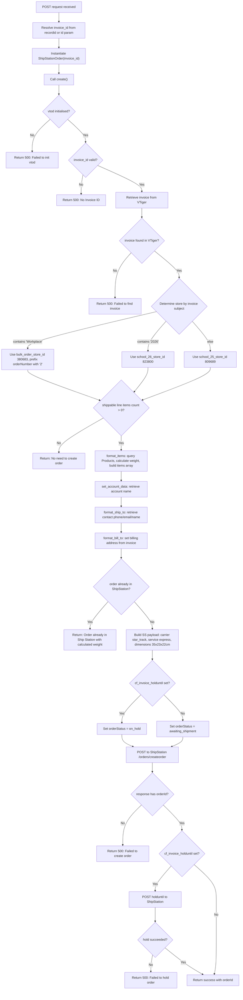

# Shipments

## POST /Invoices/createShipment.php

### Request

| Field | Type | Description |
|---|---|---|
| `id` | string | VTiger invoice ID |

### Control Flow

---

## POST /Invoices/create_shipment_2025.php

### Request

| Field | Type | Description |
|---|---|---|
| `recordid` | string | VTiger invoice ID (preferred) |
| `id` | string | VTiger invoice ID (fallback) |

### Control Flow

### Store Routing

| Invoice Subject Contains | Store ID | Store Name |
|---|---|---|
| "Workplace" | 380683 | Bulk order store |
| "2026" | 823800 | School 2026 store |
| Default | 809689 | School 2025 store |

### Item Filtering

Only line items in these sections are included in the ShipStation order:
- Student Journals
- Teacher Resources
- Extra Resources

Items with product IDs in the `teacher_sem` list (25x662672, 25x662669, 25x662668, 25x662673) are excluded.
