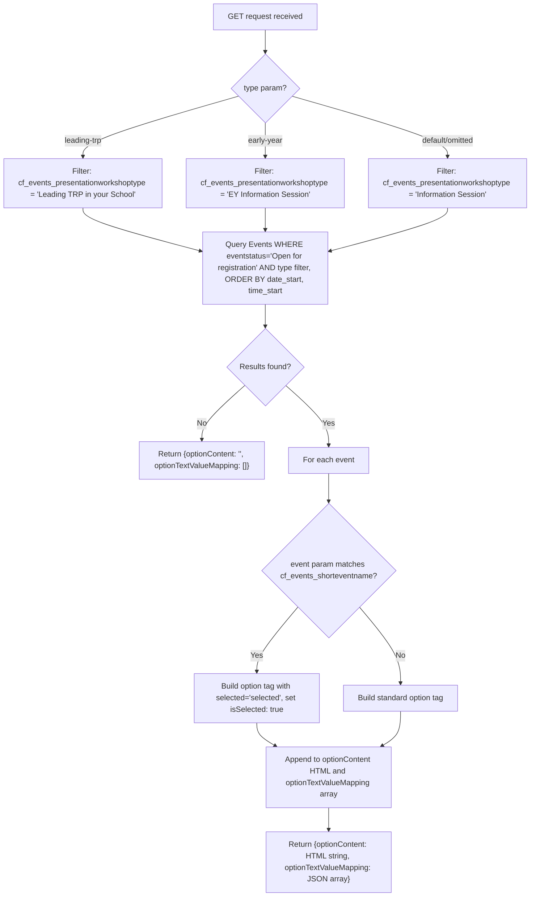

# Potential Endpoints

These endpoints use the Vtiger REST API (`$vtod`) directly.

## Overview

| Endpoint | Method | Integration | Purpose |
|---|---|---|---|
| `/Potentials/createNewProgramBooking.php` | POST | Vtiger REST | Create workplace program booking with org, contact, deal, billing contact, and invoice |
| `/Potentials/getEventPlanned.php` | GET | Vtiger REST | Retrieve open events by type and return as HTML option list |

---

## POST /Potentials/createNewProgramBooking.php

### Request

Form-urlencoded fields:

| Field | Description |
|---|---|
| `potentialname` / `org_name` | Organisation name (URL-encoded) |
| `number_of_participants` | Number of participants |
| `program_start_date` | Primary start date (fallback chain: `dr_program_start_date2`/`3`/`4`, `authen_program_start_date1`/`2`/`3`) |
| `contact_name` | Full name of primary contact (split into first/last) |
| `email_address` | Primary contact email |
| `job_title` | Contact job title |
| `org_street`, `org_city`, `org_state`, `org_postcode`, `org_country` | Organisation address |
| `purchase_order_number` | PO number |
| `billing_email`, `billing_firstname`, `billing_lastname` | Billing contact details |
| `dr_package1`, `dr_package2` | DR Package flags |
| `dr_presentation` | DR Presentation flag |
| `dr_wellbeing` | DR Wellbeing flag |
| `authen_package1` | Authenticity Package flag |
| `authen_presentation` | Authenticity Presentation flag |
| `authen_wellbeing` | Authenticity Wellbeing flag |
| `dr_package1_user`, `dr_package2_user`, etc. | Presenter selection per package (Hugh or Martin) |

### Control Flow



```mermaid
flowchart TD
    A[POST request received] --> B[Resolve potentialname from potentialname or org_name]
    B --> C[Resolve program_start_date from chain of fallback fields]
    C --> D["Build deal array: pipeline=Standard, sales_stage=Deal Won, opportunity_type=Workplace"]
    D --> E[Split contact_name into firstName and lastName]
    E --> F[Build confirmation URL with encoded params]

    F --> G{org_name provided?}
    G -- Yes --> H[Query Accounts by accountname]
    H --> I{Account exists?}
    I -- Yes --> J[Update existing account with confirmation URL and address]
    I -- No --> K["Create new Account: type=School, assigned_user_id=19x1"]
    K --> L[Set deal related_to from new account ID]
    J --> L
    G -- No --> M[No org linking]

    L & M --> N{email_address provided?}
    N -- Yes --> O[Query Contacts by email]
    O --> P{Contact exists?}
    P -- Yes --> Q[Update contact with confirmation URL, job title, address, link to account]
    P -- No --> R["Create new Contact: type=Sales Qualified Lead"]
    Q & R --> S[Set deal contact_id]
    N -- No --> S

    S --> T[Build service line items from package flags]
    T --> T1{"dr_package1 set?"}
    T1 -- Yes --> T2["Add SER36 line item + SER7 journal at $12/participant"]
    T1 -- No --> T3{dr_package2 set?}
    T2 --> T3
    T3 -- Yes --> T4["Add SER36 line item"]
    T3 -- No --> T5{dr_presentation set?}
    T4 --> T5
    T5 -- Yes --> T6["Add SER38 (Hugh) or SER39 (Martin)"]
    T5 -- No --> T7{dr_wellbeing set?}
    T6 --> T7
    T7 -- Yes --> T8["Add SER110"]
    T7 -- No --> T9{authen_package1 set?}
    T8 --> T9
    T9 -- Yes --> T10["Add SER109"]
    T9 -- No --> T11{authen_presentation set?}
    T10 --> T11
    T11 -- Yes --> T12["Add SER44 (Hugh) or SER45 (Martin)"]
    T11 -- No --> T13{authen_wellbeing set?}
    T12 --> T13
    T13 -- Yes --> T14["Add SER139"]
    T13 -- No --> U
    T14 --> U

    U["Set deal Inspire/Engage/Extend picklists from selected packages"]
    U --> V["Create Potential (deal) in VTiger with line items"]
    V --> W{Deal created successfully?}
    W -- No --> X["Return {success: false, message: error}"]
    W -- Yes --> Y{billing_email provided?}

    Y -- Yes --> Z[Query Contacts by billing_email]
    Z --> AA{Billing contact exists?}
    AA -- Yes --> AB[Update deal with billing contact ID]
    AA -- No --> AC["Create new billing Contact: type=Billing"]
    AC --> AD[Update deal with new billing contact ID]
    AB & AD --> AE

    Y -- No --> AE[Create Invoice record]
    AE --> AF["Set invoice: subject from potentialname, status=Auto Created, link to deal/account/contact"]
    AF --> AG[Copy org address to both billing and shipping address]
    AG --> AH[Create invoice in VTiger with line items]
    AH --> AI{Invoice created?}
    AI -- Yes --> AJ["Return {success: true, message: potentialId}"]
    AI -- No --> AK["Return {success: false, message: error}"]
```

### Package to Service Mapping

| Package Flag | Service No | Inspire Picklist | Engage Picklist |
|---|---|---|---|
| `dr_package1` | SER36 + SER7 (journal) | Workplace DR Hugh/Martin | DR DWS, 21-Day Journal |
| `dr_package2` | SER36 | Workplace DR Hugh/Martin | DR DWS |
| `dr_presentation` | SER38 (Hugh) / SER39 (Martin) | Workplace DR Hugh/Martin | - |
| `dr_wellbeing` | SER110 | - | DR DWS |
| `authen_package1` | SER109 | Workplace AC Hugh/Martin | AC DWS |
| `authen_presentation` | SER44 (Hugh) / SER45 (Martin) | Workplace AC Hugh/Martin | - |
| `authen_wellbeing` | SER139 | - | AC DWS |

---

## GET /Potentials/getEventPlanned.php

### Request

| Param | Type | Default | Description |
|---|---|---|---|
| `type` | string | (none) | Event filter: `leading-trp`, `early-year`, or omit for Information Session |
| `event` | string | (none) | Pre-selected event short name to mark as `selected` |

### Control Flow



### Response

```json
{
  "optionContent": "<option value='18x123'>Event Name</option>...",
  "optionTextValueMapping": [
    {"text": "Event Name", "value": "18x123"},
    {"text": "Selected Event", "value": "18x456", "isSelected": true}
  ]
}
```
