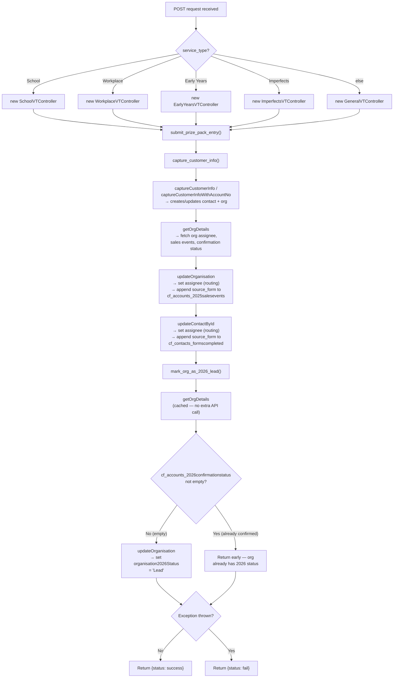

# Prize Pack Endpoint

## Overview

| Endpoint | Method | Integration | Purpose |
|---|---|---|---|
| `/api/prize_pack.php` | POST | VTAP Webhooks | Submit a prize pack entry and mark org as 2026 lead |

---

## POST /api/prize_pack.php

### Request

| Field | Type | Description |
|---|---|---|
| `service_type` | string | One of: School, Workplace, Early Years, Imperfects, or fallback to General |
| `contact_email` | string | Contact email address |
| `contact_first_name` | string | Contact first name |
| `contact_last_name` | string | Contact last name |
| `contact_phone` | string | Contact phone number (optional) |
| `school_account_no` | string | School account number (for School type) |
| `organisation_name` | string | Organisation name (for non-School types) |

### Control Flow

> **Note:** `capture_customer_info()` (in `ContactAndOrg` trait) is not a single VTAP call — it internally calls `captureCustomerInfo` (or `captureCustomerInfoWithAccountNo`), then `getOrgDetails`, `updateOrganisation`, and `updateContactById`. These update the org's assignee and sales event tracking, and the contact's assignee and forms completed tracking.

### CRM Records Modified

| Record | VTAP Endpoint | Fields Modified | Why |
|--------|--------------|----------------|-----|
| **Contact** | `captureCustomerInfo` → `updateContactById` | `assigned_user_id` (assignee routing), `cf_contacts_formscompleted` (source form appended) | Routes contact to correct partnership manager; tracks which forms this contact came through |
| **Organisation** | `captureCustomerInfo` → `updateOrganisation` | `assigned_user_id` (assignee routing), `cf_accounts_2025salesevents` (source form appended) | Routes org to correct partnership manager; tracks which conference/form touched this org |
| **Organisation** | `updateOrganisation` (mark as lead) | `cf_accounts_2026confirmationstatus` → `"Lead"` (only if currently empty) | Flags org for sales follow-up without creating a deal |

### Scenarios

| Scenario | service_type | Behaviour |
|---|---|---|
| School submission | School | SchoolVTController captures customer info (creates/updates contact + org, sets assignees, tracks source form), then marks org as 2026 Lead if not already confirmed |
| Workplace submission | Workplace | WorkplaceVTController same flow, different controller and org lookup |
| Already confirmed org | any | `mark_org_as_2026_lead()` returns early without updating since confirmation status is already set |
