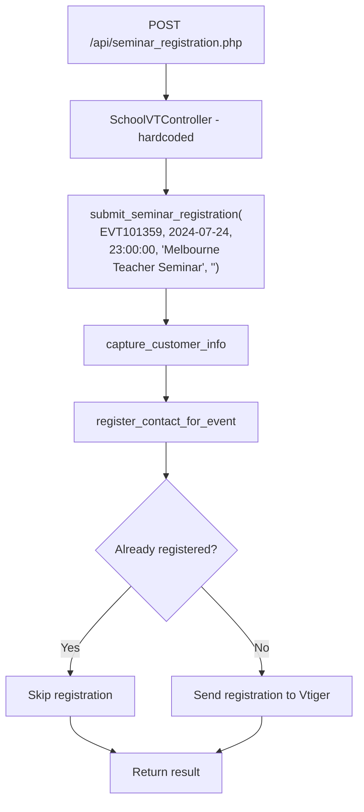

# Early Years Registrations

Early Years registrations are handled by `EarlyYearsVTController.submit_event_registration()`. This section also covers the separate `seminar_registration.php` endpoint.

## Early Years Registration Flow

1. Gets event details from `event_id`.
2. Calls `capture_customer_info()` to find or create the contact and organisation.
3. Calls `update_or_create_deal()` with stage `Considering` and a close date of event date + 1 day.
4. Calculates `first_info_session_date` from the event.
5. Calls `update_deal_with_registration()` to update the deal with the registration details.
6. Registers the contact for the event via `register_contact_for_event()`.

Unlike the School flow, Early Years registrations always create or update a deal — there is no `is_new_school()` branching or enquiry fallback.

## Key Details

- **update_deal_with_registration()** updates the deal's close date and first info session date. If the deal's current stage is `New`, it is changed to `Considering`.
- The `register_contact_for_event()` method first checks if the contact is already registered (via `checkContactRegisteredForEvent`) and skips registration if so.

## Scenarios

9. **Early Years Registration** — Standard Early Years event registration. Always creates/updates deal with `Considering` stage.

---

## POST /api/seminar_registration.php

The seminar registration endpoint handles a specific hardcoded seminar event. It does not use `service_type` or `event_id` parameters — the controller and event are fixed.

### Request

| Field | Type | Required | Description |
|-------|------|----------|-------------|
| `contact_email` | string | Yes | Contact's email address |
| `contact_first_name` | string | Yes | Contact's first name |
| `contact_last_name` | string | Yes | Contact's last name |
| `contact_phone` | string | No | Contact's phone number |
| `job_title` | string | No | Contact's job title |
| `school_account_no` | string | Yes | School's Vtiger account number |
| `state` | string | No | Australian state |

Note: No `service_type` or `event_id` parameter is needed. The controller and event are hardcoded.

### Control Flow

### Key Details

- The endpoint is hardcoded to use `SchoolVTController` with a fixed event: `EVT101359` (Melbourne Teacher Seminar on 2024-07-24).
- No `source_form` or `service_type` routing. The event details are passed directly as arguments.
- `submit_seminar_registration()` calls `capture_customer_info()` then `register_contact_for_event()` with a synthetic event object.
- No deal creation or update occurs in this flow.

### Scenarios

10. **Seminar Registration** — Registers a school contact for the hardcoded Melbourne Teacher Seminar event.
