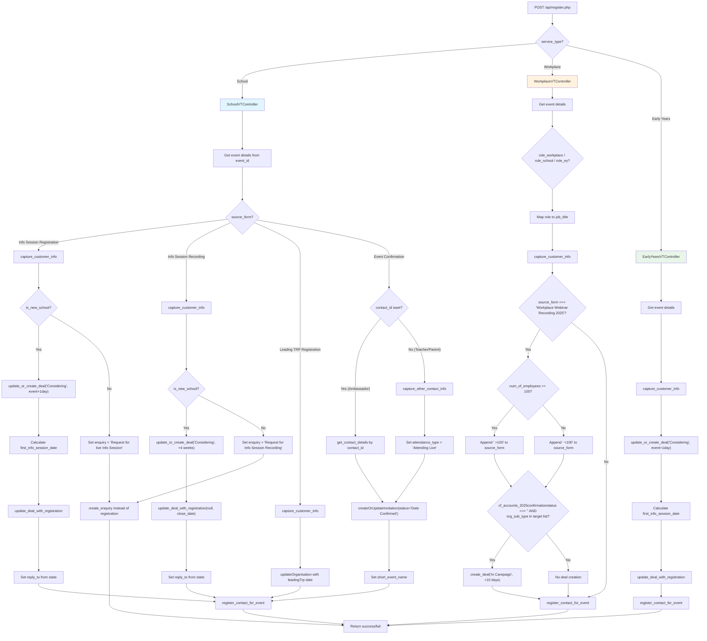

# Registration Endpoints

The registration endpoints handle event registrations across School, Workplace, and Early Years service types. The `register.php` endpoint routes to service-specific controllers that each implement `submit_event_registration()` with different branching logic. A separate `seminar_registration.php` endpoint handles a specific hardcoded seminar event.

## Overview

| Endpoint | Method | URL | Description |
|----------|--------|-----|-------------|
| Register | POST | `/api/register.php` | Register a contact for an event (service-type dependent) |
| Seminar Registration | POST | `/api/seminar_registration.php` | Register for a hardcoded Melbourne Teacher Seminar |

## In This Section

- [School Registrations](./school-registrations.md) — Info Session, Info Session Recording, Leading TRP, and Event Confirmation flows
- [Workplace Registrations](./workplace-registrations.md) — Role mapping, Webinar Recording logic, and deal creation conditions
- [Early Years Registrations](./early-years-registrations.md) — Early Years registration flow and Seminar Registration endpoint

## POST /api/register.php

### Request

| Field | Type | Required | Description |
|-------|------|----------|-------------|
| `service_type` | string | Yes | One of: `School`, `Workplace`, `Early Years` |
| `contact_email` | string | Yes | Contact's email address |
| `contact_first_name` | string | Yes | Contact's first name |
| `contact_last_name` | string | Yes | Contact's last name |
| `contact_phone` | string | No | Contact's phone number |
| `job_title` | string | No | Contact's job title |
| `state` | string | No | Australian state (e.g. VIC, NSW, QLD) |
| `event_id` | string | Yes | Vtiger event ID (with or without `18x` prefix) |
| `source_form` | string | Yes | Form name that determines branching logic |
| `school_account_no` | string | Conditional | Existing school account number (School) |
| `school_name_other` | string | Conditional | New school name (School) |
| `school_name_other_selected` | string | Conditional | Flag for new school name |
| `organisation_name` | string | Conditional | Workplace organisation name |
| `workplace_name_other` | string | Conditional | New workplace name |
| `workplace_name_other_selected` | string | Conditional | Flag for new workplace name |
| `workplace_account_no` | string | Conditional | Existing workplace account number |
| `earlyyears_account_no` | string | Conditional | Existing Early Years account number |
| `earlyyears_name_other` | string | Conditional | New Early Years service name |
| `service_name_other_selected` | string | Conditional | Flag for new Early Years name |
| `contact_id` | string | No | Existing contact ID for ambassador flow (Event Confirmation) |
| `contact_type` | string | No | Contact type for teacher/parent flow (Event Confirmation) |
| `attendance_type` | string | No | Attendance type (e.g. `Attending Live`) |
| `event_name_display` | string | No | Display name for Event Confirmation short event name |
| `contact_newsletter` | string | No | Newsletter opt-in flag |
| `num_of_students` | integer | No | Number of students (School) |
| `num_of_employees` | integer | No | Number of employees (Workplace) |
| `num_of_ey_children` | integer | No | Number of children (Early Years) |
| `organisation_sub_type` | string | No | Organisation sub-type (Workplace) |
| `role_workplace` | string | No | Workplace role, mapped to `job_title` |
| `role_school` | string | No | School role, mapped to `job_title` |
| `role_ey` | string | No | Early Years role, mapped to `job_title` |

### Control Flow

**Key details:**

- **is_new_school()** returns true when the organisation's assignee is one of `MADDIE`, `LAURA`, `VICTOR`, `HELENOR`, or `BRENDAN` (i.e. not assigned to a dedicated School Partnership Manager). When false, the school is considered an existing partner and gets an enquiry instead of a registration.
- **update_deal_with_registration()** updates the deal's close date and first info session date. If the deal's current stage is `New`, it is changed to `Considering`.
- **Workplace target organisation sub-types** for deal creation: `Professional Services`, `Healthcare`, `Government`, `Not for Profit`, `Retail/Wholesale`.
- **Event Confirmation flow** always calls `createOrUpdateInvitation` with status `Date Confirmed` and always registers the contact. The ambassador path retrieves existing contact details, while the teacher/parent path captures new contact info and forces `attendance_type = 'Attending Live'`.
- The `register_contact_for_event()` method first checks if the contact is already registered (via `checkContactRegisteredForEvent`) and skips registration if so.
