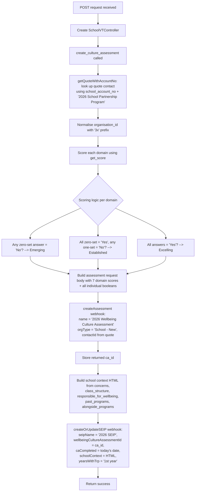

# Culture Assessment

## POST /api/submit_ca.php

### Request

| Parameter | Required | Description |
|---|---|---|
| `school_account_no` | Yes | School account number for quote lookup |
| `organisation_id` | Yes | Vtiger organisation ID (with or without `3x` prefix) |
| `VP01`-`VP04` | Yes | Vision and Practice zero-set questions (Yes/No) |
| `VP11`-`VP14` | Yes | Vision and Practice one-set questions (Yes/No) |
| `ET01`-`ET04` | Yes | Explicit Teaching zero-set questions |
| `ET11`-`ET14` | Yes | Explicit Teaching one-set questions |
| `HB01`-`HB04` | Yes | Habit Building zero-set questions |
| `HB11`-`HB14` | Yes | Habit Building one-set questions |
| `SC01`-`SC03` | Yes | Staff Capacity zero-set questions |
| `SC11`-`SC13` | Yes | Staff Capacity one-set questions |
| `SW01`-`SW02` | Yes | Staff Wellbeing zero-set questions |
| `SW11`-`SW12` | Yes | Staff Wellbeing one-set questions |
| `FC01`-`FC02` | Yes | Family Capacity zero-set questions |
| `FC11`-`FC12` | Yes | Family Capacity one-set questions |
| `P01`-`P02` | Yes | Partnerships zero-set questions |
| `P11`-`P12` | Yes | Partnerships one-set questions |
| `concern_1` | Yes | Top concern #1 |
| `concern_2` | Yes | Top concern #2 |
| `concern_3` | Yes | Top concern #3 |
| `class_structure` | Yes | How classes are structured |
| `responsible_for_wellbeing` | Yes | Who is responsible for wellbeing |
| `past_programs` | No | Past wellbeing programs |
| `alongside_programs` | No | Programs running alongside TRP |

### Control Flow

### Scoring Logic

Each of the 7 domains has two sets of questions:
- **Zero-set** (e.g., VP01-VP04): If any answer is "No", the domain score is **Emerging**
- **One-set** (e.g., VP11-VP14): If all zero-set answers are "Yes" but any one-set answer is "No", the score is **Established**
- If all answers in both sets are "Yes", the score is **Excelling**

### Scenarios

**Standard submission** -- All question fields are provided. Seven domain scores are calculated, the assessment record is created in the CRM, and the SEIP record is updated with the assessment ID, completion date, and school context narrative.
