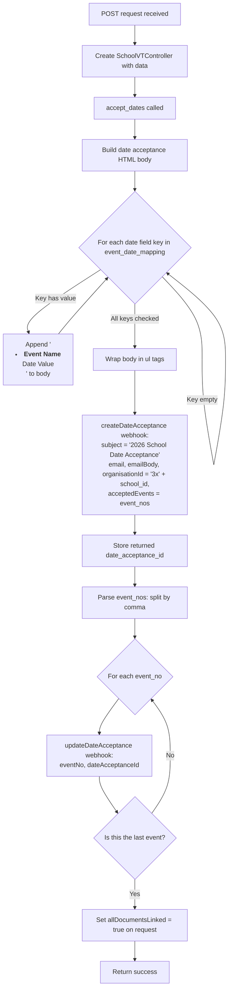

# Date Acceptance

## POST /api/accept_dates.php

### Request

| Parameter | Required | Description |
|---|---|---|
| `email` | Yes | Contact email address |
| `school_id` | Yes | Organisation ID (numeric, prefixed with `3x` internally) |
| `event_nos` | Yes | Comma-separated event numbers to link |
| `twb_1_web` | No | Date for Teacher Wellbeing 1: Looking After Yourself (Webinar) |
| `twb_1_inp` | No | Date for Teacher Wellbeing 1: Looking After Yourself (In Person) |
| `twb_2_web` | No | Date for Teacher Wellbeing 2: Looking After Each Other (Webinar) |
| `twb_2_inp` | No | Date for Teacher Wellbeing 2: Looking After Each Other (In Person) |
| `twb_3_web` | No | Date for Teacher Wellbeing 3: Sharing Success (Webinar) |
| `twb_3_inp` | No | Date for Teacher Wellbeing 3: Sharing Success (In Person) |
| `ac_staff` | No | Date for Authentic Connection for Staff (Webinar) |
| `brh_web` | No | Date for Building Resilience at Home for Parents/Carers (Webinar) |
| `brh_inp` | No | Date for Building Resilience at Home for Parents/Carers (In Person) |
| `ac_parents` | No | Date for Parenting with ACE (Webinar) |
| `cp` | No | Date for Connected Parenting with Lael Stone (Webinar) |
| `dwf_web` | No | Date for Digital Wellbeing for Families (Webinar) |
| `dwf_inp` | No | Date for Digital Wellbeing for Families (In Person) |

### Control Flow

**Note:** The current code calls `create_date_acceptance_record()` inside a try/catch but does not call `link_documents()` afterward (the `accept_dates()` method ends after the try/catch). The `link_documents()` method exists in the trait but is not invoked by `accept_dates()`.

### Scenarios

**Minimal (few dates set)** -- Only one or two date fields are provided (e.g., `twb_1_web`). The HTML body contains only those entries. The acceptance record is created with the selected events.

**Full programs (all dates set)** -- All 13 date fields are populated. The HTML body contains a full list of accepted event dates. Each event number in `event_nos` is linked to the acceptance record, with the last one flagged as `allDocumentsLinked = true`.
