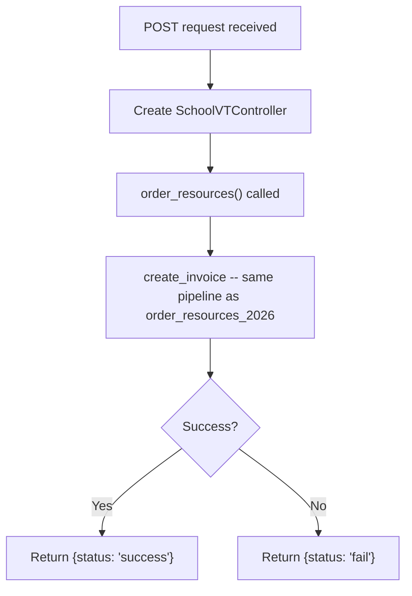
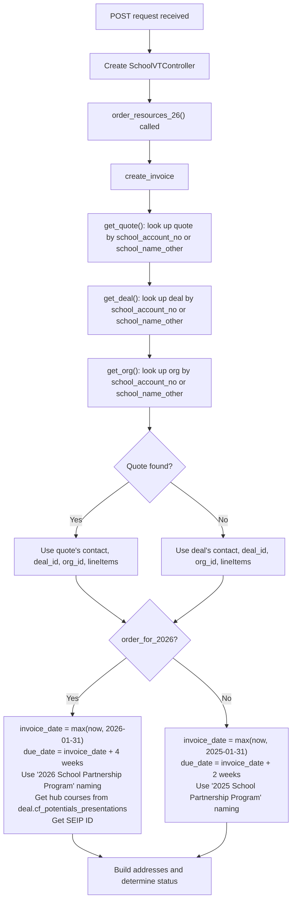
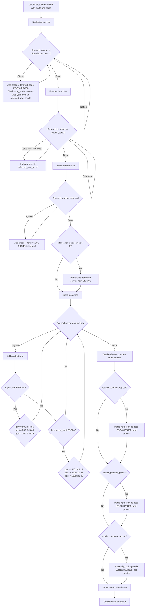
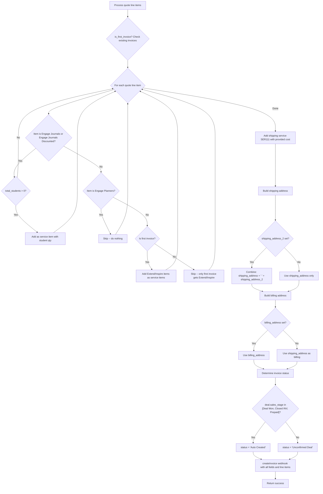

# Resource Ordering

## POST /api/order_resources.php

### Request

| Parameter | Required | Description |
|---|---|---|
| `school_account_no` | One of these | School account number |
| `school_name_other` | One of these | School name (if no account number) |
| `contact_email` | Yes | Email of person placing the order |

Plus all line item fields (year-level quantities, extras, etc. -- same fields as `order_resources_2026.php` below).

### Control Flow

### Scenarios

**Standard order** -- Follows the same invoice creation pipeline as `order_resources_2026.php`. The SchoolVTController class includes the `order_resources_26.php` trait, so both endpoints share the same `order_resources()` / `create_invoice()` implementation.

---

## POST /api/order_resources_2026.php

### Request

| Parameter | Required | Description |
|---|---|---|
| `school_account_no` | One of these | School account number |
| `school_name_other` | One of these | School name (if no account number) |
| `order_for_2026` | No | If truthy, use 2026 naming/dates; otherwise use 2025 |
| `shipping` | Yes | Shipping cost amount |
| `contact_first_name` | Yes | First name of person placing order |
| `contact_last_name` | Yes | Last name of person placing order |
| `po_number` | No | Purchase order number |
| `foundation_qty` .. `year12_qty` | No | Student journal quantities per year level |
| `tr_foundation_qty` .. `tr_year12_qty` | No | Teacher resource quantities per year level |
| `year7_planner_1/2` .. `year12_planner_1/2` | No | Set to "Planners" to include that year level for planner hub courses |
| `gem_card_qty` | No | Gem card quantity (tiered pricing) |
| `emotion_card_qty` | No | Emotion card quantity (tiered pricing) |
| `fence_sign_qty`, `reading_log_qty`, `primary_planner_qty`, `journal_21_qty`, `journal_6_qty` | No | Extra resource quantities |
| `teacher_planner_qty` / `teacher_planner_type` | No | Teacher planner quantity and type selection |
| `senior_planner_qty` / `senior_planner_type` | No | Senior planner quantity and type selection |
| `teacher_seminar_qty` / `teacher_seminar_type` | No | Teacher seminar tickets and location |
| `shipping_address`, `shipping_address_2`, `shipping_suburb`, `shipping_postcode`, `shipping_state` | Yes | Shipping address fields |
| `billing_address`, `billing_address_2`, `billing_suburb`, `billing_postcode`, `billing_state` | No | Billing address (defaults to shipping if not set) |
| `ship_by` | No | Requested ship-by date |
| `hold_until` | No | Hold shipment until date |

### Control Flow -- Flowchart 1: Invoice Setup

### Control Flow -- Flowchart 2: Line Items

### Control Flow -- Flowchart 3: Quote Items, Addresses, and Status

### Scenarios

**Basic order (2026, first invoice)** -- `order_for_2026` is set. Invoice date is max(now, 2026-01-31), due in 4 weeks. Hub courses are retrieved. Extend and Inspire quote items are included since it is the first invoice. Student journal quantities generate product line items.

**Secondary order (2026, subsequent invoice)** -- Same as above, but `is_first_invoice()` returns false because an existing invoice is found. Extend and Inspire items from the quote are skipped. Only Engage journals/discounted journals are copied from the quote.

**Previous year order** -- `order_for_2026` is not set. Uses "2025 School Partnership Program" naming. Invoice date is max(now, 2025-01-31), due in 2 weeks. No hub courses or SEIP lookup is performed.

**Order with extras (tiered pricing)** -- Gem cards and emotion cards use quantity-based pricing tiers. Teacher planners, senior planners, and teacher seminar tickets are added based on their type selections, each mapping to specific product/service codes.
