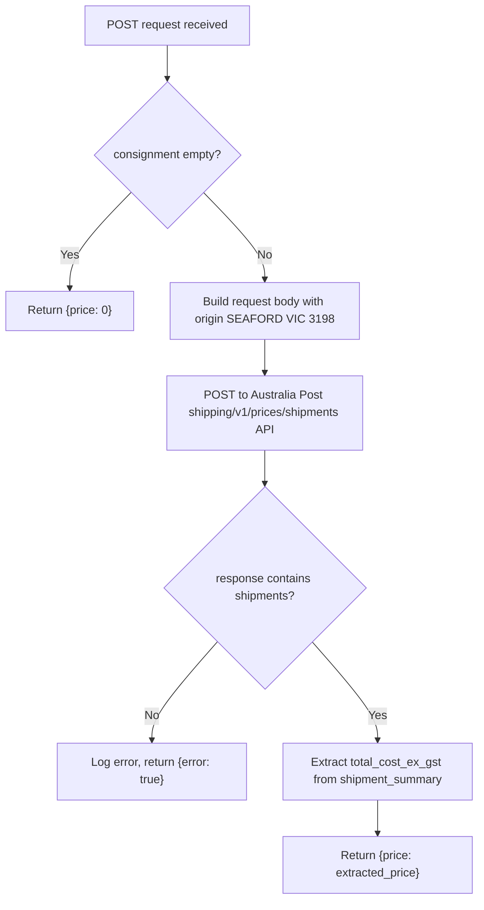

# Shipping Endpoint

## Overview

| Endpoint | Method | Integration | Purpose |
|---|---|---|---|
| `/api/calculate_shipping.php` | POST | Australia Post API | Calculate shipping cost for a consignment |

---

## POST /api/calculate_shipping.php

### Request

| Field | Type | Description |
|---|---|---|
| `consignment` | array | Array of items, each with `length`, `width`, `height`, `weight` |
| `destination_suburb` | string | Destination suburb |
| `destination_state` | string | Destination state code |
| `destination_postcode` | string | Destination postcode |

### Control Flow

### Scenarios

| Scenario | consignment | Result |
|---|---|---|
| Empty consignment | `[]` | `{price: 0}` |
| Single item | `[{length:10, width:10, height:10, weight:500}]` | `{price: <calculated>}` |
| Multi-item | `[{...}, {...}]` | `{price: <calculated>}` |
| API error | any | `{error: true}` |
