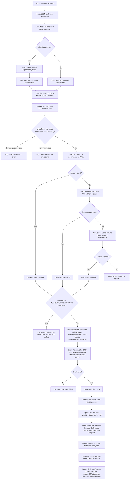
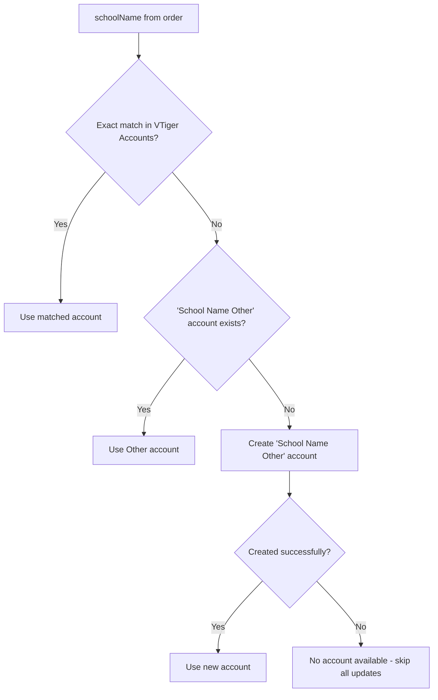

# Webhook Endpoints

Uses the Vtiger REST API (`$vtod`) directly.

## Overview

| Endpoint | Method | Integration | Purpose |
|---|---|---|---|
| `/Webhooks/Order.php` | POST | Vtiger REST | Process WooCommerce order webhook for Early Years curriculum orders |

---

## POST /Webhooks/Order.php

### Request

JSON body -- WooCommerce webhook payload:

| Field | Type | Description |
|---|---|---|
| `id` | int | WooCommerce order ID |
| `status` | string | Order status (only `processing` is handled) |
| `date_created` | string | ISO datetime (e.g. `2026-01-15T10:30:00`) |
| `billing.company` | string | Company name from billing (primary school name source) |
| `meta_data[]` | array | Order meta data; key `school_name` used as fallback for school name |
| `line_items[]` | array | Order line items with `name`, `product_id`, `quantity`, `meta_data` |

### Control Flow

### Account Resolution Logic

### Deal Update Details

When the account is found and has no existing curriculum ordered date, the webhook updates the related deal:

| Deal Field | Source |
|---|---|
| `cf_potentials_wcreference` | WooCommerce order `id` |
| `cf_potentials_numberofgroups` | Count of groups from `Engage: Early Years Teaching and Learning Program` line item meta_data |
| `cf_potentials_numberofparticipants` | `qty_early_year` from the `Early Years Children's Portfolio` line item |
| `LineItems` | Existing deal line items with updated quantity for product `25x95211` |
| `hdnGrandTotal` | Recalculated from updated line items (listprice * quantity) |

### Processing Guard

The webhook exits early without processing in two cases:
1. `status` is not `processing` (e.g. `completed`, `pending`, `on-hold`)
2. `schoolName` could not be resolved from either `billing.company` or the `school_name` meta_data key
