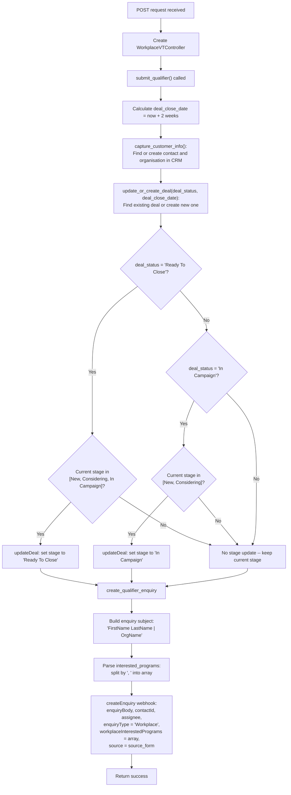

# Workplace Endpoints

These POST endpoints handle workplace-specific operations: qualifying leads from a web form and processing Calendly booking webhooks.

## Overview

| Endpoint | Method | Controller | Purpose |
|---|---|---|---|
| `/api/qualify.php` | POST | `WorkplaceVTController` | Submit a qualifier form (update deal stage and create enquiry) |
| `/api/calendly_event.php` | POST | `WorkplaceVTController` | Process a Calendly booking webhook (create/update prospect deal) |

---

## POST /api/qualify.php

### Request

| Parameter | Required | Description |
|---|---|---|
| `contact_email` | Yes | Contact email address |
| `contact_first_name` | Yes | Contact first name |
| `contact_last_name` | Yes | Contact last name |
| `organisation_name` | Yes | Organisation name |
| `deal_status` | Yes | Either `"Ready To Close"` or `"In Campaign"` |
| `interested_programs` | Yes | Comma-separated list of programs (e.g., `"Keynote, Workshop"`) |
| `enquiry` | Yes | Free-text enquiry body |
| `source_form` | Yes | Source form identifier |
| `organisation_sub_type` | No | Organisation sub-type |
| `num_of_employees` | No | Number of employees |

Additional contact/organisation fields are handled by `capture_customer_info()` in the base `ContactAndOrg` trait.

### Control Flow

### Deal Stage Update Rules

The stage is only updated in specific transitions to prevent moving a deal backward:

| Requested Status | Current Stage | Action |
|---|---|---|
| Ready To Close | New | Update to Ready To Close |
| Ready To Close | Considering | Update to Ready To Close |
| Ready To Close | In Campaign | Update to Ready To Close |
| Ready To Close | Ready To Close / Deal Won / other | No change |
| In Campaign | New | Update to In Campaign |
| In Campaign | Considering | Update to In Campaign |
| In Campaign | In Campaign / Ready To Close / other | No change |

### Scenarios

**Ready To Close** -- A qualified lead submits with `deal_status = "Ready To Close"`. The deal stage is updated if currently at New, Considering, or In Campaign. An enquiry is created with the interested programs parsed into an array and assigned to the workplace enquiry assignee.

**In Campaign** -- A lead in the nurturing phase submits with `deal_status = "In Campaign"`. The deal stage is only updated if currently at New or Considering (not if already at In Campaign or beyond). The enquiry is created the same way.

---

## POST /api/calendly_event.php

### Request

This endpoint receives a Calendly webhook payload. The relevant fields are:

| Payload Path | Description |
|---|---|
| `payload.email` | Invitee email address |
| `payload.first_name` | Invitee first name |
| `payload.last_name` | Invitee last name |
| `payload.questions_and_answers` | Array of Q&A objects with `question` and `answer` fields |
| `payload.scheduled_event.event_type` | Calendly event type URI |
| `payload.scheduled_event.start_time` | Scheduled meeting start time (ISO 8601) |

### Control Flow

```mermaid
flowchart TD
    A[Webhook received] --> B[Extract payload from raw_data]
    B --> C{event_type matches known link?}
    C -->|"Not vic_link, laura_link,<br/>or round_robin_link"| D["Return success with<br/>'integration not required'<br/>-- exit"]
    C -->|Matches| E{event_type === round_robin_link?}
    E -->|Yes| F["question_text = 'Workplace Name'"]
    E -->|No| G["question_text = 'Organisation Name'"]
    F --> H[Extract org_name from Q&A matching question_text]
    G --> H
    H --> I["Extract info_provided from Q&A matching<br/>'Please share anything that will help<br/>prepare for our meeting.'"]
    I --> J[Extract scheduled_date from scheduled_event.start_time]
    J --> K["Build data map:<br/>contact_email, contact_first_name,<br/>contact_last_name, organisation_name,<br/>scheduled_date, info_provided,<br/>source_form = 'Calendly Prospect'"]
    K --> L[Create WorkplaceVTController with mapped data]
    L --> M["create_calendly_prospect() called"]
    M --> N["capture_customer_info():<br/>Find or create contact and organisation"]
    N --> O["Calculate deal_close_date =<br/>scheduled_date + 10 days"]
    O --> P["update_or_create_deal('Considering', deal_close_date)"]
    P --> Q[update_deal_status_for_calendly]
    Q --> R["Convert scheduled_date to<br/>Australia/Melbourne timezone"]
    R --> S["Build description:<br/>existing description + 'Calendly meeting booked for: date'"]
    S --> T{info_provided not empty?}
    T -->|Yes| U["Append 'Info provided: ...' to description"]
    T -->|No| V[Skip info line]
    U --> W{"Current deal stage = 'New'?"}
    V --> W
    W -->|Yes| X["Add dealStage = 'Considering' to update"]
    W -->|No| Y[Do not change deal stage]
    X --> Z["updateDeal webhook:<br/>dealId, description, dealStage (if applicable)"]
    Y --> Z
    Z --> AA[Return success]
```

### Known Event Type Links

The endpoint recognises three hardcoded Calendly event type URIs:

| Variable | Event Type URI |
|---|---|
| `vic_link` | `https://api.calendly.com/event_types/033a4470-b2f0-4e57-85b4-a2af4383b4f1` |
| `laura_link` | `https://api.calendly.com/event_types/c3c384f9-de9f-4155-9b9c-c86eb378facb` |
| `round_robin_link` | `https://api.calendly.com/event_types/053e1993-414f-4619-a4a0-b3c218fbcedb` |

Any other event type is silently ignored with a success response.

### Scenarios

**Standard booking (vic_link or laura_link)** -- A Calendly booking comes in for a known sales rep. The Q&A field "Organisation Name" is used to find the organisation. A deal is created or updated with stage "Considering" and a close date of 10 days after the meeting. The deal description is appended with the meeting date (converted to Melbourne time) and any info the prospect provided. If the deal was previously at "New", its stage moves to "Considering".

**Round robin booking** -- The round_robin_link event type is used. The only difference is that the Q&A lookup uses "Workplace Name" instead of "Organisation Name" to extract the organisation name. All other processing is identical.
