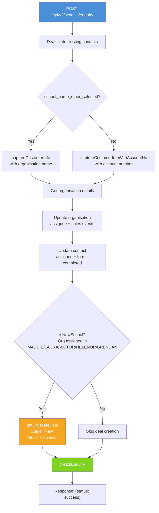
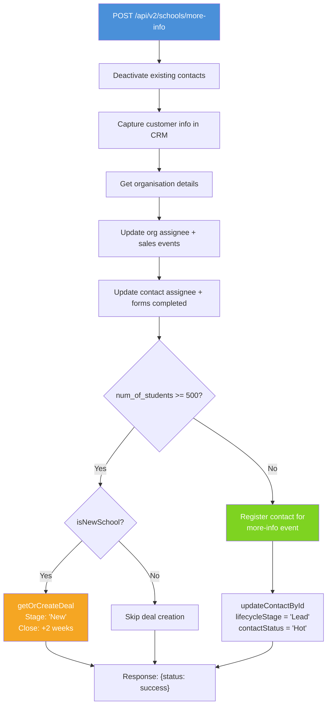
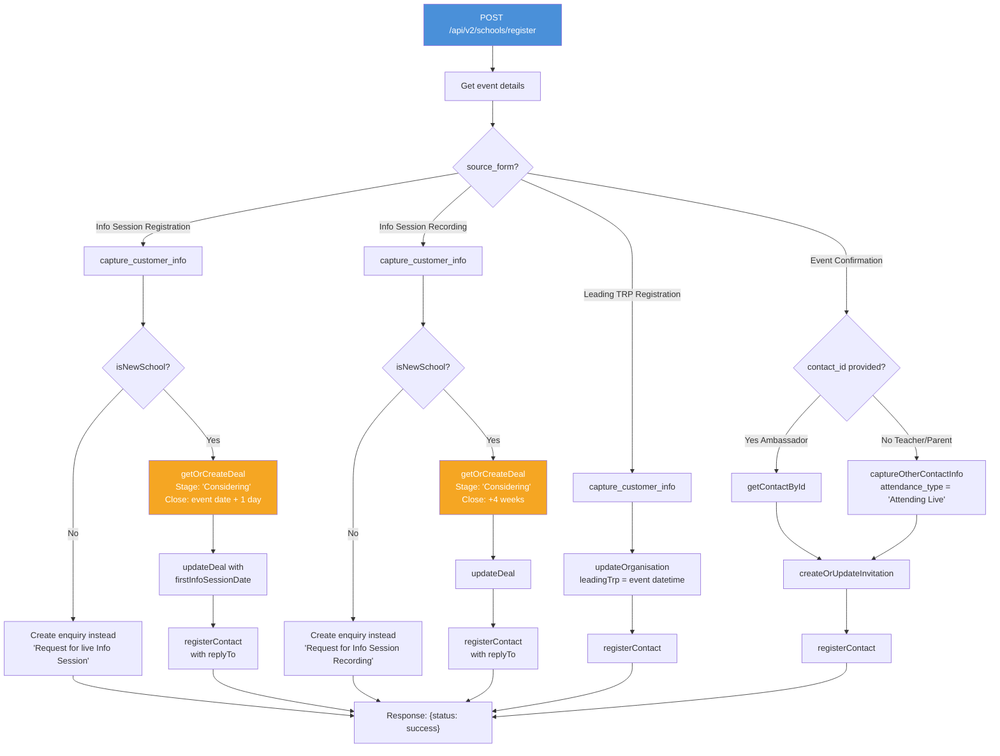

# API v2 — Schools Endpoints

API v2 introduces a schools-specific URL structure with a DDD-lite architecture. Only schools have v2 endpoints; all other service types (Workplace, Early Years, General) continue to use v1.

> **Note:** The v1 school enquiry endpoint (`POST /api/enquiry.php` with `service_type=School`) is deprecated. All school enquiries and registrations should use the v2 endpoints below.

## Key Differences from v1

| | v1 | v2 |
|---|---|---|
| **URL pattern** | `/api/enquiry.php` | `/api/v2/schools/enquiry` |
| **Service type routing** | `service_type` field in POST body | URL path determines service type |
| **Architecture** | Controller + traits | Domain objects + Application handlers |
| **Testability** | Reflection-based tests | Interface-based stubs |

## Overview

| Endpoint | Method | URL | Description |
|----------|--------|-----|-------------|
| School Enquiry | POST | `/api/v2/schools/enquiry` | Submit a school enquiry |
| School More Info | POST | `/api/v2/schools/more-info` | Request more info — registers for event or creates deal based on school size |
| School Registration | POST | `/api/v2/schools/register` | Register for an event (info session, recording, Leading TRP, event confirmation) |

---

## POST /api/v2/schools/enquiry

Submit a school enquiry. Captures customer info in CRM, creates a deal for new schools, and creates an enquiry record.

### Request

| Field | Type | Required | Description |
|-------|------|----------|-------------|
| `contact_email` | string | Yes | Contact's email address |
| `contact_first_name` | string | Yes | Contact's first name |
| `contact_last_name` | string | Yes | Contact's last name |
| `contact_phone` | string | No | Contact's phone number |
| `org_phone` | string | No | Organisation phone number |
| `job_title` | string | No | Contact's job title |
| `school_account_no` | string | Conditional | Existing school's Vtiger account number (when school is in CRM) |
| `school_name_other` | string | Conditional | New school name (when school is not in CRM) |
| `school_name_other_selected` | string | Conditional | Flag indicating a new school name was entered (truthy value) |
| `state` | string | No | Australian state (VIC, NSW, QLD, etc.). Used for assignee routing |
| `enquiry` | string | No | Enquiry text. Defaults to `"Conference Enquiry"` |
| `source_form` | string | No | Name of the originating form |
| `num_of_students` | integer | No | Number of students at the school |
| `organisation_sub_type` | string | No | Organisation sub-type |
| `contact_lead_source` | string | No | Lead source for the contact |

### Control Flow



### Assignee Routing

| Org Assignee | State | Enquiry Assignee |
|-------------|-------|-----------------|
| `null` | Any | LAURA |
| Not MADDIE | Any | Keep org assignee |
| MADDIE | NSW, QLD | BRENDAN |
| MADDIE | Other | LAURA |

### Response

```json
{"status": "success"}
```
or
```json
{"status": "fail", "message": "Error processing school enquiry: ..."}
```

### Scenarios

1. **New school enquiry (VIC)** — New school submits enquiry. Deal created with stage "New". Enquiry assigned to LAURA. → `Enquiry (New School).request.yaml`
2. **Existing school enquiry (NSW)** — School with dedicated SPM submits enquiry. No deal created. Enquiry assigned to SPM. → `Enquiry (Existing School).request.yaml`

---

## POST /api/v2/schools/more-info

Request more information about school programs. Captures customer info in CRM, then branches based on student count: large schools (>= 500 students) get a deal created, while smaller schools are registered for a more-info event.

> **v1 equivalent:** This endpoint supersedes the v1 Info Session Recording flow (`POST /api/register.php` with `source_form=Info Session Recording`), though the business logic differs.

### Request

| Field | Type | Required | Description |
|-------|------|----------|-------------|
| `contact_email` | string | Yes | Contact's email address |
| `contact_first_name` | string | Yes | Contact's first name |
| `contact_last_name` | string | Yes | Contact's last name |
| `contact_phone` | string | No | Contact's phone number |
| `org_phone` | string | No | Organisation phone number |
| `job_title` | string | No | Contact's job title |
| `contact_type` | string | No | Contact type (e.g. "Teacher", "Principal") |
| `contact_newsletter` | string | No | Newsletter opt-in |
| `school_account_no` | string | Conditional | Existing school's Vtiger account number |
| `school_name_other` | string | Conditional | New school name (when school is not in CRM) |
| `school_name_other_selected` | string | Conditional | Flag indicating a new school name was entered |
| `state` | string | No | Australian state for assignee routing |
| `organisation_sub_type` | string | No | Organisation sub-type |
| `num_of_students` | integer | No | Number of students — determines branching (>= 500 → deal, < 500 → event registration) |
| `num_of_employees` | integer | No | Number of employees |
| `contact_lead_source` | string | No | Lead source for the contact |
| `source_form` | string | No | Name of the originating form. Defaults to `"More Info 2026"` |

### Control Flow



### Response

```json
{"status": "success"}
```
or
```json
{"status": "fail", "message": "Error processing more info request: ..."}
```

### Scenarios

1. **More info (new school, >= 500 students)** — Deal created with stage "New". → `v2 School More Info (New School - Deal Creation).request.yaml`
2. **More info (new school, < 500 students)** — Contact registered for more-info event, lifecycle set to Lead/Hot. → `v2 School More Info (New School - Event Registration).request.yaml`
3. **More info (existing school)** — Customer info captured and updated, but no deal created regardless of student count.

---

## POST /api/v2/schools/register

Register a school contact for an event. Behaviour varies based on `source_form`:

- **Info Session Registration** — Capture customer info, create deal (new schools), register for event
- **Info Session Recording** — Same as above with 4-week close date
- **Leading TRP Registration** — Capture customer info, update org with Leading TRP date
- **Event Confirmation** — Confirm attendance (ambassador via `contact_id` or teacher/parent via contact details)

### Request

| Field | Type | Required | Description |
|-------|------|----------|-------------|
| `contact_email` | string | Conditional | Contact's email (not needed for Ambassador Event Confirmation) |
| `contact_first_name` | string | Conditional | Contact's first name |
| `contact_last_name` | string | Conditional | Contact's last name |
| `contact_phone` | string | No | Contact's phone number |
| `contact_type` | string | No | Contact type (e.g. "Teacher") — used for Event Confirmation |
| `contact_id` | string | Conditional | Existing contact ID (Ambassador Event Confirmation only) |
| `school_account_no` | string | Conditional | School's Vtiger account number |
| `school_name_other` | string | Conditional | New school name |
| `school_name_other_selected` | string | Conditional | Flag for new school name |
| `state` | string | No | Australian state for assignee routing |
| `event_id` | string | Yes | Vtiger event ID (with or without `18x` prefix) |
| `source_form` | string | Yes | One of: `Info Session Registration`, `Info Session Recording`, `Leading TRP Registration`, `Event Confirmation` |
| `attendance_type` | string | No | e.g. "Attending Live" |
| `event_name_display` | string | Conditional | Display name for Event Confirmation |
| `num_of_students` | integer | No | Number of students |

### Control Flow



### Response

```json
{"status": "success"}
```
or
```json
{"status": "fail", "message": "Error processing school registration: ..."}
```

### Scenarios

1. **Info Session Registration (new school)** — Creates deal, updates with info session date, registers for event. → `Info Session Registration.request.yaml`
2. **Info Session Registration (existing school)** — Creates enquiry "Request for live Info Session" instead of registering. No deal created.
3. **Info Session Recording (new school)** — Creates deal with 4-week close, registers for event. → `Info Session Recording.request.yaml`
4. **Info Session Recording (existing school)** — Creates enquiry "Request for Info Session Recording" instead.
5. **Leading TRP Registration** — Updates org with Leading TRP event datetime, registers for event. → `Leading TRP Registration.request.yaml`
6. **Event Confirmation (Ambassador)** — Looks up existing contact by ID, creates invitation, registers. → `Event Confirmation (Ambassador).request.yaml`
7. **Event Confirmation (Teacher)** — Captures new contact, sets attendance to "Attending Live", creates invitation, registers. → `Event Confirmation (Teacher).request.yaml`

