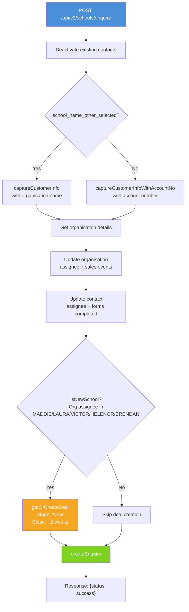
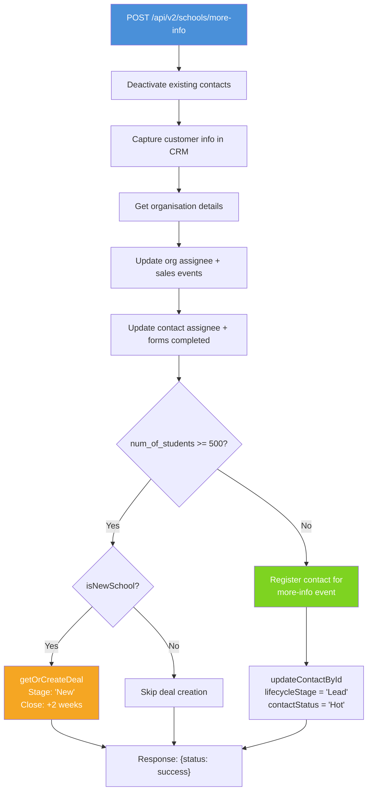
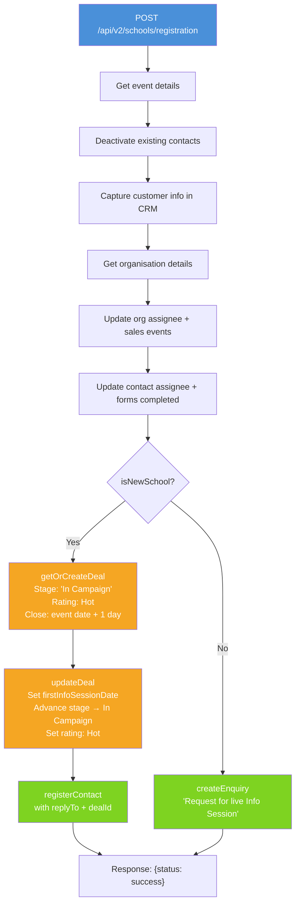
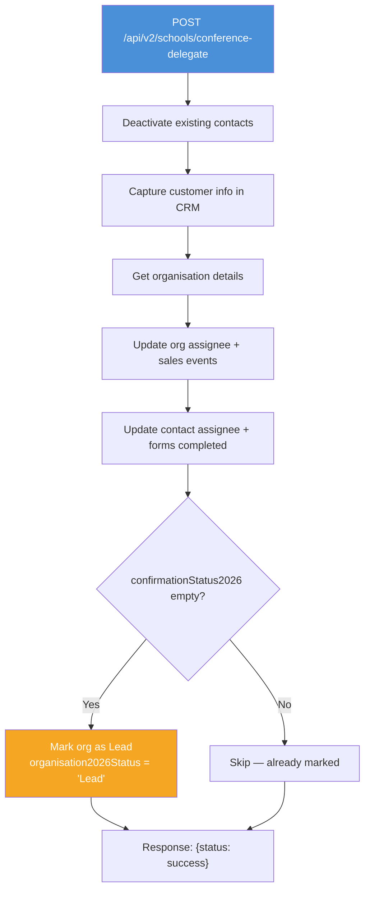
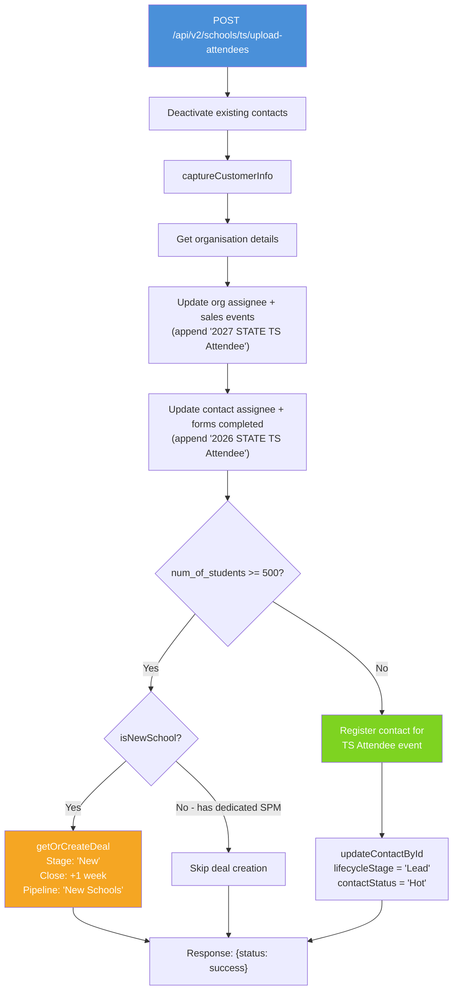

# API v2 — Schools Endpoints

API v2 introduces a schools-specific URL structure with a DDD-lite architecture. Only schools have v2 endpoints; all other service types (Workplace, Early Years, General) continue to use v1.

> **Note:** The v1 school enquiry endpoint (`POST /api/enquiry.php` with `service_type=School`) is deprecated. All school enquiries and registrations should use the v2 endpoints below.

## Key Differences from v1

| | v1 | v2 |
|---|---|---|
| **URL pattern** | `/api/enquiry.php` | `/api/v2/schools/enquiry` |
| **Service type routing** | `service_type` field in POST body | URL path determines service type |
| **Architecture** | Controller + traits | Domain objects + Application handlers |
| **Testability** | Reflection-based tests | Interface-based stubs |

## Overview

| Endpoint | Method | URL | Description |
|----------|--------|-----|-------------|
| School Enquiry | POST | `/api/v2/schools/enquiry` | Submit a school enquiry |
| School More Info | POST | `/api/v2/schools/more-info` | Request more info — registers for event or creates deal based on school size |
| School Registration | POST | `/api/v2/schools/registration` | Register for a live info session (new schools get deal + event registration, existing schools get enquiry) |
| Conference Delegate | POST | `/api/v2/schools/conference-delegate` | Capture a conference delegate's details in CRM |
| Conference Prize Pack | POST | `/api/v2/schools/conference-prize-pack` | Capture a conference prize pack recipient's details in CRM |
| TS Attendee Upload | POST | `/api/v2/schools/ts/upload-attendees` | ... |

---

## POST /api/v2/schools/enquiry

Submit a school enquiry. Captures customer info in CRM, creates a deal for new schools, and creates an enquiry record.

### Request

| Field | Type | Required | Description |
|-------|------|----------|-------------|
| `contact_email` | string | Yes | Contact's email address |
| `contact_first_name` | string | Yes | Contact's first name |
| `contact_last_name` | string | Yes | Contact's last name |
| `contact_phone` | string | No | Contact's phone number |
| `org_phone` | string | No | Organisation phone number |
| `job_title` | string | No | Contact's job title |
| `school_account_no` | string | Conditional | Existing school's Vtiger account number (when school is in CRM) |
| `school_name_other` | string | Conditional | New school name (when school is not in CRM) |
| `school_name_other_selected` | string | Conditional | Flag indicating a new school name was entered (truthy value) |
| `state` | string | No | Australian state (VIC, NSW, QLD, etc.). Used for assignee routing |
| `enquiry` | string | No | Enquiry text. Defaults to `"Conference Enquiry"` |
| `source_form` | string | No | Name of the originating form |
| `num_of_students` | integer | No | Number of students at the school |
| `organisation_sub_type` | string | No | Organisation sub-type |
| `contact_lead_source` | string | No | Lead source for the contact |

### Control Flow



### Assignee Routing

| Org Assignee | State | Enquiry Assignee |
|-------------|-------|-----------------|
| `null` | Any | LAURA |
| Not MADDIE | Any | Keep org assignee |
| MADDIE | NSW, QLD | BRENDAN |
| MADDIE | Other | LAURA |

### Response

```json
{"status": "success"}
```
or
```json
{"status": "fail", "message": "Error processing school enquiry: ..."}
```

### Scenarios

1. **New school enquiry (VIC)** — New school submits enquiry. Deal created with stage "New". Enquiry assigned to LAURA. → `Enquiry (New School).request.yaml`
2. **Existing school enquiry (NSW)** — School with dedicated SPM submits enquiry. No deal created. Enquiry assigned to SPM. → `Enquiry (Existing School).request.yaml`

---

## POST /api/v2/schools/more-info

Request more information about school programs. Captures customer info in CRM, then branches based on student count: large schools (>= 500 students) get a deal created, while smaller schools are registered for a more-info event.

> **v1 equivalent:** This endpoint supersedes the v1 Info Session Recording flow (`POST /api/register.php` with `source_form=Info Session Recording`), though the business logic differs.

### Request

| Field | Type | Required | Description |
|-------|------|----------|-------------|
| `contact_email` | string | Yes | Contact's email address |
| `contact_first_name` | string | Yes | Contact's first name |
| `contact_last_name` | string | Yes | Contact's last name |
| `contact_phone` | string | No | Contact's phone number |
| `org_phone` | string | No | Organisation phone number |
| `job_title` | string | No | Contact's job title |
| `contact_type` | string | No | Contact type (e.g. "Teacher", "Principal") |
| `contact_newsletter` | string | No | Newsletter opt-in |
| `school_account_no` | string | Conditional | Existing school's Vtiger account number |
| `school_name_other` | string | Conditional | New school name (when school is not in CRM) |
| `school_name_other_selected` | string | Conditional | Flag indicating a new school name was entered |
| `state` | string | No | Australian state for assignee routing |
| `organisation_sub_type` | string | No | Organisation sub-type |
| `num_of_students` | integer | No | Number of students — determines branching (>= 500 → deal, < 500 → event registration) |
| `num_of_employees` | integer | No | Number of employees |
| `contact_lead_source` | string | No | Lead source for the contact |
| `source_form` | string | No | Name of the originating form. Defaults to `"More Info 2026"` |

### Control Flow



### Response

```json
{"status": "success"}
```
or
```json
{"status": "fail", "message": "Error processing more info request: ..."}
```

### Scenarios

1. **More info (new school, >= 500 students)** — Deal created with stage "New". → `v2 School More Info (New School - Deal Creation).request.yaml`
2. **More info (new school, < 500 students)** — Contact registered for more-info event, lifecycle set to Lead/Hot. → `v2 School More Info (New School - Event Registration).request.yaml`
3. **More info (existing school)** — Customer info captured and updated, but no deal created regardless of student count.

---

## POST /api/v2/schools/registration

Register a school for a live information session. Captures customer info in CRM, then branches based on whether the school is new or existing.

> **Deprecates:** The v1 Info Session Registration flow (`POST /api/register.php` with `source_form=Info Session Registration`). Other v1 registration flows (Info Session Recording, Leading TRP Registration, Event Confirmation) remain on v1 for now.

### Request

| Field | Type | Required | Description |
|-------|------|----------|-------------|
| `contact_email` | string | Yes | Contact's email address |
| `contact_first_name` | string | Yes | Contact's first name |
| `contact_last_name` | string | Yes | Contact's last name |
| `event_id` | string | Yes | Vtiger event ID (with or without `18x` prefix — normalised automatically) |
| `contact_phone` | string | No | Contact's phone number |
| `org_phone` | string | No | Organisation phone number |
| `job_title` | string | No | Contact's job title |
| `contact_type` | string | No | Contact type (e.g. "Teacher", "Principal") |
| `contact_newsletter` | string | No | Newsletter opt-in |
| `school_account_no` | string | Conditional | Existing school's Vtiger account number |
| `school_name_other` | string | Conditional | New school name (when school is not in CRM) |
| `school_name_other_selected` | string | Conditional | Flag indicating a new school name was entered |
| `state` | string | No | Australian state for assignee routing |
| `organisation_sub_type` | string | No | Organisation sub-type |
| `num_of_students` | integer | No | Number of students at the school |
| `num_of_employees` | integer | No | Number of employees |
| `contact_lead_source` | string | No | Lead source for the contact |
| `source_form` | string | No | Defaults to `"Info Session Registration 2026"` |

### Control Flow



### Assignee Routing

Same rules as [School Enquiry](#post-apiv2schoolsenquiry). Additionally, the `replyTo` field on the registration is set via `AssigneeRules::resolveRegistrationReplyTo()`:

| State | Reply To |
|-------|----------|
| NSW, QLD | BRENDAN |
| Other | LAURA |

### Response

```json
{"status": "success"}
```
or
```json
{"status": "fail", "message": "Error processing school registration: ..."}
```

### Scenarios

1. **New school (VIC)** — Deal created with stage "In Campaign" + rating "Hot", deal updated with info session date, contact registered for event with replyTo=LAURA. → `v2 School Registration (New School).request.yaml`
2. **New school (NSW)** — Same as above but replyTo=BRENDAN and assignee routing to BRENDAN. → `v2 School Registration (New School - NSW).request.yaml`
3. **Existing school** — Enquiry created with body "Request for live Info Session". No deal created, no event registration. → `v2 School Registration (Existing School).request.yaml`

---

## POST /api/v2/schools/conference-delegate

Capture a conference delegate's details in CRM. Creates or updates the contact and organisation, routes assignees, tracks the source form, and marks the organisation as a 2026 Lead if not already marked.

> **v1 equivalent:** Uses the same business logic as `POST /api/prize_pack.php` with `source_form` set to a delegate-specific value (e.g. "NSWPDPN Delegate 2026"). This v2 endpoint provides a dedicated URL for clarity.

### Request

| Field | Type | Required | Description |
|-------|------|----------|-------------|
| `contact_email` | string | Yes | Contact's email address |
| `contact_first_name` | string | Yes | Contact's first name |
| `contact_last_name` | string | Yes | Contact's last name |
| `contact_phone` | string | No | Contact's phone number |
| `org_phone` | string | No | Organisation phone number |
| `job_title` | string | No | Contact's job title |
| `contact_type` | string | No | Contact type (e.g. "Teacher", "Principal") |
| `contact_newsletter` | string | No | Newsletter opt-in |
| `school_account_no` | string | Conditional | Existing school's Vtiger account number |
| `school_name_other` | string | Conditional | New school name (when school is not in CRM) |
| `school_name_other_selected` | string | Conditional | Flag indicating a new school name was entered |
| `state` | string | No | Australian state for assignee routing |
| `organisation_sub_type` | string | No | Organisation sub-type |
| `num_of_students` | integer | No | Number of students at the school |
| `num_of_employees` | integer | No | Number of employees |
| `contact_lead_source` | string | No | Lead source for the contact |
| `source_form` | string | No | Defaults to `"Conference Delegate 2026"`. Override for conference-specific values (e.g. "NSWPDPN Delegate 2026") |

### Control Flow



### Assignee Routing

Same rules as [School Enquiry](#post-apiv2schoolsenquiry).

### Response

```json
{"status": "success"}
```
or
```json
{"status": "fail", "message": "Error processing school conference delegate: ..."}
```

### Scenarios

1. **Existing school delegate** — Contact captured with existing account number, org and contact assignees updated, source form tracked, org marked as Lead. → `v2 Conference Delegate (Existing School).request.yaml`
2. **New school delegate** — New school name provided, contact captured with organisation name, custom source form override. → `v2 Conference Delegate (New School).request.yaml`

---

## POST /api/v2/schools/conference-prize-pack

Capture a conference prize pack recipient's details in CRM. Identical business logic to [Conference Delegate](#post-apiv2schoolsconference-delegate) but with a different default `source_form`.

> **v1 equivalent:** `POST /api/prize_pack.php` with `source_form=Prize Pack`.

### Request

Same fields as [Conference Delegate](#post-apiv2schoolsconference-delegate). The only difference is the default `source_form` value: `"Prize Pack 2026"`.

### Control Flow

Same as [Conference Delegate](#post-apiv2schoolsconference-delegate).

### Response

```json
{"status": "success"}
```
or
```json
{"status": "fail", "message": "Error processing school conference prize pack: ..."}
```

### Scenarios

1. **Existing school prize pack** — Contact captured with existing account number. → `v2 Prize Pack (Existing School).request.yaml`
2. **New school prize pack** — New school name provided. → `v2 Prize Pack (New School).request.yaml`

---

## POST /api/v2/schools/ts/upload-attendees

Capture a single TS (Teacher Seminar) conference attendee in CRM. Designed to be called once per row by the conf-uploads batch tool after the prep step has fetched student counts.

The handler does two things:

1. **Tag the contact and organisation.** Same customer-capture flow as every other v2 endpoint (deactivate → capture → fetch org → update org → update contact), but with **different tags** applied to the contact and the organisation:
   - Contact `forms_completed` ← `"2026 {STATE} TS Attendee"` (e.g. `2026 VIC TS Attendee`)
   - Organisation sales-events list ← `"2027 {STATE} TS Attendee"` (e.g. `2027 VIC TS Attendee`)

   The year difference is intentional: the conference runs in 2027, but attendees are captured during the 2026 cycle.

2. **Branch on student count.**
   - **>= 500 students** — create a deal for the school (one per school via `getOrCreateDeal`; subsequent attendees from the same school don't duplicate). Deal stage `New`, close date `+1 week`, pipeline `New Schools`. From this point G&D nurtures.
   - **< 500 students** — register the contact for the TS Attendee event and flag them `lifecycleStage = Lead`, `contactStatus = Hot`. The two follow-up emails (Email 1 +1wk, Email 2 +2wks) and the eventual move to Lead/Warm are driven by vTiger Process Designer — not this handler.

### Request

| Field | Type | Required | Description |
|-------|------|----------|-------------|
| `contact_email` | string | Yes | Attendee's email |
| `contact_first_name` | string | Yes | Attendee's first name |
| `contact_last_name` | string | Yes | Attendee's last name |
| `school_name` | string | Yes | School (organisation) name |
| `state` | string | Yes | Australian state code (VIC, NSW, QLD, SA, WA, TAS, NT, ACT) — substituted into `{STATE}` in the tags |
| `num_of_students` | integer | No | Student count (typically populated by `prepare_ts_attendee.py`). Drives the branching at step 6 |
| `contact_phone` | string | No | Contact's phone number |
| `job_title` | string | No | Contact's job title |

### Control Flow



### Response

```json
{"status": "success"}
```
or
```json
{"status": "fail", "message": "Error processing TS Attendee upload: ..."}
```

### Notes & TBDs

- **TS Attendee event ID** — the handler accepts the event ID as a constructor argument; the endpoint passes it through. Until the event is created in vTiger, the placeholder `18xPLACEHOLDER` is used. Update the constant `DEFAULT_TS_EVENT_ID` (or the endpoint wiring) once the real event exists.
- **Multi-attendee deal linkage** — when multiple attendees come from the same 500+ school, `getOrCreateDeal` reuses the existing deal but the *first* attendee's contact gets linked. Pending Ian/Maddie/G&D to confirm whether this is the right rule.
- **Tag template override** — the handler accepts custom contact/org tag templates via constructor args (used in tests, and useful for production smoke-testing with `'SHANNON TEST'` instead of the real tags).
