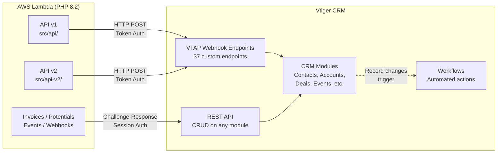

# Vtiger CRM Integration

Overview of how TRP's serverless API integrates with Vtiger CRM — covering the two integration paths, VTAP webhook endpoints, internal workflows, and end-to-end business flows.

---

## Integration Architecture

The PHP API communicates with Vtiger CRM via two distinct paths depending on the endpoint.



| Path | Class | Auth | Used By |
|------|-------|------|---------|
| VTAP Webhooks | v1: `VTController::post_request_to_vt()` / v2: `VtigerWebhookClient::post()` | Token per endpoint | All `/api/` and `/api/v2/` endpoints |
| REST API | `dhvt` class (`$vtod` global) | Challenge-response session | Invoices, Potentials, Events, Webhooks |

---

## VTAP Webhook Endpoints

37 custom VTAP endpoints handle all CRM operations for the form-based API. Each endpoint runs custom code inside Vtiger to create, update, or retrieve CRM records.

**[VTAP Endpoint Reference →](vtap-endpoints.md)** — Full documentation of every endpoint with request/response fields and callers.

### Endpoint Summary

| Group | Count | Endpoints |
|-------|-------|-----------|
| Customer Management | 7 | captureCustomerInfo, captureCustomerInfoWithAccountNo, setContactsInactive, getContactByEmail, getContactById, getContactDetails, updateContactById |
| Organisation Management | 5 | getOrgDetails, getOrganisationByName, getOrgWithAccountNo, getOrgWithName, updateOrganisation |
| Deal Management | 7 | createDeal, getOrCreateDeal, getDealByContactId, getDealDetails, getDealDetailsFromAccountNo, updateDeal, setDealLineItems |
| Quote & Invoice | 7 | createQuote, getQuoteWithAccountNo, getQuoteWithName, setQuoteLineItems, createInvoice, getInvoicesFromAccountNo, getInvoicesFromOrgName |
| Event & Registration | 4 | getEventDetails, checkContactRegisteredForEvent, registerContact, createOrUpdateInvitation |
| Catalogue | 2 | getServices, getProducts |
| Enquiry & Sales | 3 | createEnquiry, createDateAcceptance, updateDateAcceptance |
| Specialised | 2 | createAssessment, createOrUpdateSEIP |

---

## Vtiger Workflows

Automated workflows configured in Vtiger (Settings → Automation → Workflows) trigger on CRM record changes — sending emails, updating fields, or creating related records.

**[Workflow Documentation →](workflows.md)** — Known workflows and their triggers.

---

## Related: Business Flows

For end-to-end documentation of how form submissions flow through the API and into Vtiger, see the **[Business Flows](../flows/index.md)** section. Each flow shows how VTAP endpoints are orchestrated and cross-references this endpoint reference.

---

## Configuration

### Webhook Tokens
Each VTAP endpoint has a unique auth token configured in:
- **v2:** `src/api-v2/Config/webhook_tokens.php`
- **v1:** `src/api/classes/base.php` (static `$tokens` array)

### Staff Assignee Constants
- **v2:** `ApiV2\Config\UserIds` class
- **v1:** Constants on `VTController` base class (e.g., `MADDIE`, `LAURA`, `BRENDAN`)

Assignee routing logic lives in `ApiV2\Domain\AssigneeRules` (v2) and various controller methods (v1).

### Base URL
```
https://theresilienceproject.od2.vtiger.com/restapi/vtap/webhook/{endpoint}
```
