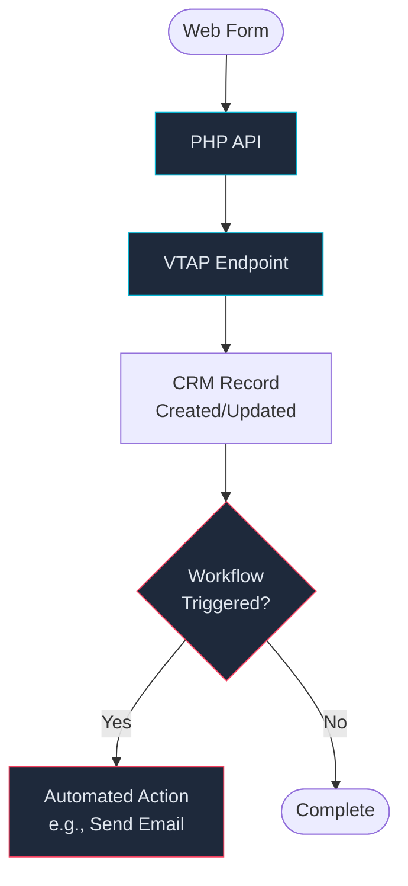

# Vtiger Workflows

Automated workflows configured in Vtiger CRM (Settings → Automation → Workflows) that trigger on record changes. These run **inside Vtiger** after VTAP endpoints or REST API calls create/update records.

---

## Known Workflows

### New enquiry — send email to enquirer

| Property | Value |
|----------|-------|
| **Trigger module** | Enquiries |
| **Trigger condition** | On new record creation |
| **Action** | Sends automated email to the enquirer's email address |
| **Created by endpoint** | [createEnquiry](vtap-endpoints.md#createenquiry) |

**Important:** This workflow must be **disabled before bulk imports** (e.g., conference lead imports via `apps/conf-uploads/`) to avoid sending hundreds of automated emails. Re-enable after import completes.

**How to disable:**
1. Navigate to Vtiger → Settings → Automation → Workflows
2. Find "New enquiry - send email to enquirer"
3. Toggle the workflow off
4. Run the bulk import
5. Toggle the workflow back on

Referenced in: `apps/conf-uploads/WORKFLOW.md`

---

## Workflow Inventory

> **Action required:** The following sections are templates for documenting all Vtiger workflows. Review the complete list in Vtiger (Settings → Automation → Workflows) and fill in the details for each workflow.

To document each workflow, capture:
- **Name** — as shown in Vtiger
- **Trigger module** — which CRM module triggers the workflow (Contacts, Accounts, Potentials, Enquiries, etc.)
- **Trigger condition** — when it fires (on create, on update, on specific field change)
- **Conditions** — any filter conditions (e.g., only for certain record types)
- **Actions** — what the workflow does (send email, update field, create record, webhook call)
- **Related endpoint** — which VTAP endpoint creates/updates the triggering record

### Template

Use this template for each additional workflow:

```markdown
### {Workflow Name}

| Property | Value |
|----------|-------|
| **Trigger module** | {Module name} |
| **Trigger condition** | {On create / On update / On field change} |
| **Conditions** | {Any filter conditions, or "None"} |
| **Actions** | {What the workflow does} |
| **Related endpoint** | [{endpoint}](vtap-endpoints.md#{endpoint-anchor}) |

{Any additional notes about this workflow.}
```

---

## Modules with Likely Workflows

Based on the VTAP endpoints and business flows, these Vtiger modules are most likely to have workflows configured:

| Module | Why | Check for workflows that... |
|--------|-----|----------------------------|
| **Enquiries** | Created by `createEnquiry` — known workflow sends email | Send notifications, update related records |
| **Contacts** | Created/updated frequently by customer capture flows | Welcome emails, status change notifications |
| **Accounts (Organisations)** | Updated with lead status, assignee changes | Assignee notifications, status change alerts |
| **Potentials (Deals)** | Stage changes from New → Considering → Deal Won | Stage change notifications, task creation |
| **Events** | Registration and invitation tracking | Confirmation emails, reminder notifications |
| **Invoices** | Created by order resources flow | Invoice notification emails, Xero sync |
| **Quotes** | Created during program confirmation | Quote notification emails |
| **SEIP** | Created/updated during confirmation and assessment | Progress tracking notifications |
| **Registrations** | Created by `registerContact` | Registration confirmation emails |

---

## Workflow vs VTAP Endpoint Logic

Understanding where business logic lives:



- **PHP API** — Handles form validation, business logic, assignee routing, and orchestrates VTAP calls
- **VTAP Endpoints** — Execute CRM operations (create/update/retrieve records)
- **Vtiger Workflows** — React to record changes with automated actions (emails, field updates, record creation)

The PHP code controls **what** happens and **when**. Vtiger workflows control **side effects** that happen automatically after records change.
